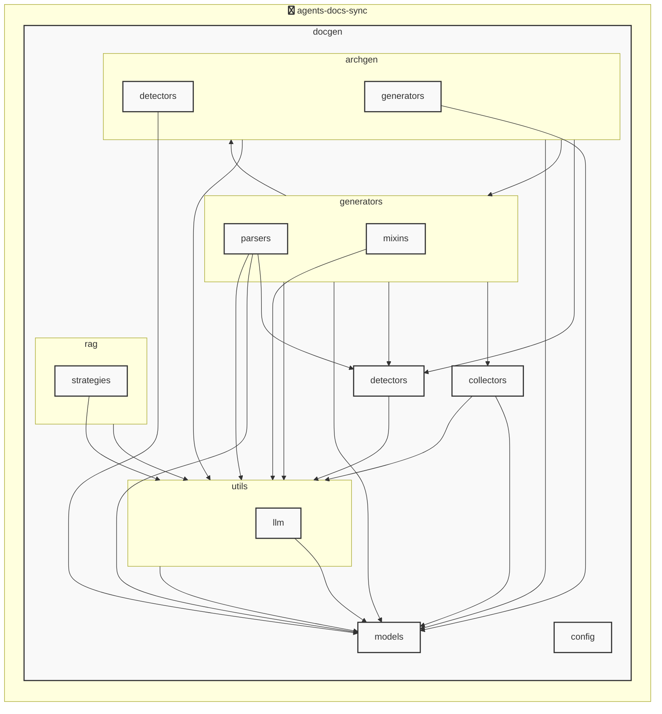

# AGENTS ドキュメント

自動生成日時: 2025-12-04 13:40:49

このドキュメントは、AIコーディングエージェントがプロジェクト内で効果的に作業するための指示とコンテキストを提供します。

---


<!-- MANUAL_START:description -->

<!-- MANUAL_END:description -->


`agents-docs-sync` は、リポジトリにコミットが行われるたびに自動でテストを実行し、ドキュメント（AGENTS.md）を生成・更新するパイプラインです。  
Python 3.x とシェルスクリプトの組み合わせで構築されており、CLI エントリポイント `agents_docs_sync` が用意されています。

### 主な技術スタック
| ランタイム | パッケージ |
|------------|-------------|
| Python      | `pydantic`, `pyyaml`, `jinja2`, `outlines`, `httpx`, `openai`, `anthropic`, `sentence-transformers`, `torch` など |
| テスト環境   | `pytest`, `pytest-cov`, `pytest-mock` |
| コード整形/解析 | `ruff` |

### アーキテクチャ
- **エントリポイント**  
  `agents_docs_sync = "docgen.docgen:main"`（pyproject.toml）により、コマンドラインから直接実行可能。  

- **ドキュメント生成モジュール (`docgen/docgen.py`)**  
  - Jinja2 テンプレートを用いて AGENTS.md を構築。
  - `AgentsConfig`, `AgentsGenerationConfig` 等の Pydantic モデルで設定情報と出力内容を管理。  
  - 既存ドキュメント解析結果は `AgentsDocument` に格納され、再利用可能。

- **テスト実行**  
  コミット時に GitHub Actions / CI が起動し、pytest を走らせてカバレッジ情報を取得。  

- **アーキテクチャ図自動生成（LLM 未使用）**  
  `docs/implementation/auto_architecture_generator.md` に記載されるように、プロジェクト構造から静的解析で依存関係を抽出し、Markdown 用の図表へ変換。  

- **フックシステム**  
  - `agents_docs_sync hook install` でカスタムスクリプトやビルド前/後処理を登録できる。  
  - シェルベースの拡張性が高く、CI/CD パイプラインに容易に組み込めます。

### 主な機能
| 機能 | 説明 |
|------|------|
| **自動テスト実行** | コミットごとに `pytest` を走らせ、失敗を即座に検知。 |
| **AGENTS.md 自動更新** | 設定ファイル (`agents_config.yml`) とコードベースから抽出した情報でマージし、新しいドキュメントを生成。 |
| **CLI ユーティリティ** | `--help` でオプション一覧表示、サブコマンド（run, hook install 等）により柔軟な操作が可能。 |
| **依存関係解析** | OpenAI / Anthropic の LLM を使わずに Python パッケージとモジュール間のリンクを可視化し、図として出力。 |
| **テストカバレッジ統合** | `pytest-cov` で取得した結果をドキュメント内に埋め込み、品質管理を一元化。 |

### 実行例
```bash
# コミット時のパイプライン（CI 内）
agents_docs_sync run

# フックインストール
agents_docs_sync hook install

# ヘルプ表示
agents_docs_sync --help
```

このように、`agents-docs-sync` はコード品質とドキュメント整合性を自動化しつつ、拡張可能なフレームワークとして設計されています。
**使用技術**: python, shell
## プロジェクト構造
```
├── docgen//
│   ├── archgen//
│   │   ├── detectors//
│   │   │   └── python_detector.py
│   │   └── generators//
│   │       └── mermaid_generator.py
│   ├── collectors//
│   │   ├── collector_utils.py
│   │   └── project_info_collector.py
│   ├── config//
│   │   └── config_accessor.py
│   ├── detectors//
│   │   ├── configs//
│   │   │   ├── go.toml
│   │   │   ├── javascript.toml
│   │   │   ├── python.toml
│   │   │   └── typescript.toml
│   │   ├── base_detector.py
│   │   ├── detector_patterns.py
│   │   ├── plugin_registry.py
│   │   └── unified_detector.py
│   ├── generators//
│   │   ├── mixins//
│   │   │   ├── formatting_mixin.py
│   │   │   ├── llm_mixin.py
│   │   │   ├── markdown_mixin.py
│   │   │   └── template_mixin.py
│   │   ├── parsers//
│   │   │   ├── base_parser.py
│   │   │   ├── generic_parser.py
│   │   │   ├── js_parser.py
│   │   │   └── python_parser.py
│   │   ├── agents_generator.py
│   │   ├── api_generator.py
│   │   ├── base_generator.py
│   │   ├── contributing_generator.py
│   │   └── readme_generator.py
│   ├── hooks//
│   │   ├── tasks//
│   │   │   └── base.py
│   │   ├── config.py
│   │   └── orchestrator.py
│   ├── index//
│   │   └── meta.json
│   ├── models//
│   │   ├── agents.py
│   │   ├── config.py
│   │   └── detector.py
│   ├── prompts//
│   │   ├── agents_prompts.toml
│   │   ├── commit_message_prompts.toml
│   │   └── readme_prompts.toml
│   ├── rag//
│   │   ├── embedder.py
│   │   ├── indexer.py
│   │   ├── retriever.py
│   │   └── validator.py
│   ├── utils//
│   │   ├── llm//
│   │   │   ├── base.py
│   │   │   └── local_client.py
│   │   ├── cache.py
│   │   ├── exceptions.py
│   │   ├── file_utils.py
│   │   └── prompt_loader.py
│   ├── cli_handlers.py
│   ├── config.toml
│   ├── config_manager.py
│   ├── detector_config_loader.py
│   ├── docgen.py
│   ├── document_generator.py
│   └── hooks.toml
├── docs/
├── scripts/
├── tests/
├── AGENTS.md
├── README.md
├── pyproject.toml
├── requirements-docgen.txt
└── requirements-test.txt
```
## アーキテクチャ

<!-- MANUAL_START:architecture -->

<!-- MANUAL_END:architecture -->


## Services

### agents-docs-sync
- **Type**: python
- **Description**: コミットするごとにテスト実行・ドキュメント生成・AGENTS.md の自動更新を行うパイプライン
- **Dependencies**: anthropic, hnswlib, httpx, jinja2, openai, outlines, pydantic, pytest, pytest-cov, pytest-mock, pyyaml, ruff, sentence-transformers, torch

---

## 開発環境のセットアップ

<!-- MANUAL_START:setup -->

<!-- MANUAL_END:setup -->
### 前提条件

- Python 3.12以上

### 依存関係のインストール
#### Python依存関係

```bash
uv sync
```

### LLM環境のセットアップ
#### ローカルLLMを使用する場合

1. **ローカルLLMのインストール**

   - Ollamaをインストール: https://ollama.ai/
   - モデルをダウンロード: `ollama pull llama3`
   - サービスを起動: `ollama serve`

2. **ローカルLLM使用時の注意事項**
   - モデルが起動していることを確認してください
   - ローカルリソース（メモリ、CPU）を監視してください

---


## ビルドおよびテスト手順

### ビルド手順
```bash
uv sync
```
```bash
uv build
```
```bash
uv run python3 docgen/docgen.py
```

### テスト実行
```bash
bash scripts/run_tests.sh
```
```bash
uv run pytest tests/ -v --tb=short
```
### 利用可能なコマンド

プロジェクトで定義されているスクリプトコマンド:

| コマンド | 説明 |
| --- | --- |
| `agents_docs_sync` | 汎用ドキュメント自動生成システム |
#### `agents_docs_sync` のオプション

| オプション | 説明 |
| --- | --- |
| `--config` | 設定ファイルのパス |
| `--detect-only` | 言語検出のみ実行 |
| `--no-api-doc` | APIドキュメントを生成しない |
| `--no-readme` | READMEを更新しない |
| `--build-index` | RAGインデックスをビルド |
| `--use-rag` | RAGを使用してドキュメント生成 |
| `--generate-arch` | アーキテクチャ図を生成（Mermaid形式） |
| `hook_name` | フック名（指定しない場合は全て） |
| `hook_name` | フック名（指定しない場合は全て） |
| `hook_name` | 実行するフック名 |
| `hook_args` | フック引数 |
| `--force` | 既存ファイルを強制上書き |

---

## コーディング規約

<!-- MANUAL_START:other -->

<!-- MANUAL_END:other -->
### リンター

- **ruff** を使用
  ```bash
  ruff check .
  ruff format .
  ```

---

## プルリクエストの手順

<!-- MANUAL_START:pr -->

<!-- MANUAL_END:pr -->
1. **ブランチの作成**
   ```bash
   git checkout -b feature/your-feature-name
   ```

2. **変更のコミット**
   - コミットメッセージは明確で説明的に
   - 関連するIssue番号を含める

3. **テストの実行**
   ```bash
   bash scripts/run_tests.sh
   uv run pytest tests/ -v --tb=short
   ```

4. **プルリクエストの作成**
   - タイトル: `[種類] 簡潔な説明`
   - 説明: 変更内容、テスト結果、関連Issueを記載

---

*このAGENTS.mdは自動生成されています。最終更新: 2025-12-04 13:40:49*