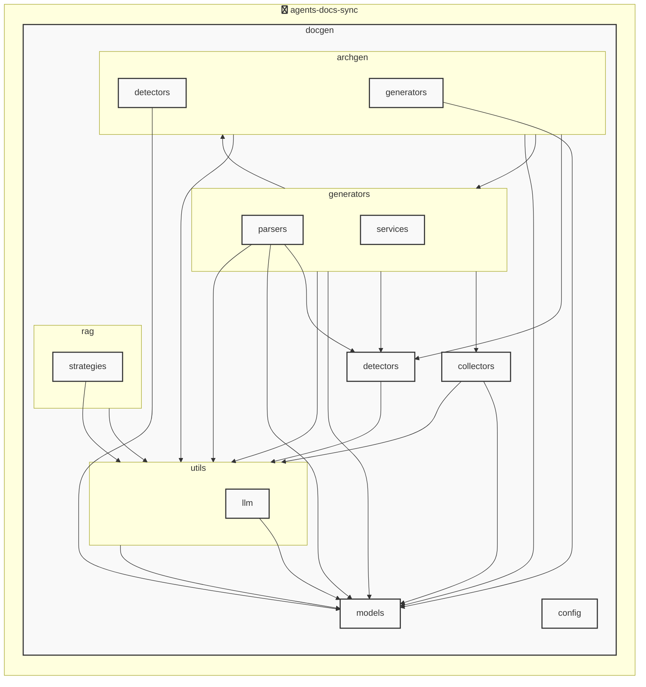

# AGENTS ドキュメント

自動生成日時: 2025-12-04 14:38:20

このドキュメントは、AIコーディングエージェントがプロジェクト内で効果的に作業するための指示とコンテキストを提供します。

---


<!-- MANUAL_START:description -->

<!-- MANUAL_END:description -->


本プロジェクトは、コードベースとドキュメントの整合性を保つために設計された自動化パイプラインです。コミットごとに以下の処理が順次実行されます。

1. **テスト実行**  
   `pytest`（バージョン7.4以上）＋カバー率確認用(`pytest-cov`)でユニット・統合テストを走らせ、失敗した場合はCIビルドが停止します。モックライブラリ(`pytest-mock`)も併設し、外部依存の振る舞いを安全に再現できます。

2. **ドキュメント生成**  
   ソースコード内のdocstringやYAML構成（`pyyaml>=6.0.3`）から自動で Markdown ドキュメントを作り出します。生成されたファイルは `docs/` ディレクトリに格納され、GitHub Pages などと連携して公開できます。

3. **AGENTS.md 自動更新**  
   パイプラインの最後に実行するシェルスクリプトが最新ドキュメントを読み込み、AI エージェント用情報（インターフェース定義・使用例）を `AGENTS.md` に書き込むことで、人手による更新作業を排除します。

### 実装構成
- **言語**: Python 3.11+, Shell (Bash)
- **パッケージ管理**: uv（Python 用高速インストールツール）
- **主な依存関係**
  - `pyyaml>=6.0.3` – YAML 設定の読み書き
  - `pytest>=7.4.0`, `pytest-cov>=4.1.0`, `pytest-mock>=3.11.1`
  - その他、ドキュメント生成に必要なスクリプトライブラリ

### ローカル実行手順（uv を使用）
```bash
# 仮想環境作成と依存関係インストール
uv venv .venv
source .venv/bin/activate
uv pip install -r requirements.txt   # もしくは uv sync

# テスト & ドキュメント生成を一括で実行（CI と同等）
./scripts/run_pipeline.sh
```

### CI の構成ポイント
- GitHub Actions に `workflow_dispatch` および `push` イベントが設定され、コミット時に上記シェルスクリプトを呼び出します。
- 生成されたドキュメントは自動的に `gh-pages` ブランチへデプロイされるようになっています。

### メンテナンスのヒント
- **新しいエージェント機能** を追加した際は、docstring の書き方を統一し（例：入力/出力型、制約など）、YAML 定義に追記するだけで `AGENTS.md` が自動更新されます。
- テスト失敗時の詳細ログは CI のアーティファクトとして保存しておくとデバッグが容易です。

このパイプラインを活用すれば、コード変更ごとにドキュメントやエージェント仕様書を常に最新状態で保つことができ、AI エージェントの開発・運用コストを大幅に削減できます。
**使用技術**: python, shell
## プロジェクト構造
```
├── docgen//
│   ├── archgen//
│   │   ├── detectors//
│   │   │   └── python_detector.py
│   │   └── generators//
│   │       └── mermaid_generator.py
│   ├── collectors//
│   │   ├── collector_utils.py
│   │   └── project_info_collector.py
│   ├── config//
│   │   └── config_accessor.py
│   ├── detectors//
│   │   ├── configs//
│   │   │   ├── go.toml
│   │   │   ├── javascript.toml
│   │   │   ├── python.toml
│   │   │   └── typescript.toml
│   │   ├── base_detector.py
│   │   ├── detector_patterns.py
│   │   ├── plugin_registry.py
│   │   └── unified_detector.py
│   ├── generators//
│   │   ├── parsers//
│   │   │   ├── base_parser.py
│   │   │   ├── generic_parser.py
│   │   │   ├── js_parser.py
│   │   │   └── python_parser.py
│   │   ├── services//
│   │   │   ├── formatting_service.py
│   │   │   ├── llm_service.py
│   │   │   └── template_service.py
│   │   ├── agents_generator.py
│   │   ├── api_generator.py
│   │   ├── base_generator.py
│   │   ├── contributing_generator.py
│   │   ├── readme_generator.py
│   │   └── service_factory.py
│   ├── hooks//
│   │   ├── tasks//
│   │   │   └── base.py
│   │   ├── config.py
│   │   └── orchestrator.py
│   ├── index//
│   │   └── meta.json
│   ├── models//
│   │   ├── agents.py
│   │   ├── config.py
│   │   └── detector.py
│   ├── prompts//
│   │   ├── agents_prompts.toml
│   │   ├── commit_message_prompts.toml
│   │   └── readme_prompts.toml
│   ├── rag//
│   │   ├── embedder.py
│   │   ├── indexer.py
│   │   ├── retriever.py
│   │   └── validator.py
│   ├── utils//
│   │   ├── llm//
│   │   │   ├── base.py
│   │   │   └── local_client.py
│   │   ├── cache.py
│   │   ├── exceptions.py
│   │   ├── file_utils.py
│   │   └── prompt_loader.py
│   ├── cli_handlers.py
│   ├── config.toml
│   ├── config_manager.py
│   ├── detector_config_loader.py
│   ├── docgen.py
│   ├── document_generator.py
│   └── hooks.toml
├── docs/
├── scripts/
├── tests/
├── AGENTS.md
├── README.md
├── pyproject.toml
├── requirements-docgen.txt
└── requirements-test.txt
```
## アーキテクチャ

<!-- MANUAL_START:architecture -->

<!-- MANUAL_END:architecture -->


## Services

### agents-docs-sync
- **Type**: python
- **Description**: コミットするごとにテスト実行・ドキュメント生成・AGENTS.md の自動更新を行うパイプライン
- **Dependencies**: anthropic, hnswlib, httpx, jinja2, openai, outlines, pydantic, pytest, pytest-cov, pytest-mock, pyyaml, ruff, sentence-transformers, torch

---

## 開発環境のセットアップ

<!-- MANUAL_START:setup -->

<!-- MANUAL_END:setup -->
### 前提条件

- Python 3.12以上

### 依存関係のインストール
#### Python依存関係

```bash
uv sync
```

### LLM環境のセットアップ
#### ローカルLLMを使用する場合

1. **ローカルLLMのインストール**

   - Ollamaをインストール: https://ollama.ai/
   - モデルをダウンロード: `ollama pull llama3`
   - サービスを起動: `ollama serve`

2. **ローカルLLM使用時の注意事項**
   - モデルが起動していることを確認してください
   - ローカルリソース（メモリ、CPU）を監視してください

---


## ビルドおよびテスト手順

### ビルド手順
```bash
uv sync
uv build
uv run python3 docgen/docgen.py
```

### テスト実行
```bash
bash scripts/run_tests.sh
uv run pytest tests/ -v --tb=short
```
### 利用可能なコマンド

プロジェクトで定義されているスクリプトコマンド:

| コマンド | 説明 |
| --- | --- |
| `agents_docs_sync` | 汎用ドキュメント自動生成システム |
#### `agents_docs_sync` のオプション

| オプション | 説明 |
| --- | --- |
| `--config` | 設定ファイルのパス |
| `--detect-only` | 言語検出のみ実行 |
| `--no-api-doc` | APIドキュメントを生成しない |
| `--no-readme` | READMEを更新しない |
| `--build-index` | RAGインデックスをビルド |
| `--use-rag` | RAGを使用してドキュメント生成 |
| `--generate-arch` | アーキテクチャ図を生成（Mermaid形式） |
| `hook_name` | フック名（指定しない場合は全て） |
| `hook_name` | フック名（指定しない場合は全て） |
| `hook_name` | 実行するフック名 |
| `hook_args` | フック引数 |
| `--force` | 既存ファイルを強制上書き |

---

## コーディング規約

<!-- MANUAL_START:other -->

<!-- MANUAL_END:other -->
### リンター

- **ruff** を使用
  ```bash
  ruff check .
  ruff format .
  ```

---

## プルリクエストの手順

<!-- MANUAL_START:pr -->

<!-- MANUAL_END:pr -->
1. **ブランチの作成**
   ```bash
   git checkout -b feature/your-feature-name
   ```

2. **変更のコミット**
   - コミットメッセージは明確で説明的に
   - 関連するIssue番号を含める

3. **テストの実行**
   ```bash
   bash scripts/run_tests.sh
   uv run pytest tests/ -v --tb=short
   ```

4. **プルリクエストの作成**
   - タイトル: `[種類] 簡潔な説明`
   - 説明: 変更内容、テスト結果、関連Issueを記載

---

*このAGENTS.mdは自動生成されています。最終更新: 2025-12-04 14:38:20*