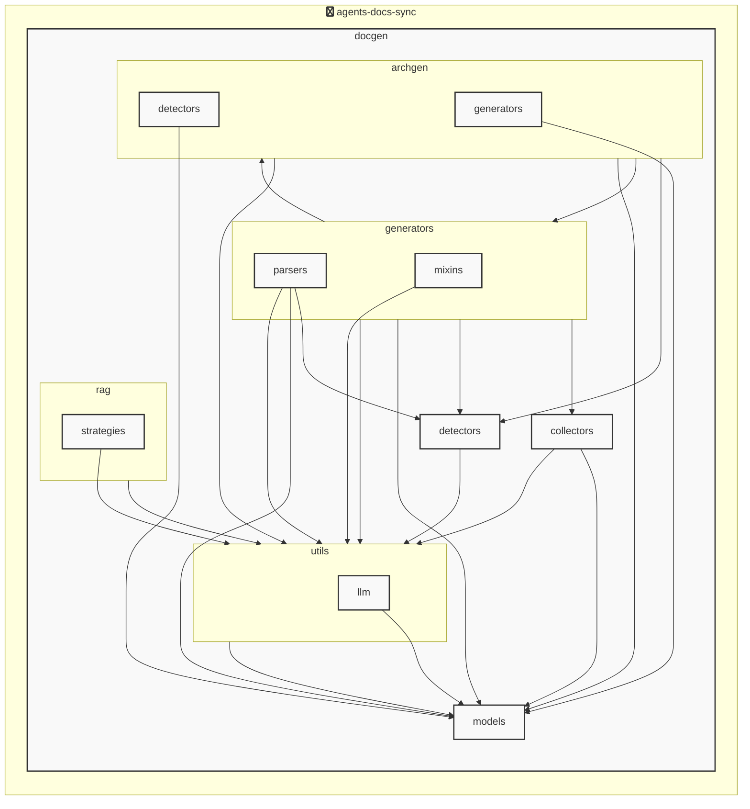

# AGENTS ドキュメント

自動生成日時: 2025-12-02 17:09:26

このドキュメントは、AIコーディングエージェントがプロジェクト内で効果的に作業するための指示とコンテキストを提供します。

---


<!-- MANUAL_START:description -->
`agents-docs-sync` は、AIコーディングエージェントがプロジェクト内で効果的に作業するためのドキュメント生成ツールです。
このドキュメント（AGENTS.md）自体も、このツールによって自動生成・更新されています。
<!-- MANUAL_END:description -->

agents-docs-sync は、Python とシェルスクリプトで構築された CI/CD パイプラインツールです。  
コミットごとに自動的にテスト実行（`pytest`, `coverage`）、ドキュメント生成、および **AGENTS.md** の差分更新を行うことで、開発者が最新の仕様書を手間なく保守できるよう設計されています。  

### 主要コンポーネント  
- **CLI エントリポイント** (`agents-docs-sync`, `agents_docs_sync`) は `docgen.docgen:main` を実行し、全体フローを制御します。  
- **Pydantic モデル群**（`ProjectOverview`, `AgentsConfig`, `AgentsGenerationConfig`, `AgentsDocument` など）は構成ファイルと生成結果の型安全な管理に使用されます。これらは YAML/JSON で記述された設定を読み込み、バリデーション・ドキュメント化を担います。  
- **テンプレートエンジン**（Jinja2）によって Markdown テンプレートが動的生成され、`AGENTS.md`, `README.rst` 等のファイルに差分を書き込む仕組みです。  
- **コードベース解析**は `hnswlib` と `sentence-transformers` で実装された埋め込み検索を利用し、ソース構造から自動的にアーキテクチャ図（SVG/PlantUML）や関連ドメイン情報を抽出します。LLM を使わずコード解析だけで可視化する点が特徴です。  
- **HTTP API 呼び出し**は `httpx` で実装され、外部サービス（例：OpenAI, Anthropic）のトークン管理やレスポンス取得を担います。  

### アーキテクチャ概要
1. **Git フック / CI トリガ**  
   - コミット時に `agents-docs-sync` を実行し、以下のサブタスクへ分岐します。  
2. **ユニット／統合テスト** (`pytest`, `pytest-cov`)  
   - 失敗した場合はビルドを中断し、ステータスコードで通知します。  
3. **構成ファイルロード & バリデーション**（Pydantic）  
4. **ソース解析 → 埋め込み検索 (hnswlib + sentence-transformers)**  
   - モジュール・クラス間の関係を抽出し、アーキテクチャ図生成に渡します。  
5. **ドキュメント生成**（Jinja2 テンプレート）  
   - 取得した構造情報と設定値から `AGENTS.md` を再構築・差分コミットします。  
6. **Hook インストール／管理** (`agents_docs_sync hook install`)  
   - Git フックや CI 設定を自動で配置し、開発環境のセットアップコストを削減します。  

### 技術スタックと品質保証
| ライブラリ | 役割 |
|------------|------|
| `pydantic` | 型安全な設定管理・バリデーション |
| `jinja2`   | Markdown テンプレート生成 |
| `httpx`    | 非同期 HTTP クライアント（API 呼び出し） |
| `sentence-transformers`, `torch` | 文脈埋め込み生成 |
| `hnswlib`  | 高速近似最近傍検索、図自動化に利用 |
| `openai`, `anthropic` | 必要時 LLM 呼び出し（デフォルトでは使用せず） |
| `pytest`, `coverage` | テスト実行とカバレッジ測定 |
| `ruff`     | 静的コード解析・スタイルチェック |

### ユーザー体験
- **CLI での簡易操作**  
  ```bash
  agents-docs-sync --help
  ```
- **フック一括インストール**  
  ```bash
  agents_docs_sync hook install
  ```
- **設定ファイル（YAML/JSON）を編集するだけで、ドキュメントの構造や出力フォーマットが変更可能**

### 成果物
| ファイル | 内容 |
|----------|------|
| `AGENTS.md` | 自動生成されたエージェント設計書・API 仕様 |
| アーキテクチャ図（SVG/PlantUML） | コード構造に基づく可視化 |
| CI 設定ファイル | GitHub Actions / Jenkins 用の自動実行スクリプト |

agents-docs-sync は、開発フローとドキュメント管理を一体化し、リポジトリ内で常に最新状態を保つことができる強力なツールです。
**使用技術**: python, shell


## プロジェクト構造
```
agents-docs-sync/
 ├─ docgen/
 │  ├─ archgen/
 │  │  ├─ detectors/
 │  │  │  └─ python_detector.py
 │  │  └─ generators/
 │  │     └─ mermaid_generator.py
 │  ├─ collectors/
 │  │  ├─ collector_utils.py
 │  │  └─ project_info_collector.py
 │  ├─ detectors/
 │  │  ├─ configs/
 │  │  │  ├─ go.toml
 │  │  │  ├─ javascript.toml
 │  │  │  ├─ python.toml
 │  │  │  └─ typescript.toml
 │  │  ├─ base_detector.py
 │  │  ├─ detector_patterns.py
 │  │  ├─ plugin_registry.py
 │  │  └─ unified_detector.py
 │  ├─ generators/
 │  │  ├─ mixins/
 │  │  │  ├─ llm_mixin.py
 │  │  │  ├─ markdown_mixin.py
 │  │  │  └─ template_mixin.py
 │  │  ├─ parsers/
 │  │  │  ├─ base_parser.py
 │  │  │  ├─ generic_parser.py
 │  │  │  ├─ js_parser.py
 │  │  │  └─ python_parser.py
 │  │  ├─ agents_generator.py
 │  │  ├─ api_generator.py
 │  │  ├─ base_generator.py
 │  │  ├─ contributing_generator.py
 │  │  └─ readme_generator.py
 │  ├─ hooks/
 │  │  ├─ tasks/
 │  │  │  └─ base.py
 │  │  ├─ config.py
 │  │  └─ orchestrator.py
 │  ├─ index/
 │  │  └─ meta.json
 │  ├─ models/
 │  │  ├─ agents.py
 │  │  ├─ config.py
 │  │  └─ detector.py
 │  ├─ prompts/
 │  │  ├─ agents_prompts.toml
 │  │  ├─ commit_message_prompts.toml
 │  │  └─ readme_prompts.toml
 │  ├─ rag/
 │  │  ├─ embedder.py
 │  │  ├─ indexer.py
 │  │  ├─ retriever.py
 │  │  └─ validator.py
 │  ├─ utils/
 │  │  ├─ llm/
 │  │  │  ├─ base.py
 │  │  │  └─ local_client.py
 │  │  ├─ cache.py
 │  │  ├─ exceptions.py
 │  │  ├─ file_utils.py
 │  │  └─ prompt_loader.py
 │  ├─ config.toml
 │  ├─ config_manager.py
 │  ├─ docgen.py
 │  └─ hooks.toml
 ├─ docs/
 ├─ scripts/
 ├─ tests/
 ├─ AGENTS.md
 ├─ README.md
 ├─ pyproject.toml
 ├─ requirements-docgen.txt
 └─ requirements-test.txt
```


## アーキテクチャ

<!-- MANUAL_START:architecture -->

<!-- MANUAL_END:architecture -->


## Services

### agents-docs-sync
- **Type**: python
- **Description**: コミットするごとにテスト実行・ドキュメント生成・AGENTS.md の自動更新を行うパイプライン
- **Dependencies**: anthropic, hnswlib, httpx, jinja2, openai, outlines, pydantic, pytest, pytest-cov, pytest-mock, pyyaml, ruff, sentence-transformers, torch


---

## 開発環境のセットアップ

<!-- MANUAL_START:setup -->

<!-- MANUAL_END:setup -->
### 前提条件

- Python 3.12以上


### 依存関係のインストール


#### Python依存関係

```bash

uv sync

```


### LLM環境のセットアップ


#### ローカルLLMを使用する場合

1. **ローカルLLMのインストール**

   - Ollamaをインストール: https://ollama.ai/
   - モデルをダウンロード: `ollama pull llama3`
   - サービスを起動: `ollama serve`

2. **ローカルLLM使用時の注意事項**
   - モデルが起動していることを確認してください
   - ローカルリソース（メモリ、CPU）を監視してください


---


## ビルドおよびテスト手順

### ビルド手順


```bash
uv sync
uv build
uv run python3 docgen/docgen.py
```


### テスト実行


```bash
uv run pytest tests/ -v --tb=short
```


---

## コーディング規約

<!-- MANUAL_START:other -->

<!-- MANUAL_END:other -->


### リンター

- **ruff** を使用

  ```bash
  ruff check .
  ruff format .
  ```


---

## プルリクエストの手順

<!-- MANUAL_START:pr -->

<!-- MANUAL_END:pr -->
1. **ブランチの作成**
   ```bash
   git checkout -b feature/your-feature-name
   ```

2. **変更のコミット**
   - コミットメッセージは明確で説明的に
   - 関連するIssue番号を含める

3. **テストの実行**
   ```bash
   
   
   uv run pytest tests/ -v --tb=short
   
   
   ```

4. **プルリクエストの作成**
   - タイトル: `[種類] 簡潔な説明`
   - 説明: 変更内容、テスト結果、関連Issueを記載


---

*このAGENTS.mdは自動生成されています。最終更新: 2025-12-02 17:09:26*