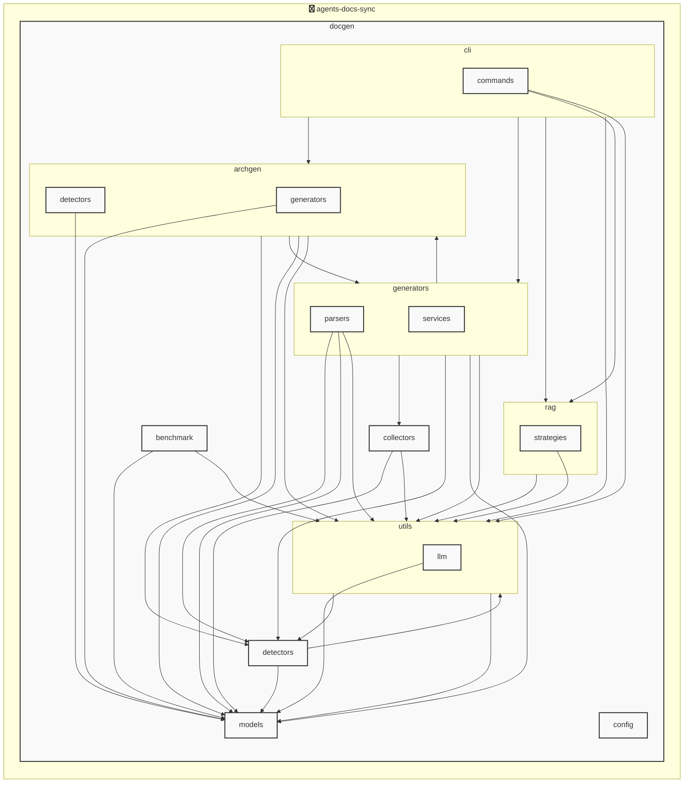

# AGENTS ドキュメント

自動生成日時: 2025-12-23 15:50:44

このドキュメントは、AIコーディングエージェントがプロジェクト内で効果的に作業するための指示とコンテキストを提供します。

---


<!-- MANUAL_START:description -->

<!-- MANUAL_END:description -->


このプロジェクトは、リポジトリにコミットがあるたびに自動的にテストを実行し、ドキュメント（主に Markdown 形式）と **AGENTS.md** を最新状態へ更新する CI パイプラインです。  
- **Python / Shell の組み合わせで構成されており**, `uv` がパッケージ管理・ビルドツールとして使用されています。  
- テストは **pytest**、カバレッジ計測は **pytest‑cov** で実行し、その結果を HTML/Markdown レポートにまとめます。  
- ドキュメント生成はコード内の docstring や YAML メタデータから自動的に Markdown ファイルへ変換される仕組み（例: `mkdocs`、Sphinx の拡張）で行われ、パッケージ全体の API 仕様が一元管理できます。  
- **AGENTS.md** はプロジェクト内の AI エージェントモジュールを走査し、それぞれに付与されたメタ情報（名前・バージョン・概要など）を抽出してファイルへ書き込みます。これにより、エージェントが追加／更新されるたびに手動でドキュメントを書き換える必要はありません。

### 主要な機能
| 機能 | 内容 |
|------|-------|
| **自動テスト実行** | `pytest` + `pytest-mock`, `pyyaml` を利用し、ユニット・統合テストをすべて走らせます。失敗したケースはコミット時に即座にフィードバックされます。 |
| **カバレッジ報告** | `coverage.xml` 生成後、HTML/Markdown レポートへ変換し、PR のコメントや GitHub Actions に埋め込み可能です。 |
| **ドキュメント自動生成** | YAML 設定ファイル (`docs/config.yaml`) を参照して、API ドキュメントとエージェント固有の説明を Markdown へ変換します。 |
| **AGENTS.md の同期更新** | `agents/` ディレクトリ内の Python ファイルから `@agent_info(...)` デコレーターで取得した情報を集計し、既存のファイルに差分を書き込みます。 |

### 使い方
1. **ローカル環境構築**  
   ```bash
   # uv が未インストールの場合は公式サイトから入手
   curl -LsSf https://astral.sh/uv/install.sh | sh

   # 必要パッケージをインストール（依存関係は pyproject.toml で管理）
   uv sync --dev
   ```
2. **ローカル実行**  
   ```bash
   ./scripts/run_pipeline.sh
   ```
3. **GitHub Actions の設定例**  
   `ci.yml` に以下を追加し、push 時に自動化します。  

```yaml
jobs:
  sync-docs-agents:
    runs-on: ubuntu-latest
    steps:
      - uses: actions/checkout@v4
      - name: Install uv
        run: |
          curl -LsSf https://astral.sh/uv/install.sh | sh
          echo "$HOME/.cargo/bin" >> $GITHUB_PATH
      - name: Set up Python 3.12
        uses: actions/setup-python@v5
        with:
          python-version: '3.12'
      - run: uv sync --dev
      - run: ./scripts/run_pipeline.sh
```

### AI エージェント開発者向けのポイント  
- **エージェント登録**は `agents/` フォルダ内に Python ファイルを作成し、以下のようなデコレーターでメタ情報を付与します。  
  ```python
  from agents import agent_info

  @agent_info(name="WeatherBot", version="1.0", description="天気予報取得エージェント")
  class WeatherAgent:
      ...
  ```
- このファイルがコミットされると、パイプラインは自動的に `AGENTS.md` を更新し、新しいエージェントの概要をドキュメント化します。  
- テストケースも同時に追加しておくことで、CI が失敗した際には即座に修正箇所が分かります。

### まとめ
* **継続的インテグレーション**でコードと文書の整合性を保ちつつ  
* AI エージェント開発者はメタデータだけを書けば、ドキュメント更新やカバレッジ報告まで自動化されます。  
* 依存関係管理からテスト実行・成果物生成まで一括で処理できるため、プロジェクトの品質向上と開発スピードが大幅に改善します。
**使用技術**: python, shell
## プロジェクト構造
```
├── docgen//
│   ├── archgen//
│   │   ├── detectors//
│   │   │   ├── generic_detector.py
│   │   │   └── python_detector.py
│   │   └── generators//
│   │       └── mermaid_generator.py
│   ├── benchmark//
│   │   ├── comparator.py
│   │   ├── core.py
│   │   ├── recorder.py
│   │   └── reporter.py
│   ├── cli//
│   │   ├── commands//
│   │   │   └── hooks.py
│   │   └── runner.py
│   ├── collectors//
│   │   ├── collector_utils.py
│   │   ├── command_help_extractor.py
│   │   ├── project_info_collector.py
│   │   └── structure_analyzer.py
│   ├── config//
│   │   └── config_accessor.py
│   ├── detectors//
│   │   ├── configs//
│   │   │   ├── go.toml
│   │   │   ├── javascript.toml
│   │   │   ├── python.toml
│   │   │   └── typescript.toml
│   │   ├── base_detector.py
│   │   ├── detector_patterns.py
│   │   ├── plugin_registry.py
│   │   └── unified_detector.py
│   ├── generators//
│   │   ├── parsers//
│   │   │   ├── base_parser.py
│   │   │   ├── generic_parser.py
│   │   │   ├── js_parser.py
│   │   │   └── python_parser.py
│   │   ├── services//
│   │   │   ├── formatting_service.py
│   │   │   ├── llm_service.py
│   │   │   ├── rag_service.py
│   │   │   └── template_service.py
│   │   ├── agents_generator.py
│   │   ├── api_generator.py
│   │   ├── base_generator.py
│   │   ├── contributing_generator.py
│   │   ├── readme_generator.py
│   │   └── service_factory.py
│   ├── hooks//
│   │   ├── tasks//
│   │   │   └── base.py
│   │   ├── config.py
│   │   └── orchestrator.py
│   ├── index//
│   │   └── meta.json
│   ├── models//
│   │   ├── agents.py
│   │   ├── config.py
│   │   └── detector.py
│   ├── prompts//
│   │   ├── agents_prompts.toml
│   │   ├── agents_prompts_en.toml
│   │   ├── agents_prompts_ja.toml
│   │   ├── commit_message_prompts.toml
│   │   ├── readme_prompts.toml
│   │   ├── readme_prompts_en.toml
│   │   └── readme_prompts_ja.toml
│   ├── rag//
│   │   ├── strategies//
│   │   │   └── code_strategy.py
│   │   ├── embedder.py
│   │   ├── indexer.py
│   │   ├── retriever.py
│   │   └── validator.py
│   ├── utils//
│   │   ├── llm//
│   │   │   ├── base.py
│   │   │   └── local_client.py
│   │   ├── cache.py
│   │   ├── exceptions.py
│   │   ├── file_scanner.py
│   │   ├── file_utils.py
│   │   ├── gitignore_parser.py
│   │   └── prompt_loader.py
│   ├── config.toml
│   ├── config_manager.py
│   ├── detector_config_loader.py
│   ├── docgen.py
│   ├── document_generator.py
│   ├── hooks.toml
│   └── language_detector.py
├── docs/
├── scripts/
├── tests/
├── AGENTS.md
├── ARCHITECTURE_DETECTOR_FIX.md
├── BENCHMARK_PLAN.md
├── BUGFIX_SUMMARY.md
├── CHANGELOG_IMPROVEMENTS.md
├── GENERALIZATION_PLAN.md
├── IMPROVEMENT_PLAN.md
├── RAG_CHUNKER_FIX.md
├── RAG_RELEVANCE_LOGIC.md
├── README.md
├── pyproject.toml
├── requirements-docgen.txt
└── requirements-test.txt
```
## アーキテクチャ

<!-- MANUAL_START:architecture -->

<!-- MANUAL_END:architecture -->


## Services

### agents-docs-sync
- **Type**: python
- **Description**: コミットするごとにテスト実行・ドキュメント生成・AGENTS.md の自動更新を行うパイプライン
- **Dependencies**: anthropic, hnswlib, httpx, jinja2, openai, outlines, pip-licenses, psutil, pydantic, pytest, pytest-cov, pytest-mock, pyyaml, ruff, sentence-transformers, torch

### agents-docs-sync
- **Type**: shell
- **Description**: Shell project detected by source files

---

## 開発環境のセットアップ

<!-- MANUAL_START:setup -->

<!-- MANUAL_END:setup -->
### 前提条件
- Python 3.12以上

### 依存関係のインストール
#### Python依存関係

```bash
uv sync
```

### LLM環境のセットアップ
#### ローカルLLMを使用する場合

1. **ローカルLLMのインストール**

   - Ollamaをインストール: https://ollama.ai/
   - モデルをダウンロード: `ollama pull llama3`
   - サービスを起動: `ollama serve`

2. **ローカルLLM使用時の注意事項**
   - モデルが起動していることを確認してください
   - ローカルリソース（メモリ、CPU）を監視してください

---


## ビルドおよびテスト手順

### ビルド手順
```bash
uv sync
uv build
uv run python3 docgen/docgen.py
```

### テスト実行
```bash
bash scripts/run_tests.sh
uv run pytest tests/ -v --tb=short
```
## コマンド

プロジェクトで利用可能なスクリプト:

| コマンド | 説明 |
| --- | --- |
| `agents_docs_sync` | docgen.docgen:main |
| `agents-docs-sync` | docgen.docgen:main |

### `agents_docs_sync` のオプション

| オプション | 説明 |
| --- | --- |
| `--config` | 設定ファイルのパス |
| `--quiet` | 詳細メッセージを抑制 |
| `--detect-only` | 言語検出のみ実行 |
| `--no-api-doc` | APIドキュメントを生成しない |
| `--no-readme` | READMEを更新しない |
| `--build-index` | RAGインデックスをビルド |
| `--use-rag` | RAGを使用してドキュメント生成 |
| `--generate-arch` | アーキテクチャ図を生成（Mermaid形式） |

### `agents_docs_sync` のサブコマンド

| サブコマンド | 説明 |
| --- | --- |
| `agents_docs_sync init` | プロジェクトの初期化（必須ファイルを作成） |
| `agents_docs_sync commit-msg` | コミットメッセージ生成 |
| `agents_docs_sync hooks` | Git hooksの管理 |
| `agents_docs_sync benchmark` | ベンチマークを実行してレポートを生成 |

#### `agents_docs_sync init` のオプション

| オプション | 説明 |
| --- | --- |
| `--force` | 既存ファイルを強制上書き |

#### `agents_docs_sync hooks` のサブコマンド

| サブコマンド | 説明 |
| --- | --- |
| `agents_docs_sync hooks list` | 利用可能なフックを表示 |
| `agents_docs_sync hooks enable` | フックを有効化 |
| `agents_docs_sync hooks disable` | フックを無効化 |
| `agents_docs_sync hooks run` | フックを手動実行 |
| `agents_docs_sync hooks validate` | フック設定を検証 |

#### `agents_docs_sync benchmark` のオプション

| オプション | 説明 |
| --- | --- |
| `--targets` | 測定対象の処理（デフォルト: all） |
| `--format` | 出力形式（デフォルト: markdown） |
| `--output` | 出力ファイルのパス（指定しない場合は標準出力） |
| `--verbose` | 詳細情報を表示 |
| `--compare` | 2つのベンチマーク結果を比較（JSONファイルのパスを2つ指定） |

### `agents-docs-sync` のオプション

| オプション | 説明 |
| --- | --- |
| `--config` | 設定ファイルのパス |
| `--quiet` | 詳細メッセージを抑制 |
| `--detect-only` | 言語検出のみ実行 |
| `--no-api-doc` | APIドキュメントを生成しない |
| `--no-readme` | READMEを更新しない |
| `--build-index` | RAGインデックスをビルド |
| `--use-rag` | RAGを使用してドキュメント生成 |
| `--generate-arch` | アーキテクチャ図を生成（Mermaid形式） |

### `agents-docs-sync` のサブコマンド

| サブコマンド | 説明 |
| --- | --- |
| `agents-docs-sync init` | プロジェクトの初期化（必須ファイルを作成） |
| `agents-docs-sync commit-msg` | コミットメッセージ生成 |
| `agents-docs-sync hooks` | Git hooksの管理 |
| `agents-docs-sync benchmark` | ベンチマークを実行してレポートを生成 |

#### `agents-docs-sync init` のオプション

| オプション | 説明 |
| --- | --- |
| `--force` | 既存ファイルを強制上書き |

#### `agents-docs-sync hooks` のサブコマンド

| サブコマンド | 説明 |
| --- | --- |
| `agents-docs-sync hooks list` | 利用可能なフックを表示 |
| `agents-docs-sync hooks enable` | フックを有効化 |
| `agents-docs-sync hooks disable` | フックを無効化 |
| `agents-docs-sync hooks run` | フックを手動実行 |
| `agents-docs-sync hooks validate` | フック設定を検証 |

#### `agents-docs-sync benchmark` のオプション

| オプション | 説明 |
| --- | --- |
| `--targets` | 測定対象の処理（デフォルト: all） |
| `--format` | 出力形式（デフォルト: markdown） |
| `--output` | 出力ファイルのパス（指定しない場合は標準出力） |
| `--verbose` | 詳細情報を表示 |
| `--compare` | 2つのベンチマーク結果を比較（JSONファイルのパスを2つ指定） |
---

## コーディング規約

<!-- MANUAL_START:other -->

<!-- MANUAL_END:other -->
### リンター

- **ruff** を使用
  ```bash
  ruff check .
  ruff format .
  ```

---

## プルリクエストの手順

<!-- MANUAL_START:pr -->

<!-- MANUAL_END:pr -->
1. **ブランチの作成**
   ```bash
   git checkout -b feature/your-feature-name
   ```

2. **変更のコミット**
   - コミットメッセージは明確で説明的に
   - 関連するIssue番号を含める

3. **テストの実行**
   ```bash
   bash scripts/run_tests.sh
   uv run pytest tests/ -v --tb=short
   ```

4. **プルリクエストの作成**
   - タイトル: `[種類] 簡潔な説明`
   - 説明: 変更内容、テスト結果、関連Issueを記載

---

*このAGENTS.mdは自動生成されています。最終更新: 2025-12-23 15:50:44*