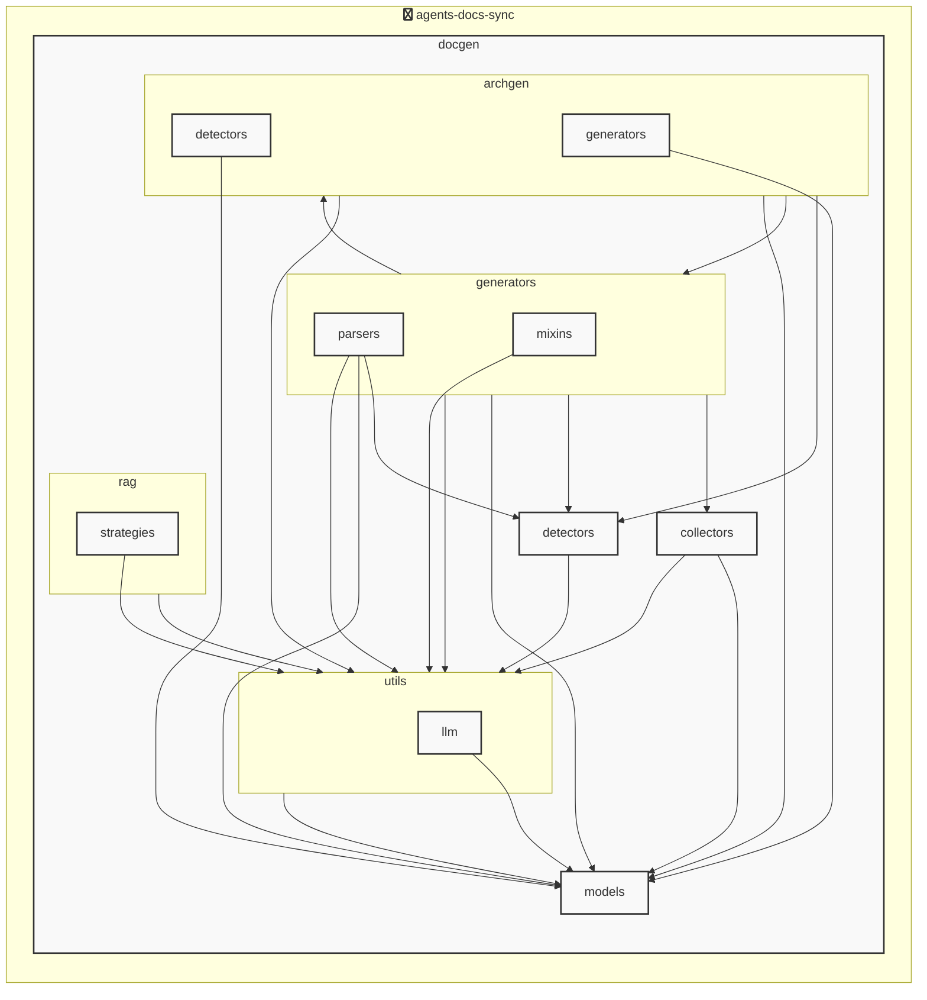

# AGENTS ドキュメント

自動生成日時: 2025-12-02 19:08:32

このドキュメントは、AIコーディングエージェントがプロジェクト内で効果的に作業するための指示とコンテキストを提供します。

---


<!-- MANUAL_START:description -->
<!-- MANUAL_END:description -->

agents-docs-sync は、コミットごとに自動的にテスト実行・ドキュメント生成・AGENTS.md の更新を行う CI/CD パイプラインです。  
Python で構築されており、シェルスクリプトも併用しているため、GitHub Actions や GitLab Runner といった任意の実行環境に簡単に組み込めます。

### アーキテクチャ
- **エントリポイント**  
  `agents_docs_sync` スクリプトは `docgen.docgen:main` を呼び出し、CLI のオプション解析からパイプライン実行を開始します。  
- **設定モデル** (`pydantic`)  
  - `ProjectOverview`: プロジェクト全体のメタ情報（名前・バージョン等）  
  - `AgentsConfigSection` / `AgentsGenerationConfig`: エージェント固有の構成と生成オプションを定義  
  - `AgentsDocument`: AGENTS.md に落ちるデータ構造。YAML/JSON ファイルから読み込み、バリデーション後にテンプレートへ渡します。  
- **テスト実行** (`pytest`)  
  コミット時に自動で全ユニット・統合テストを走らせ、カバレッジ結果は `coverage.xml` に保存されます。  
- **ドキュメント生成** (`jinja2`, `pydantic`)  
  設定モデルから構造化データを取得し、Jinja テンプレートで AGENTS.md を再作成します。テンプレートのカスタマイズはプロジェクトルートに `templates/` 配下へ配置するだけです。  
- **アーキテクチャ図自動生成** (`graphviz`, `hnswlib + sentence-transformers`)  
  ソースコード構造を解析し、モジュール間の依存関係を可視化します。このプロセスは LLM を一切使用せず、ローカルで高速に実行可能です。生成画像は `docs/architecture_diagram.png` に保存されます。  
- **フック管理** (`agents_docs_sync hook install`)  
  Git の pre‑commit フックを自動設定し、新しいコミットが作られるたびにパイプラインを走らせるよう構成します。

### 主な機能
| 機能 | 説明 |
|------|-----|
| **CI パイプライン** | コミット時に `pytest` でテスト実行、失敗した場合はビルド停止。成功なら次へ進む。 |
| **AGENTS.md 自動更新** | 設定ファイル（YAML/JSON）を読み込み、テンプレートエンジンでマークダウン生成。既存の `agents` セクションが差分のみ書き換えられます。 |
| **アーキテクチャ図自動化** | コードベースから依存関係グラフを抽出し、PNG 形式で保存。文脈情報は sentence‑transformers + hnswlib による埋め込み検索により補完されますが、LLM は使用せず高速です。 |
| **柔軟な設定** | `docs/CONFIG_GUIDE.md` を参照し、フックの有効化・無効化やテンプレートパス変更などを簡単に行えます。 |
| **依存性管理** | 必要ライブラリは pyproject.toml に明示されており、 `pip install -e .[dev]` で開発環境構築が可能です（anthropic, openai 等の外部 API キー設定もサポート）。 |

### 主な依存パッケージ
```
pydantic          # 設定とデータバリデーション
jinja2            # テンプレートエンジン
pytest / pytest-cov  # テスト実行・カバレッジ取得
httpx             # HTTP クライアント（API 呼び出し用）
openai, anthropic   # 必要に応じて LLM API キーで拡張可能
outlines          # 自動生成テンプレート補助 (LLM ベース)
sentence-transformers / hnswlib  # 埋め込み検索・類似度判定
torch             # ML モデル実行のバックエンド
ruff              # 静的コード解析
```

### 実行例（GitHub Actions）
```yaml
jobs:
  docs-sync:
    runs-on: ubuntu-latest
    steps:
      - uses: actions/checkout@v4
        with:
          fetch-depth: 0
      - name: Set up Python
        uses: actions/setup-python@v5
        with:
          python-version: '3.11'
      - run: pip install .[dev]
      - run: agents_docs_sync --run-all
```

このように、`agents-docs-sync` はコミットをトリガーとした自動テスト・ドキュメント生成パイプラインを提供し、プロジェクトの品質保証と情報共有を一元化します。
**使用技術**: python, shell


## プロジェクト構造
```
agents-docs-sync/
 ├─ docgen/
 │  ├─ archgen/
 │  │  ├─ detectors/
 │  │  │  └─ python_detector.py
 │  │  └─ generators/
 │  │     └─ mermaid_generator.py
 │  ├─ collectors/
 │  │  ├─ collector_utils.py
 │  │  └─ project_info_collector.py
 │  ├─ detectors/
 │  │  ├─ configs/
 │  │  │  ├─ go.toml
 │  │  │  ├─ javascript.toml
 │  │  │  ├─ python.toml
 │  │  │  └─ typescript.toml
 │  │  ├─ base_detector.py
 │  │  ├─ detector_patterns.py
 │  │  ├─ plugin_registry.py
 │  │  └─ unified_detector.py
 │  ├─ generators/
 │  │  ├─ mixins/
 │  │  │  ├─ llm_mixin.py
 │  │  │  ├─ markdown_mixin.py
 │  │  │  └─ template_mixin.py
 │  │  ├─ parsers/
 │  │  │  ├─ base_parser.py
 │  │  │  ├─ generic_parser.py
 │  │  │  ├─ js_parser.py
 │  │  │  └─ python_parser.py
 │  │  ├─ agents_generator.py
 │  │  ├─ api_generator.py
 │  │  ├─ base_generator.py
 │  │  ├─ contributing_generator.py
 │  │  └─ readme_generator.py
 │  ├─ hooks/
 │  │  ├─ tasks/
 │  │  │  └─ base.py
 │  │  ├─ config.py
 │  │  └─ orchestrator.py
 │  ├─ index/
 │  │  └─ meta.json
 │  ├─ models/
 │  │  ├─ agents.py
 │  │  ├─ config.py
 │  │  └─ detector.py
 │  ├─ prompts/
 │  │  ├─ agents_prompts.toml
 │  │  ├─ commit_message_prompts.toml
 │  │  └─ readme_prompts.toml
 │  ├─ rag/
 │  │  ├─ embedder.py
 │  │  ├─ indexer.py
 │  │  ├─ retriever.py
 │  │  └─ validator.py
 │  ├─ utils/
 │  │  ├─ llm/
 │  │  │  ├─ base.py
 │  │  │  └─ local_client.py
 │  │  ├─ cache.py
 │  │  ├─ exceptions.py
 │  │  ├─ file_utils.py
 │  │  └─ prompt_loader.py
 │  ├─ config.toml
 │  ├─ config_manager.py
 │  ├─ docgen.py
 │  └─ hooks.toml
 ├─ docs/
 ├─ scripts/
 ├─ tests/
 ├─ AGENTS.md
 ├─ README.md
 ├─ pyproject.toml
 ├─ requirements-docgen.txt
 └─ requirements-test.txt
```


## アーキテクチャ

<!-- MANUAL_START:architecture -->
<!-- MANUAL_END:architecture -->


## Services

### agents-docs-sync
- **Type**: python
- **Description**: コミットするごとにテスト実行・ドキュメント生成・AGENTS.md の自動更新を行うパイプライン
- **Dependencies**: anthropic, hnswlib, httpx, jinja2, openai, outlines, pydantic, pytest, pytest-cov, pytest-mock, pyyaml, ruff, sentence-transformers, torch


---

## 開発環境のセットアップ

<!-- MANUAL_START:setup -->
<!-- MANUAL_END:setup -->
### 前提条件

- Python 3.12以上


### 依存関係のインストール


#### Python依存関係

```bash

uv sync

```


### LLM環境のセットアップ


#### ローカルLLMを使用する場合

1. **ローカルLLMのインストール**

   - Ollamaをインストール: https://ollama.ai/
   - モデルをダウンロード: `ollama pull llama3`
   - サービスを起動: `ollama serve`

2. **ローカルLLM使用時の注意事項**
   - モデルが起動していることを確認してください
   - ローカルリソース（メモリ、CPU）を監視してください


---


## ビルドおよびテスト手順

### ビルド手順


```bash
uv sync
uv build
uv run python3 docgen/docgen.py
```


### テスト実行


```bash
uv run pytest tests/ -v --tb=short
```


### 利用可能なコマンド

プロジェクトで定義されているスクリプトコマンド:

| コマンド | 説明 |
| --- | --- |

| `agents_docs_sync` | 汎用ドキュメント自動生成システム |


#### `agents_docs_sync` のオプション

| オプション | 説明 |
| --- | --- |

| `--config` | 設定ファイルのパス |

| `--detect-only` | 言語検出のみ実行 |

| `--no-api-doc` | APIドキュメントを生成しない |

| `--no-readme` | READMEを更新しない |

| `--build-index` | RAGインデックスをビルド |

| `--use-rag` | RAGを使用してドキュメント生成 |

| `--generate-arch` | アーキテクチャ図を生成（Mermaid形式） |

| `hook_name` | フック名（指定しない場合は全て） |

| `hook_name` | フック名（指定しない場合は全て） |

| `hook_name` | 実行するフック名 |

| `hook_args` | フック引数 |

| `--force` | 既存ファイルを強制上書き |


---

## コーディング規約

<!-- MANUAL_START:other -->
<!-- MANUAL_END:other -->


### リンター

- **ruff** を使用

  ```bash
  ruff check .
  ruff format .
  ```


---

## プルリクエストの手順

<!-- MANUAL_START:pr -->
<!-- MANUAL_END:pr -->
1. **ブランチの作成**
   ```bash
   git checkout -b feature/your-feature-name
   ```

2. **変更のコミット**
   - コミットメッセージは明確で説明的に
   - 関連するIssue番号を含める

3. **テストの実行**
   ```bash
   
   
   uv run pytest tests/ -v --tb=short
   
   
   ```

4. **プルリクエストの作成**
   - タイトル: `[種類] 簡潔な説明`
   - 説明: 変更内容、テスト結果、関連Issueを記載


---

*このAGENTS.mdは自動生成されています。最終更新: 2025-12-02 19:08:32*