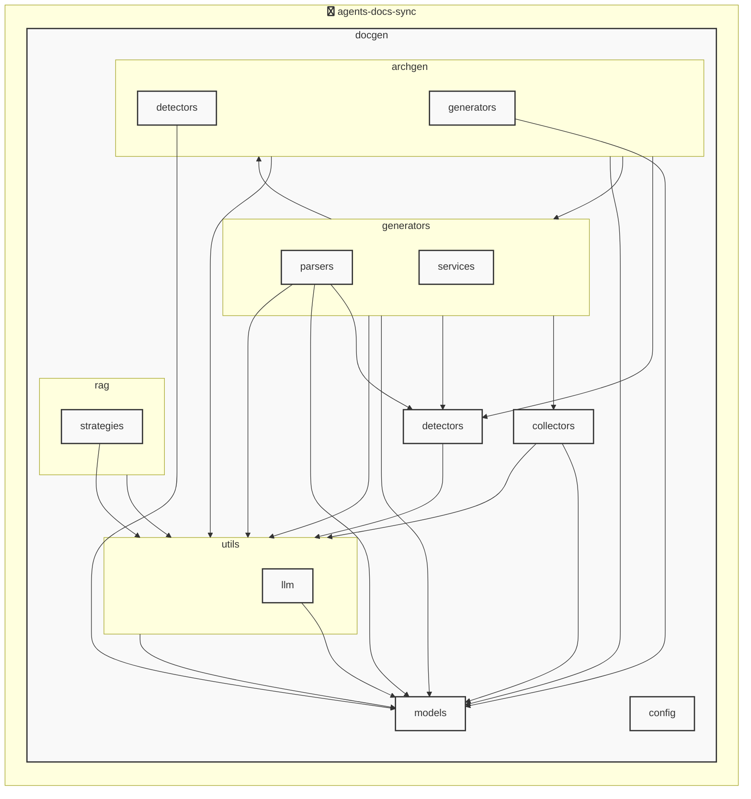

# AGENTS ドキュメント

自動生成日時: 2025-12-05 12:31:22

このドキュメントは、AIコーディングエージェントがプロジェクト内で効果的に作業するための指示とコンテキストを提供します。

---


<!-- MANUAL_START:description -->

<!-- MANUAL_END:description -->


The **agents-docs-sync** project is a continuous‑integration style pipeline that keeps three key artifacts in sync whenever new code is committed:

1. **Unit tests and coverage reports** – All Python modules are executed under `pytest`, with optional mocking via `pytest-mock`. Coverage statistics are collected through `pytest-cov` to ensure the test suite continues to exercise all agent behaviours.
2. **Project documentation** – A lightweight static‑site generator (e.g., MkDocs or pdoc) is run against the source tree, producing Markdown/HTML files that expose API usage and example snippets for each AI agent defined in the repository.
3. **AGENTS.md** – This file serves as a machine‑readable catalog of all available agents. The pipeline scans every module for classes decorated with `@agent` (or another agreed pattern), extracts their docstrings, signatures, and any metadata stored in YAML front matter via `pyyaml`, then rewrites AGENTS.md so that downstream tools or chat‑based assistants can query the current list of capabilities without manual edits.

### Trigger & Execution

- **Trigger**: The pipeline is invoked automatically on every commit to the main branch (via GitHub Actions, GitLab CI/CD, or a local `pre-push` hook).  
- **Execution order**:
  1. Install dependencies using `uv pip install -r requirements.txt`.  
  2. Run tests with coverage: `pytest --cov=agents --cov-report xml`.  
  3. Build docs: e.g., `mkdocs build` or `pdoc --html agents/`.  
  4. Regenerate AGENTS.md by running a small Python script (`scripts/generate_agents_md.py`) that parses the source tree.

### Technology Stack

| Component | Purpose |
|-----------|---------|
| **Python** | Core language for agent logic, tests, and pipeline scripts. |
| **Shell** | Wrapper scripts to orchestrate `uv`, documentation tools, and git commands. |
| **`uv` (package manager)** | Fast dependency resolution and isolation; used to install the exact versions listed in `pyproject.toml`. |
| **PyYAML (`>=6.0.3`)** | Parses YAML front‑matter or configuration files embedded within agent modules for metadata extraction. |
| **pytest (`>=7.4.0`), pytest-cov (`>=4.1.0`), pytest-mock (`>=3.11.1`)** | Provides a robust testing ecosystem, coverage measurement, and mocking utilities to simulate external services during tests. |

### Why It Matters for AI Agents

- **Up‑to‑date documentation** ensures that an assistant can read the latest API surface without manual intervention.
- **Automated AGENTS.md** gives agents a reliable source of truth about which behaviours exist in the codebase, supporting features like auto‑completion, intent matching, or dynamic import resolution.
- **Continuous testing and coverage guarantees** reduce regressions when new agent logic is added, allowing AI assistants to rely on stable implementations.

By keeping tests, docs, and the agents catalog automatically aligned with every commit, this pipeline eliminates a common source of friction for developers and ensures that any downstream tooling—whether an IDE extension or a conversational UI—has accurate, current information about all available agents.
**使用技術**: python, shell
## プロジェクト構造
```
├── docgen//
│   ├── archgen//
│   │   ├── detectors//
│   │   │   └── python_detector.py
│   │   └── generators//
│   │       └── mermaid_generator.py
│   ├── collectors//
│   │   ├── collector_utils.py
│   │   ├── command_help_extractor.py
│   │   └── project_info_collector.py
│   ├── config//
│   │   └── config_accessor.py
│   ├── detectors//
│   │   ├── configs//
│   │   │   ├── go.toml
│   │   │   ├── javascript.toml
│   │   │   ├── python.toml
│   │   │   └── typescript.toml
│   │   ├── base_detector.py
│   │   ├── detector_patterns.py
│   │   ├── plugin_registry.py
│   │   └── unified_detector.py
│   ├── generators//
│   │   ├── parsers//
│   │   │   ├── base_parser.py
│   │   │   ├── generic_parser.py
│   │   │   ├── js_parser.py
│   │   │   └── python_parser.py
│   │   ├── services//
│   │   │   ├── formatting_service.py
│   │   │   ├── llm_service.py
│   │   │   └── template_service.py
│   │   ├── agents_generator.py
│   │   ├── api_generator.py
│   │   ├── base_generator.py
│   │   ├── contributing_generator.py
│   │   ├── readme_generator.py
│   │   └── service_factory.py
│   ├── hooks//
│   │   ├── tasks//
│   │   │   └── base.py
│   │   ├── config.py
│   │   └── orchestrator.py
│   ├── index//
│   │   └── meta.json
│   ├── models//
│   │   ├── agents.py
│   │   ├── config.py
│   │   └── detector.py
│   ├── prompts//
│   │   ├── agents_prompts.toml
│   │   ├── commit_message_prompts.toml
│   │   └── readme_prompts.toml
│   ├── rag//
│   │   ├── embedder.py
│   │   ├── indexer.py
│   │   ├── retriever.py
│   │   └── validator.py
│   ├── utils//
│   │   ├── llm//
│   │   │   ├── base.py
│   │   │   └── local_client.py
│   │   ├── cache.py
│   │   ├── exceptions.py
│   │   ├── file_utils.py
│   │   └── prompt_loader.py
│   ├── cli_handlers.py
│   ├── config.toml
│   ├── config_manager.py
│   ├── detector_config_loader.py
│   ├── docgen.py
│   ├── document_generator.py
│   └── hooks.toml
├── docs/
├── scripts/
├── tests/
├── AGENTS.md
├── README.md
├── pyproject.toml
├── requirements-docgen.txt
└── requirements-test.txt
```
## アーキテクチャ

<!-- MANUAL_START:architecture -->

<!-- MANUAL_END:architecture -->


## Services

### agents-docs-sync
- **Type**: python
- **Description**: コミットするごとにテスト実行・ドキュメント生成・AGENTS.md の自動更新を行うパイプライン
- **Dependencies**: anthropic, hnswlib, httpx, jinja2, openai, outlines, pydantic, pytest, pytest-cov, pytest-mock, pyyaml, ruff, sentence-transformers, torch

---

## 開発環境のセットアップ

<!-- MANUAL_START:setup -->

<!-- MANUAL_END:setup -->
### 前提条件

- Python 3.12以上

### 依存関係のインストール
#### Python依存関係

```bash
uv sync
```

### LLM環境のセットアップ
#### ローカルLLMを使用する場合

1. **ローカルLLMのインストール**

   - Ollamaをインストール: https://ollama.ai/
   - モデルをダウンロード: `ollama pull llama3`
   - サービスを起動: `ollama serve`

2. **ローカルLLM使用時の注意事項**
   - モデルが起動していることを確認してください
   - ローカルリソース（メモリ、CPU）を監視してください

---


## ビルドおよびテスト手順

### ビルド手順
```bash
uv sync
uv build
uv run python3 docgen/docgen.py
```

### テスト実行
```bash
bash scripts/run_tests.sh
uv run pytest tests/ -v --tb=short
```
## コマンド

プロジェクトで利用可能なスクリプト:

| コマンド | 説明 |
| --- | --- |
| `agents_docs_sync` | 汎用ドキュメント自動生成システム |

### `agents_docs_sync` のオプション

| オプション | 説明 |
| --- | --- |
| `--config` | 設定ファイルのパス |
| `--detect-only` | 言語検出のみ実行 |
| `--no-api-doc` | APIドキュメントを生成しない |
| `--no-readme` | READMEを更新しない |
| `--build-index` | RAGインデックスをビルド |
| `--use-rag` | RAGを使用してドキュメント生成 |
| `--generate-arch` | アーキテクチャ図を生成（Mermaid形式） |

### `agents_docs_sync` のサブコマンド

| サブコマンド | 説明 |
| --- | --- |
| `agents_docs_sync commit-msg` | コミットメッセージ生成 |
| `agents_docs_sync hooks` | Git hooksの管理 |
| `agents_docs_sync init` | プロジェクトの初期化（必須ファイルを作成） |

#### `agents_docs_sync hooks` のサブコマンド

| サブコマンド | 説明 |
| --- | --- |
| `agents_docs_sync hooks list` | 利用可能なフックを表示 |
| `agents_docs_sync hooks enable` | フックを有効化 |
| `agents_docs_sync hooks disable` | フックを無効化 |
| `agents_docs_sync hooks run` | フックを手動実行 |
| `agents_docs_sync hooks validate` | フック設定を検証 |

##### `agents_docs_sync hooks enable` のオプション

| オプション | 説明 |
| --- | --- |
| `hook_name` | フック名（指定しない場合は全て） |

##### `agents_docs_sync hooks disable` のオプション

| オプション | 説明 |
| --- | --- |
| `hook_name` | フック名（指定しない場合は全て） |

##### `agents_docs_sync hooks run` のオプション

| オプション | 説明 |
| --- | --- |
| `hook_name` | 実行するフック名 |
| `hook_args` | フック引数 |

#### `agents_docs_sync init` のオプション

| オプション | 説明 |
| --- | --- |
| `--force` | 既存ファイルを強制上書き |
---

## コーディング規約

<!-- MANUAL_START:other -->

<!-- MANUAL_END:other -->
### リンター

- **ruff** を使用
  ```bash
  ruff check .
  ruff format .
  ```

---

## プルリクエストの手順

<!-- MANUAL_START:pr -->

<!-- MANUAL_END:pr -->
1. **ブランチの作成**
   ```bash
   git checkout -b feature/your-feature-name
   ```

2. **変更のコミット**
   - コミットメッセージは明確で説明的に
   - 関連するIssue番号を含める

3. **テストの実行**
   ```bash
   bash scripts/run_tests.sh
   uv run pytest tests/ -v --tb=short
   ```

4. **プルリクエストの作成**
   - タイトル: `[種類] 簡潔な説明`
   - 説明: 変更内容、テスト結果、関連Issueを記載

---

*このAGENTS.mdは自動生成されています。最終更新: 2025-12-05 12:31:22*