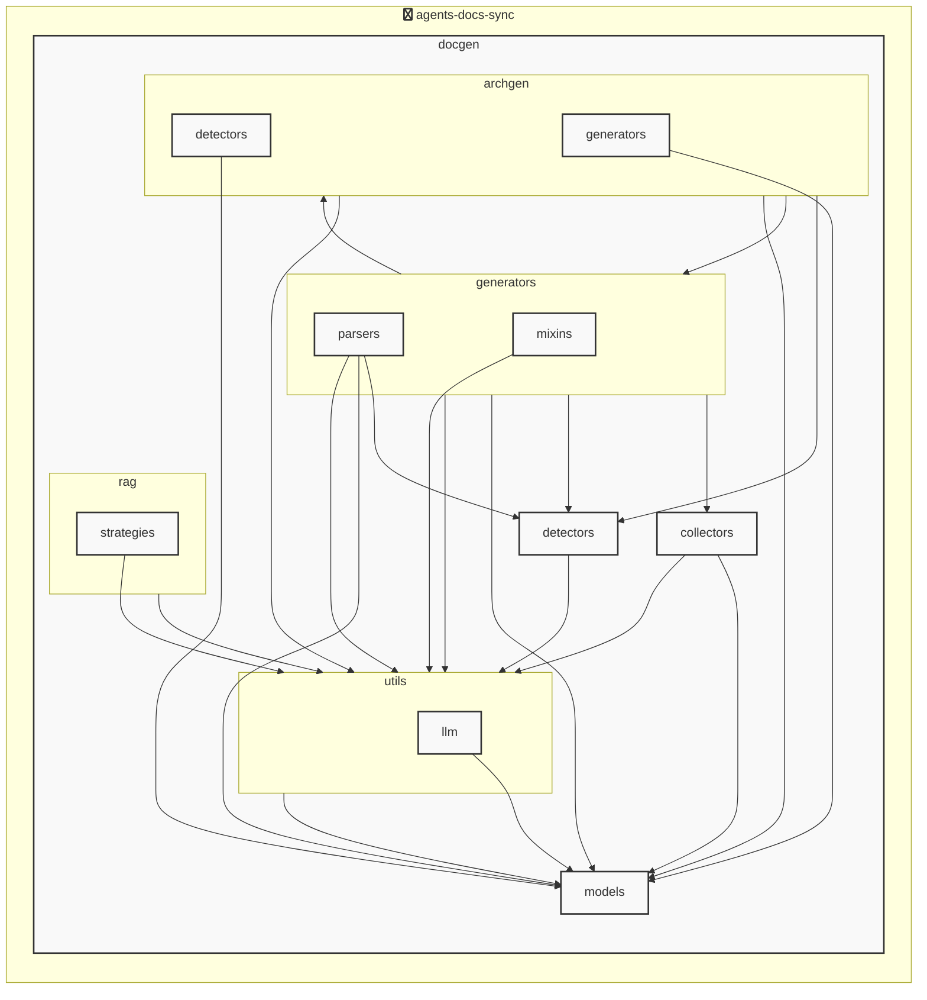

# AGENTS ドキュメント

自動生成日時: 2025-12-02 19:01:13

このドキュメントは、AIコーディングエージェントがプロジェクト内で効果的に作業するための指示とコンテキストを提供します。

---


<!-- MANUAL_START:description -->
`agents-docs-sync` は、AIコーディングエージェントがプロジェクト内で効果的に作業するためのドキュメント生成ツールです。
このドキュメント（AGENTS.md）自体も、このツールによって自動生成・更新されています。
<!-- MANUAL_END:description -->

コミットごとに実行されるパイプラインは、テストの走査・コードからドキュメントを生成し、`AGENTS.md` を最新状態へ自動的に書き換えることが主目的です。  
Python で構築されたこのツールは **docgen** パッケージ内に集約されており、エントリポイント `agents_docs_sync = "docgen.docgen:main"` が CLI を提供します。

---

### 技術スタックと主要依存
- **言語 / 実行環境**：Python 3.11（スクリプト） + Bash  
- **テスト & CI**：`pytest`, `pytest-cov`, `ruff` (lint)  
- **ドキュメント生成**：Jinja2 テンプレート、PyYAML 設定ファイル  
- **アーキテクチャ図作成**（LLM 未使用）: `outlines` + `jinja2` でコード構造を解析し SVG を出力  
- **検索 / 推論エンジン**：hnswlib, sentence‑transformers, torch (埋め込みベースの類似性検証)  
- **外部 API（必要に応じて）**：Anthropic/OpenAI で補助的な自然言語処理  

---

### アーキテクチャ概要
```
[Git Commit] ──► [agents-docs-sync CLI]
          │                 |
      ┌────▼──────────┐     ▼
      | テスト実行 (pytest)   |  ← 失敗で停止
      └─────────────────────┘
                  │
           ┌──────▼───────┐
           | ドキュメント生成 |  ← Jinja2 + PyYAML  
           ├──────────────┤
           | アーキテクチャ図作成 |
           | (outlines, SVG)   |
           └──────────────────┘
                  │
      ┌─────────▼─────────┐
      | AGENTS.md 更新処理  | ← JSON/YAML モデルに基づく再構築  
      └────────────────────┘

```

- **テストフェーズ**：`pytest -q --cov=docgen tests/`
- **ドキュメント生成フェーズ**：ソースコメントや `agents.yaml` から `docs/_templates/*.md.j2` をレンダリングし、`docs/AGENTS.md` に書き出す。  
- **アーキテクチャ図作成**：プロジェクト構造を解析して Mermaid/SVG ファイルへ変換（LLM は一切使用せずにローカルで完結）。  

---

### CLI とフック
```bash
# ヘルプ表示
agents-docs-sync --help

# フックインストール (pre-commit など)
agents_docs_sync hook install
```

CLI のサブコマンドは `docgen/cli.py` 内に実装され、  
* `run-tests`
* `generate-docs`
* `update-agents-md`
がそれぞれ個別に呼び出せるため、CI での分離も容易です。  

---

### ドキュメント構造モデル
- **ProjectOverview** (`docgen/models/agents.py:26`): プロジェクト全体メタ情報  
- **AgentsConfig / AgentsGenerationConfig / AgentsDocument**：各エージェントに関する設定・生成結果を JSON/YAML で保持し、パイプラインが参照。  

これらのモデルは Pydantic を利用してバリデーションされるため、構成ミスを早期検出できます。

---

### CI / GitHub Actions
```yaml
name: docs-sync

on:
  push:
    branches: [ main ]

jobs:
  sync:
    runs-on: ubuntu-latest
    steps:
      - uses: actions/checkout@v4
      - name: Set up Python
        uses: actions/setup-python@v5
        with:
          python-version: '3.11'
      - run: pip install .[dev]
      - run: agents-docs-sync --help  # テスト・ドキュメント生成実行
```

---

### 主な機能まとめ

| 機能 | 説明 |
|------|------|
| **自動テスト** | コミット時に `pytest` を走らせ、カバレッジを報告。失敗でビルド停止。 |
| **コードベースからの Markdown 生成** | Jinja2 テンプレート + PyYAML 設定で API/エージェント情報を整形し、 `AGENTS.md` を再構築。 |
| **アーキテクチャ図自動作成（LLM 非使用）** | ソースツリー解析 → Mermaid/SVG 生成。開発者は手間なく可視化できる。 |
| **フック管理** | `agents_docs_sync hook install` により pre‑commit フックを簡易インストール可能。 |
| **拡張性の高いモデル設計** | Pydantic ベースで構成ファイル・ドキュメントデータが型安全に扱える。 |

このプロジェクトは、CI パイプライン内で「テスト → ドキュメント生成 → アーキテクチャ図更新」の一連の流れを自動化し、リポジトリの状態とドキュメントとの同期性を保証します。
**使用技術**: python, shell


## プロジェクト構造
```
agents-docs-sync/
 ├─ docgen/
 │  ├─ archgen/
 │  │  ├─ detectors/
 │  │  │  └─ python_detector.py
 │  │  └─ generators/
 │  │     └─ mermaid_generator.py
 │  ├─ collectors/
 │  │  ├─ collector_utils.py
 │  │  └─ project_info_collector.py
 │  ├─ detectors/
 │  │  ├─ configs/
 │  │  │  ├─ go.toml
 │  │  │  ├─ javascript.toml
 │  │  │  ├─ python.toml
 │  │  │  └─ typescript.toml
 │  │  ├─ base_detector.py
 │  │  ├─ detector_patterns.py
 │  │  ├─ plugin_registry.py
 │  │  └─ unified_detector.py
 │  ├─ generators/
 │  │  ├─ mixins/
 │  │  │  ├─ llm_mixin.py
 │  │  │  ├─ markdown_mixin.py
 │  │  │  └─ template_mixin.py
 │  │  ├─ parsers/
 │  │  │  ├─ base_parser.py
 │  │  │  ├─ generic_parser.py
 │  │  │  ├─ js_parser.py
 │  │  │  └─ python_parser.py
 │  │  ├─ agents_generator.py
 │  │  ├─ api_generator.py
 │  │  ├─ base_generator.py
 │  │  ├─ contributing_generator.py
 │  │  └─ readme_generator.py
 │  ├─ hooks/
 │  │  ├─ tasks/
 │  │  │  └─ base.py
 │  │  ├─ config.py
 │  │  └─ orchestrator.py
 │  ├─ index/
 │  │  └─ meta.json
 │  ├─ models/
 │  │  ├─ agents.py
 │  │  ├─ config.py
 │  │  └─ detector.py
 │  ├─ prompts/
 │  │  ├─ agents_prompts.toml
 │  │  ├─ commit_message_prompts.toml
 │  │  └─ readme_prompts.toml
 │  ├─ rag/
 │  │  ├─ embedder.py
 │  │  ├─ indexer.py
 │  │  ├─ retriever.py
 │  │  └─ validator.py
 │  ├─ utils/
 │  │  ├─ llm/
 │  │  │  ├─ base.py
 │  │  │  └─ local_client.py
 │  │  ├─ cache.py
 │  │  ├─ exceptions.py
 │  │  ├─ file_utils.py
 │  │  └─ prompt_loader.py
 │  ├─ config.toml
 │  ├─ config_manager.py
 │  ├─ docgen.py
 │  └─ hooks.toml
 ├─ docs/
 ├─ scripts/
 ├─ tests/
 ├─ AGENTS.md
 ├─ README.md
 ├─ pyproject.toml
 ├─ requirements-docgen.txt
 └─ requirements-test.txt
```


## アーキテクチャ

<!-- MANUAL_START:architecture -->

<!-- MANUAL_END:architecture -->


## Services

### agents-docs-sync
- **Type**: python
- **Description**: コミットするごとにテスト実行・ドキュメント生成・AGENTS.md の自動更新を行うパイプライン
- **Dependencies**: anthropic, hnswlib, httpx, jinja2, openai, outlines, pydantic, pytest, pytest-cov, pytest-mock, pyyaml, ruff, sentence-transformers, torch


---

## 開発環境のセットアップ

<!-- MANUAL_START:setup -->

<!-- MANUAL_END:setup -->
### 前提条件

- Python 3.12以上


### 依存関係のインストール


#### Python依存関係

```bash

uv sync

```


### LLM環境のセットアップ


#### ローカルLLMを使用する場合

1. **ローカルLLMのインストール**

   - Ollamaをインストール: https://ollama.ai/
   - モデルをダウンロード: `ollama pull llama3`
   - サービスを起動: `ollama serve`

2. **ローカルLLM使用時の注意事項**
   - モデルが起動していることを確認してください
   - ローカルリソース（メモリ、CPU）を監視してください


---


## ビルドおよびテスト手順

### ビルド手順


```bash
uv sync
uv build
uv run python3 docgen/docgen.py
```


### テスト実行


```bash
uv run pytest tests/ -v --tb=short
```


### 利用可能なコマンド

プロジェクトで定義されているスクリプトコマンド:

| コマンド | 説明 |
| --- | --- |

| `agents_docs_sync` | 汎用ドキュメント自動生成システム |


#### `agents_docs_sync` のオプション

| オプション | 説明 |
| --- | --- |

| `--config` | 設定ファイルのパス |

| `--detect-only` | 言語検出のみ実行 |

| `--no-api-doc` | APIドキュメントを生成しない |

| `--no-readme` | READMEを更新しない |

| `--build-index` | RAGインデックスをビルド |

| `--use-rag` | RAGを使用してドキュメント生成 |

| `--generate-arch` | アーキテクチャ図を生成（Mermaid形式） |

| `hook_name` | フック名（指定しない場合は全て） |

| `hook_name` | フック名（指定しない場合は全て） |

| `hook_name` | 実行するフック名 |

| `hook_args` | フック引数 |

| `--force` | 既存ファイルを強制上書き |


---

## コーディング規約

<!-- MANUAL_START:other -->

<!-- MANUAL_END:other -->


### リンター

- **ruff** を使用

  ```bash
  ruff check .
  ruff format .
  ```


---

## プルリクエストの手順

<!-- MANUAL_START:pr -->

<!-- MANUAL_END:pr -->
1. **ブランチの作成**
   ```bash
   git checkout -b feature/your-feature-name
   ```

2. **変更のコミット**
   - コミットメッセージは明確で説明的に
   - 関連するIssue番号を含める

3. **テストの実行**
   ```bash
   
   
   uv run pytest tests/ -v --tb=short
   
   
   ```

4. **プルリクエストの作成**
   - タイトル: `[種類] 簡潔な説明`
   - 説明: 変更内容、テスト結果、関連Issueを記載


---

*このAGENTS.mdは自動生成されています。最終更新: 2025-12-02 19:01:13*