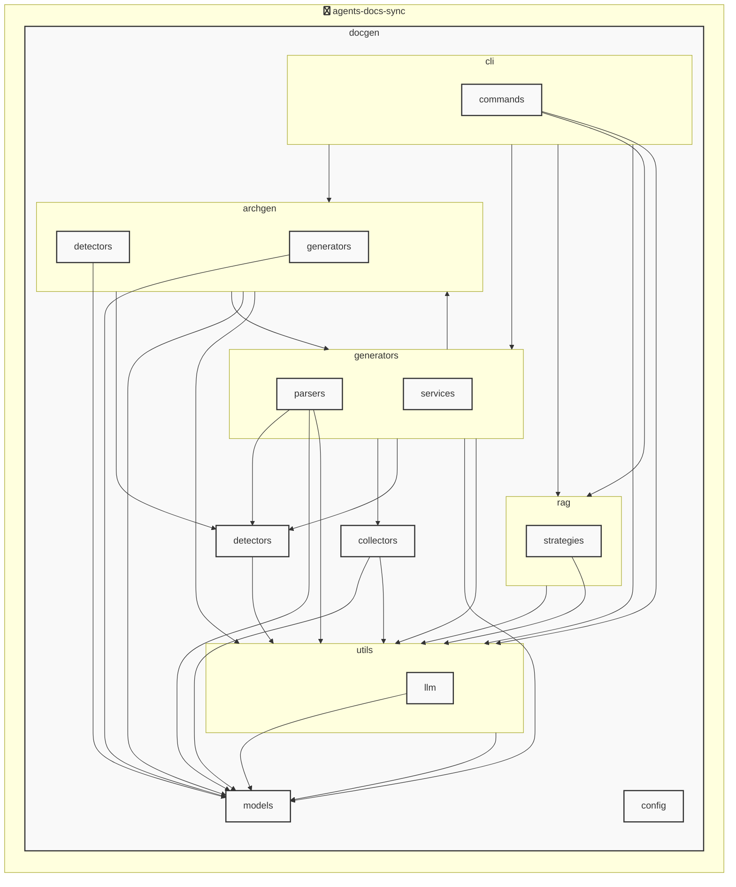

# AGENTS ドキュメント

自動生成日時: 2025-12-12 00:20:12

このドキュメントは、AIコーディングエージェントがプロジェクト内で効果的に作業するための指示とコンテキストを提供します。

---


<!-- MANUAL_START:description -->

<!-- MANUAL_END:description -->


`agents‑docs‐sync` は、コミットごとに自動でテストを実行し、ドキュメント（Sphinx/ MkDocs など）を生成して `AGENTS.md` を更新する CI/CD パイプラインです。  
Python とシェルスクリプトだけで構成されているため、既存のプロジェクトに簡単に組み込むことができます。

### 主な機能
- **テスト実行** – `pytest`（pyproject.toml では uv を使用）を使ってユニット・統合テストを走らせます。  
- **カバレッジ計測** – `pytest‑cov` によりコードの網羅率が自動で報告され、品質保証に役立ちます。  
- **ドキュメント生成** – Sphinx など既存のビルダーを呼び出し、最新 API ドキュメントや使用例を書き込みます。  
- **AGENTS.md の更新** – `pyyaml` を利用してエージェント定義（name, description, inputs/outputs 等）を読み取り、マークダウンに整形します。

### 使い方
```bash
# 依存関係のインストール (uv が必要)
pip install uv
uv sync

# 手動でパイプライン実行
./scripts/run_pipeline.sh
```
GitHub Actions 等を設定すれば、`push` 時に自動的にこのスクリプトが走ります。

### カスタマイズポイント
- **ドキュメントビルダー** – `docs/Makefile` などのターゲット名を変更して任意のツールへ切り替え可。  
- **AGENTS.md のフォーマット** – Jinja テンプレートでレイアウトやフィールド追加が可能です。  
- **環境変数** – `DOCS_OUTPUT_DIR`, `PYTEST_ARGS` などを設定してビルドの挙動を細かく制御できます。

このプロジェクトは、エージェントライブラリを継続的に整合性・可読性と共に保守したい開発者向けに設計されており、CI 環境で一括実行することで手動更新の負担を大幅に軽減します。
**使用技術**: python, shell
## プロジェクト構造
```
├── docgen//
│   ├── archgen//
│   │   ├── detectors//
│   │   │   └── python_detector.py
│   │   └── generators//
│   │       └── mermaid_generator.py
│   ├── cli//
│   │   ├── commands//
│   │   │   └── hooks.py
│   │   └── runner.py
│   ├── collectors//
│   │   ├── collector_utils.py
│   │   ├── command_help_extractor.py
│   │   └── project_info_collector.py
│   ├── config//
│   │   └── config_accessor.py
│   ├── detectors//
│   │   ├── configs//
│   │   │   ├── go.toml
│   │   │   ├── javascript.toml
│   │   │   ├── python.toml
│   │   │   └── typescript.toml
│   │   ├── base_detector.py
│   │   ├── detector_patterns.py
│   │   ├── plugin_registry.py
│   │   └── unified_detector.py
│   ├── generators//
│   │   ├── parsers//
│   │   │   ├── base_parser.py
│   │   │   ├── generic_parser.py
│   │   │   ├── js_parser.py
│   │   │   └── python_parser.py
│   │   ├── services//
│   │   │   ├── formatting_service.py
│   │   │   ├── llm_service.py
│   │   │   └── template_service.py
│   │   ├── agents_generator.py
│   │   ├── api_generator.py
│   │   ├── base_generator.py
│   │   ├── contributing_generator.py
│   │   ├── readme_generator.py
│   │   └── service_factory.py
│   ├── hooks//
│   │   ├── tasks//
│   │   │   └── base.py
│   │   ├── config.py
│   │   └── orchestrator.py
│   ├── index//
│   │   └── meta.json
│   ├── models//
│   │   ├── agents.py
│   │   ├── config.py
│   │   └── detector.py
│   ├── prompts//
│   │   ├── agents_prompts.toml
│   │   ├── commit_message_prompts.toml
│   │   └── readme_prompts.toml
│   ├── rag//
│   │   ├── embedder.py
│   │   ├── indexer.py
│   │   ├── retriever.py
│   │   └── validator.py
│   ├── utils//
│   │   ├── llm//
│   │   │   ├── base.py
│   │   │   └── local_client.py
│   │   ├── cache.py
│   │   ├── exceptions.py
│   │   ├── file_utils.py
│   │   └── prompt_loader.py
│   ├── config.toml
│   ├── config_manager.py
│   ├── detector_config_loader.py
│   ├── docgen.py
│   ├── document_generator.py
│   └── hooks.toml
├── docs/
├── scripts/
├── tests/
├── AGENTS.md
├── README.md
├── pyproject.toml
├── requirements-docgen.txt
└── requirements-test.txt
```
## アーキテクチャ

<!-- MANUAL_START:architecture -->

<!-- MANUAL_END:architecture -->


## Services

### agents-docs-sync
- **Type**: python
- **Description**: コミットするごとにテスト実行・ドキュメント生成・AGENTS.md の自動更新を行うパイプライン
- **Dependencies**: anthropic, hnswlib, httpx, jinja2, openai, outlines, pip-licenses, pydantic, pytest, pytest-cov, pytest-mock, pyyaml, ruff, sentence-transformers, torch

---

## 開発環境のセットアップ

<!-- MANUAL_START:setup -->

<!-- MANUAL_END:setup -->
### 前提条件

- Python 3.12以上

### 依存関係のインストール
#### Python依存関係

```bash
uv sync
```

### LLM環境のセットアップ
#### ローカルLLMを使用する場合

1. **ローカルLLMのインストール**

   - Ollamaをインストール: https://ollama.ai/
   - モデルをダウンロード: `ollama pull llama3`
   - サービスを起動: `ollama serve`

2. **ローカルLLM使用時の注意事項**
   - モデルが起動していることを確認してください
   - ローカルリソース（メモリ、CPU）を監視してください

---


## ビルドおよびテスト手順

### ビルド手順
```bash
uv sync
uv build
uv run python3 docgen/docgen.py
```

### テスト実行
```bash
bash scripts/run_tests.sh
uv run pytest tests/ -v --tb=short
```
## コマンド

プロジェクトで利用可能なスクリプト:

| コマンド | 説明 |
| --- | --- |
| `agents_docs_sync` | docgen.docgen:main |

### `agents_docs_sync` のオプション

| オプション | 説明 |
| --- | --- |
| `--config` | 設定ファイルのパス |
| `--quiet` | 詳細メッセージを抑制 |
| `--detect-only` | 言語検出のみ実行 |
| `--no-api-doc` | APIドキュメントを生成しない |
| `--no-readme` | READMEを更新しない |
| `--build-index` | RAGインデックスをビルド |
| `--use-rag` | RAGを使用してドキュメント生成 |
| `--generate-arch` | アーキテクチャ図を生成（Mermaid形式） |

### `agents_docs_sync` のサブコマンド

| サブコマンド | 説明 |
| --- | --- |
| `agents_docs_sync init` | プロジェクトの初期化（必須ファイルを作成） |
| `agents_docs_sync commit-msg` | コミットメッセージ生成 |
| `agents_docs_sync hooks` | Git hooksの管理 |

#### `agents_docs_sync init` のオプション

| オプション | 説明 |
| --- | --- |
| `--force` | 既存ファイルを強制上書き |

#### `agents_docs_sync hooks` のサブコマンド

| サブコマンド | 説明 |
| --- | --- |
| `agents_docs_sync hooks list` | 利用可能なフックを表示 |
| `agents_docs_sync hooks enable` | フックを有効化 |
| `agents_docs_sync hooks disable` | フックを無効化 |
| `agents_docs_sync hooks run` | フックを手動実行 |
| `agents_docs_sync hooks validate` | フック設定を検証 |
---

## コーディング規約

<!-- MANUAL_START:other -->

<!-- MANUAL_END:other -->
### リンター

- **ruff** を使用
  ```bash
  ruff check .
  ruff format .
  ```

---

## プルリクエストの手順

<!-- MANUAL_START:pr -->

<!-- MANUAL_END:pr -->
1. **ブランチの作成**
   ```bash
   git checkout -b feature/your-feature-name
   ```

2. **変更のコミット**
   - コミットメッセージは明確で説明的に
   - 関連するIssue番号を含める

3. **テストの実行**
   ```bash
   bash scripts/run_tests.sh
   uv run pytest tests/ -v --tb=short
   ```

4. **プルリクエストの作成**
   - タイトル: `[種類] 簡潔な説明`
   - 説明: 変更内容、テスト結果、関連Issueを記載

---

*このAGENTS.mdは自動生成されています。最終更新: 2025-12-12 00:20:12*