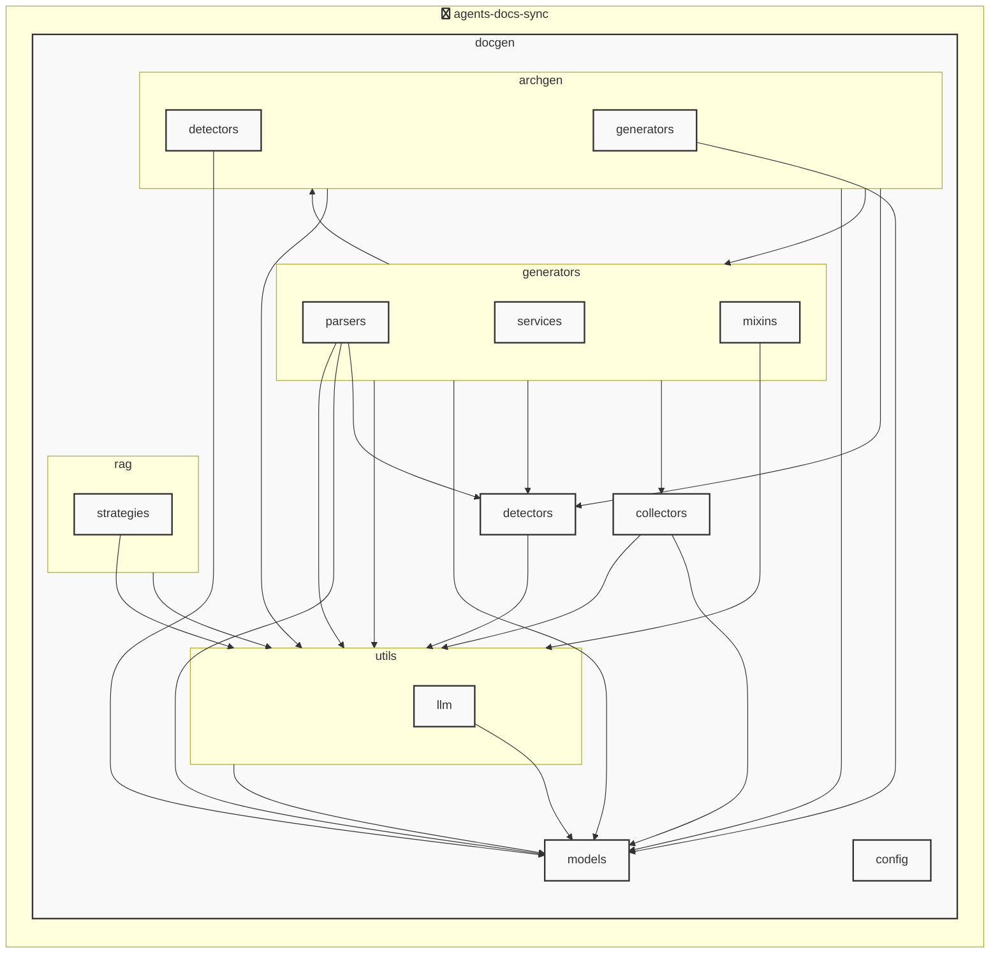

# AGENTS ドキュメント

自動生成日時: 2025-12-04 14:10:09

このドキュメントは、AIコーディングエージェントがプロジェクト内で効果的に作業するための指示とコンテキストを提供します。

---


<!-- MANUAL_START:description -->

<!-- MANUAL_END:description -->


コミットごとに自動で実行される CI パイプラインを提供します。  
パイプラインは 3 本の主要タスクから構成されています。

- **テスト・品質検証** – `pytest` と `ruff` を使い、単体テスト（カバレッジ計測付き）とコード静的解析を実行。失敗時にはビルドが中断されます。
- **ドキュメント生成** – Jinja2 テンプレートに `pydantic` で定義されたモデル (`ProjectOverview`, `AgentsConfig`, `AgentsGenerationConfig`, `AgentsDocument`) を埋め込み、Markdown と API ドキュメントを自動作成。  
- **AGENTS.md 自動更新** – コードベースからエージェント構造を抽出し（`docgen/models/agents.py` に定義されたデータモデルに従い）、`outlines` を利用して統一フォーマットの `AGENTS.md` を再生成します。

### 技術スタック
- **言語**：Python 3.11、Bash  
- **依存ライブラリ**（主要）  
  - `anthropic`, `openai`: LLM 呼び出しサポート（必要に応じて拡張可能）。  
  - `hnswlib`, `sentence-transformers`, `torch`: ベクトル検索・埋め込み生成。  
  - `httpx`: HTTP クライアントとして API コールを実装。  
  - `jinja2`：テンプレートエンジン。  
  - `outlines`：自然言語から構造化データへの変換に使用。  
  - `pydantic`：設定ファイルとドキュメントモデルのバリデーション。  
  - `pytest`, `pytest-cov`: テストフレームワーク・カバレッジ計測。  
  - `ruff`: リント＆フォーマットツール。

### アーキテクチャ（高水準）
```
┌───────────────────────┐
│ GitHub Actions / CI    │ ← コミットイベントトリガー
├─────────────▲───────────┤
│             │           ▼
│   ──────┬─────┴──────┐  └───────┬────────────────┘
│         │            │          │
│    テスト実行       ドキュメント生成      AGENTS.md 更新
│ (pytest, ruff)     (jinja2 + outlines)
├─────────────▼───────────┤
│  ビルド結果／レポート   └─────────────────────┘
```

- **CLI**：`agents_docs_sync --help` がエントリーポイント。  
  `pyproject.toml` の `[project.scripts]` により、インストール後はシステム全体でコマンドとして利用可能。

### 主な機能詳細

| 機能 | 実装ポイント | ユーザーへのメリット |
|------|---------------|------------------------|
| **自動テスト・品質保証** | `pytest` + `ruff`; CI 失敗時に即通知 | コードの安全性を継続的に確保し、マージ前にバグ検出。 |
| **構造化ドキュメント生成** | Jinja2 テンプレート＋pydantic モデル（`ProjectOverview`, `AgentsConfigSection`, など） | 手作業の Markdown 作成を排除し、一貫したフォーマットで最新情報を提供。 |
| **AGENTS.md 自動更新** | コード解析 → outlines による構造化データ生成 → Jinja2 テンプレート適用 | エージェント仕様が変更された際に手作業の同期不要、ドキュメントと実装の整合性を保つ。 |
| **アーキテクチャ図自動生成**（拡張） | プロジェクト構造から Mermaid/Graphviz を描画 (LLM 不使用) | ビジュアル化で設計理解が速く、README などに即埋め込み可能。 |

### コマンド例

```bash
# パイプライン全体を手動実行（CI の代替）
agents_docs_sync run

# AGENTS.md をローカルで更新 (開発中のみ)
agents_docs_sync generate-agents-md

# Hook インストール（Git 事前フックなどに利用可）
agents_docs_sync hook install
```

### 拡張性・保守ポイント

- **設定ファイル**は YAML/JSON に対応し、`pydantic` モデルでバリデーション。  
- LLM を必要とせず構造解析を行う設計により、実行コストが低く済む（LLM はオプション）。  
- 依存ライブラリは `requirements.txt` と `pyproject.toml` 両方で管理し、開発環境・CI 環境の差異を最小化。  

以上により、コミットごとに自動テスト実行からドキュメント生成までワンライフサイクルを完結させることで、エージェント系プロジェクトの品質保証と文書管理が一元化されます。
**使用技術**: python, shell
## プロジェクト構造
```
├── docgen//
│   ├── archgen//
│   │   ├── detectors//
│   │   │   └── python_detector.py
│   │   └── generators//
│   │       └── mermaid_generator.py
│   ├── collectors//
│   │   ├── collector_utils.py
│   │   └── project_info_collector.py
│   ├── config//
│   │   └── config_accessor.py
│   ├── detectors//
│   │   ├── configs//
│   │   │   ├── go.toml
│   │   │   ├── javascript.toml
│   │   │   ├── python.toml
│   │   │   └── typescript.toml
│   │   ├── base_detector.py
│   │   ├── detector_patterns.py
│   │   ├── plugin_registry.py
│   │   └── unified_detector.py
│   ├── generators//
│   │   ├── mixins//
│   │   │   ├── formatting_mixin.py
│   │   │   ├── llm_mixin.py
│   │   │   ├── markdown_mixin.py
│   │   │   └── template_mixin.py
│   │   ├── parsers//
│   │   │   ├── base_parser.py
│   │   │   ├── generic_parser.py
│   │   │   ├── js_parser.py
│   │   │   └── python_parser.py
│   │   ├── services//
│   │   │   ├── formatting_service.py
│   │   │   ├── llm_service.py
│   │   │   └── template_service.py
│   │   ├── agents_generator.py
│   │   ├── api_generator.py
│   │   ├── base_generator.py
│   │   ├── contributing_generator.py
│   │   ├── readme_generator.py
│   │   └── service_factory.py
│   ├── hooks//
│   │   ├── tasks//
│   │   │   └── base.py
│   │   ├── config.py
│   │   └── orchestrator.py
│   ├── index//
│   │   └── meta.json
│   ├── models//
│   │   ├── agents.py
│   │   ├── config.py
│   │   └── detector.py
│   ├── prompts//
│   │   ├── agents_prompts.toml
│   │   ├── commit_message_prompts.toml
│   │   └── readme_prompts.toml
│   ├── rag//
│   │   ├── embedder.py
│   │   ├── indexer.py
│   │   ├── retriever.py
│   │   └── validator.py
│   ├── utils//
│   │   ├── llm//
│   │   │   ├── base.py
│   │   │   └── local_client.py
│   │   ├── cache.py
│   │   ├── exceptions.py
│   │   ├── file_utils.py
│   │   └── prompt_loader.py
│   ├── cli_handlers.py
│   ├── config.toml
│   ├── config_manager.py
│   ├── detector_config_loader.py
│   ├── docgen.py
│   ├── document_generator.py
│   └── hooks.toml
├── docs/
├── scripts/
├── tests/
├── AGENTS.md
├── README.md
├── pyproject.toml
├── requirements-docgen.txt
└── requirements-test.txt
```
## アーキテクチャ

<!-- MANUAL_START:architecture -->

<!-- MANUAL_END:architecture -->


## Services

### agents-docs-sync
- **Type**: python
- **Description**: コミットするごとにテスト実行・ドキュメント生成・AGENTS.md の自動更新を行うパイプライン
- **Dependencies**: anthropic, hnswlib, httpx, jinja2, openai, outlines, pydantic, pytest, pytest-cov, pytest-mock, pyyaml, ruff, sentence-transformers, torch

---

## 開発環境のセットアップ

<!-- MANUAL_START:setup -->

<!-- MANUAL_END:setup -->
### 前提条件

- Python 3.12以上

### 依存関係のインストール
#### Python依存関係

```bash
uv sync
```

### LLM環境のセットアップ
#### ローカルLLMを使用する場合

1. **ローカルLLMのインストール**

   - Ollamaをインストール: https://ollama.ai/
   - モデルをダウンロード: `ollama pull llama3`
   - サービスを起動: `ollama serve`

2. **ローカルLLM使用時の注意事項**
   - モデルが起動していることを確認してください
   - ローカルリソース（メモリ、CPU）を監視してください

---


## ビルドおよびテスト手順

### ビルド手順
```bash
uv sync
```
```bash
uv build
```
```bash
uv run python3 docgen/docgen.py
```

### テスト実行
```bash
bash scripts/run_tests.sh
```
```bash
uv run pytest tests/ -v --tb=short
```
### 利用可能なコマンド

プロジェクトで定義されているスクリプトコマンド:

| コマンド | 説明 |
| --- | --- |
| `agents_docs_sync` | 汎用ドキュメント自動生成システム |
#### `agents_docs_sync` のオプション

| オプション | 説明 |
| --- | --- |
| `--config` | 設定ファイルのパス |
| `--detect-only` | 言語検出のみ実行 |
| `--no-api-doc` | APIドキュメントを生成しない |
| `--no-readme` | READMEを更新しない |
| `--build-index` | RAGインデックスをビルド |
| `--use-rag` | RAGを使用してドキュメント生成 |
| `--generate-arch` | アーキテクチャ図を生成（Mermaid形式） |
| `hook_name` | フック名（指定しない場合は全て） |
| `hook_name` | フック名（指定しない場合は全て） |
| `hook_name` | 実行するフック名 |
| `hook_args` | フック引数 |
| `--force` | 既存ファイルを強制上書き |

---

## コーディング規約

<!-- MANUAL_START:other -->

<!-- MANUAL_END:other -->
### リンター

- **ruff** を使用
  ```bash
  ruff check .
  ruff format .
  ```

---

## プルリクエストの手順

<!-- MANUAL_START:pr -->

<!-- MANUAL_END:pr -->
1. **ブランチの作成**
   ```bash
   git checkout -b feature/your-feature-name
   ```

2. **変更のコミット**
   - コミットメッセージは明確で説明的に
   - 関連するIssue番号を含める

3. **テストの実行**
   ```bash
   bash scripts/run_tests.sh
   uv run pytest tests/ -v --tb=short
   ```

4. **プルリクエストの作成**
   - タイトル: `[種類] 簡潔な説明`
   - 説明: 変更内容、テスト結果、関連Issueを記載

---

*このAGENTS.mdは自動生成されています。最終更新: 2025-12-04 14:10:09*