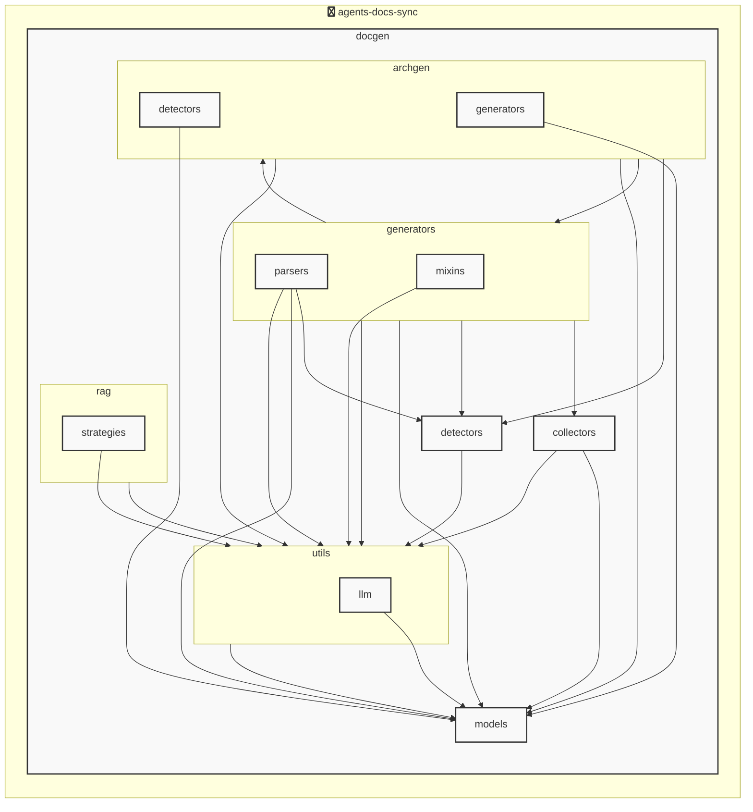

# AGENTS ドキュメント

自動生成日時: 2025-12-02 17:58:28

このドキュメントは、AIコーディングエージェントがプロジェクト内で効果的に作業するための指示とコンテキストを提供します。

---


<!-- MANUAL_START:description -->
`agents-docs-sync` は、AIコーディングエージェントがプロジェクト内で効果的に作業するためのドキュメント生成ツールです。
このドキュメント（AGENTS.md）自体も、このツールによって自動生成・更新されています。
<!-- MANUAL_END:description -->

`agents-docs-sync` は Python とシェルスクリプトで構成される CI/CD パイプラインツールです。  
リポジトリへコミットがあるたびに、以下の一連作業を自動実行します。

- **テスト実行**： `pytest`, `pytest-cov` でユニット・統合テストを走らせる
- **ドキュメント生成**  
  - ソースコードと設定ファイル（YAML/JSON）からメタデータ抽出し、Pydantic モデル (`ProjectOverview`, `AgentsConfigSection`, `AgentsGenerationConfig` 等) にマッピング  
  - Jinja2 テンプレートを用いて Markdown を構築 → `AGENTS.md`
- **アーキテクチャ図自動生成**（LLM 不使用）  
  - リポジトリ内のディレクトリ・ファイル構造を解析し、`docgen/architecture.py` が YAML に変換して PlantUML / Mermaid 用に描画
- **デプロイ／同期**： `agents-docs-sync hook install` コマンドで GitHub Actions 等へのフック登録

### 技術スタックと主要依存ライブラリ  
| ランタイム | 役割 |
|-----------|------|
| Python3.x | 本体ロジック、CLI (`docgen/docgen.py`) |
| Shell | スクリプト化されたビルド/デプロイワークフロー |

| パッケージ | 主な機能 |
|------------|---------|
| `pydantic` | 設定・モデル検証（構造化データ） |
| `jinja2`   | テンプレートエンジン、Markdown 生成 |
| `httpx`, `openai`, `anthropic` | 必要に応じて外部 LLM API 呼び出し (現行はオプション) |
| `sentence-transformers`, `hnswlib` | 文書類似度検索・クラスタリング（ドキュメント整理）|
| `torch`    | 依存ライブラリの実装要件として保持 |
| `pytest`, `ruff`, `pyyaml` | テスト、コード品質チェック、YAML パース |

### アーキテクチャ概要  
1. **CLI Entry Point** (`agents-docs-sync`) → `docgen.docgen:main()`  
2. CLI は引数解析後に以下を順次呼び出す  
   - `tests.run_tests()`: テスト実行 & カバレッジ取得  
   - `docs.generate_docs(config)`: 設定ファイル読み込み、Pydantic モデルへ変換 → Jinja2 で Markdown 出力  
   - `arch.draw_diagram(repo_root)`：ディレクトリ構造を解析し PlantUML / Mermaid 用 YAML を生成  
3. **フックシステム** (`agents_docs_sync hook install`) により、Git のコミットやプッシュ時に上記 CLI がトリガーされるよう設定

### 主要機能の詳細
- **自動ドキュメント更新**：`AGENTS.md` を毎回最新状態へ書き換え。既存内容と差分を検知し、必要な箇所のみを書き込むことで無駄な変更履歴を抑制。
- **構造化モデル管理**：`docgen/models/agents.py` に定義された Pydantic クラス群 (`ProjectOverview`, `AgentsConfigSection`, `AgentsGenerationConfig`, `AgentsDocument`) で、設定・ドキュメントデータの整合性を保証。  
- **拡張可能なフック**：CLI 内に `hook install`/`hook remove` を実装し、ユーザーが独自スクリプトや外部ツールと連携できるよう設計。
- **CI/CD との統合サポート**：GitHub Actions 用 YAML テンプレートを含むため、簡単にワークフローへ組み込めます。  
- **テストカバレッジの可視化**：`pytest-cov` の結果を Markdown に埋め込み、PR で直接確認可能。

### 使用例
```bash
# コマンドラインヘルプ表示
agents-docs-sync --help

# フックインストール（GitHub Actions 等）
agents_docs_sync hook install
```

このように `agents-docs-sync` はコードベースとドキュメントを常時同期させ、リポジトリの品質管理を効率化するための包括的ツールです。
**使用技術**: python, shell


## プロジェクト構造
```
agents-docs-sync/
 ├─ docgen/
 │  ├─ archgen/
 │  │  ├─ detectors/
 │  │  │  └─ python_detector.py
 │  │  └─ generators/
 │  │     └─ mermaid_generator.py
 │  ├─ collectors/
 │  │  ├─ collector_utils.py
 │  │  └─ project_info_collector.py
 │  ├─ detectors/
 │  │  ├─ configs/
 │  │  │  ├─ go.toml
 │  │  │  ├─ javascript.toml
 │  │  │  ├─ python.toml
 │  │  │  └─ typescript.toml
 │  │  ├─ base_detector.py
 │  │  ├─ detector_patterns.py
 │  │  ├─ plugin_registry.py
 │  │  └─ unified_detector.py
 │  ├─ generators/
 │  │  ├─ mixins/
 │  │  │  ├─ llm_mixin.py
 │  │  │  ├─ markdown_mixin.py
 │  │  │  └─ template_mixin.py
 │  │  ├─ parsers/
 │  │  │  ├─ base_parser.py
 │  │  │  ├─ generic_parser.py
 │  │  │  ├─ js_parser.py
 │  │  │  └─ python_parser.py
 │  │  ├─ agents_generator.py
 │  │  ├─ api_generator.py
 │  │  ├─ base_generator.py
 │  │  ├─ contributing_generator.py
 │  │  └─ readme_generator.py
 │  ├─ hooks/
 │  │  ├─ tasks/
 │  │  │  └─ base.py
 │  │  ├─ config.py
 │  │  └─ orchestrator.py
 │  ├─ index/
 │  │  └─ meta.json
 │  ├─ models/
 │  │  ├─ agents.py
 │  │  ├─ config.py
 │  │  └─ detector.py
 │  ├─ prompts/
 │  │  ├─ agents_prompts.toml
 │  │  ├─ commit_message_prompts.toml
 │  │  └─ readme_prompts.toml
 │  ├─ rag/
 │  │  ├─ embedder.py
 │  │  ├─ indexer.py
 │  │  ├─ retriever.py
 │  │  └─ validator.py
 │  ├─ utils/
 │  │  ├─ llm/
 │  │  │  ├─ base.py
 │  │  │  └─ local_client.py
 │  │  ├─ cache.py
 │  │  ├─ exceptions.py
 │  │  ├─ file_utils.py
 │  │  └─ prompt_loader.py
 │  ├─ config.toml
 │  ├─ config_manager.py
 │  ├─ docgen.py
 │  └─ hooks.toml
 ├─ docs/
 ├─ scripts/
 ├─ tests/
 ├─ AGENTS.md
 ├─ README.md
 ├─ pyproject.toml
 ├─ requirements-docgen.txt
 └─ requirements-test.txt
```


## アーキテクチャ

<!-- MANUAL_START:architecture -->

<!-- MANUAL_END:architecture -->


## Services

### agents-docs-sync
- **Type**: python
- **Description**: コミットするごとにテスト実行・ドキュメント生成・AGENTS.md の自動更新を行うパイプライン
- **Dependencies**: anthropic, hnswlib, httpx, jinja2, openai, outlines, pydantic, pytest, pytest-cov, pytest-mock, pyyaml, ruff, sentence-transformers, torch


---

## 開発環境のセットアップ

<!-- MANUAL_START:setup -->

<!-- MANUAL_END:setup -->
### 前提条件

- Python 3.12以上


### 依存関係のインストール


#### Python依存関係

```bash

uv sync

```


### LLM環境のセットアップ


#### ローカルLLMを使用する場合

1. **ローカルLLMのインストール**

   - Ollamaをインストール: https://ollama.ai/
   - モデルをダウンロード: `ollama pull llama3`
   - サービスを起動: `ollama serve`

2. **ローカルLLM使用時の注意事項**
   - モデルが起動していることを確認してください
   - ローカルリソース（メモリ、CPU）を監視してください


---


## ビルドおよびテスト手順

### ビルド手順


```bash
uv sync
uv build
uv run python3 docgen/docgen.py
```


### テスト実行


```bash
uv run pytest tests/ -v --tb=short
```


### 利用可能なコマンド

プロジェクトで定義されているスクリプトコマンド:

| コマンド | 説明 |
| --- | --- |

| `agents-docs-sync` | 汎用ドキュメント自動生成システム |

| `agents_docs_sync` | 汎用ドキュメント自動生成システム |


#### `agents-docs-sync` のオプション

| オプション | 説明 |
| --- | --- |

| `--config` | 設定ファイルのパス |

| `--detect-only` | 言語検出のみ実行 |

| `--no-api-doc` | APIドキュメントを生成しない |

| `--no-readme` | READMEを更新しない |

| `--build-index` | RAGインデックスをビルド |

| `--use-rag` | RAGを使用してドキュメント生成 |

| `--generate-arch` | アーキテクチャ図を生成（Mermaid形式） |

| `hook_name` | フック名（指定しない場合は全て） |

| `hook_name` | フック名（指定しない場合は全て） |

| `hook_name` | 実行するフック名 |

| `hook_args` | フック引数 |

| `--force` | 既存ファイルを強制上書き |


#### `agents_docs_sync` のオプション

| オプション | 説明 |
| --- | --- |

| `--config` | 設定ファイルのパス |

| `--detect-only` | 言語検出のみ実行 |

| `--no-api-doc` | APIドキュメントを生成しない |

| `--no-readme` | READMEを更新しない |

| `--build-index` | RAGインデックスをビルド |

| `--use-rag` | RAGを使用してドキュメント生成 |

| `--generate-arch` | アーキテクチャ図を生成（Mermaid形式） |

| `hook_name` | フック名（指定しない場合は全て） |

| `hook_name` | フック名（指定しない場合は全て） |

| `hook_name` | 実行するフック名 |

| `hook_args` | フック引数 |

| `--force` | 既存ファイルを強制上書き |


---

## コーディング規約

<!-- MANUAL_START:other -->

<!-- MANUAL_END:other -->


### リンター

- **ruff** を使用

  ```bash
  ruff check .
  ruff format .
  ```


---

## プルリクエストの手順

<!-- MANUAL_START:pr -->

<!-- MANUAL_END:pr -->
1. **ブランチの作成**
   ```bash
   git checkout -b feature/your-feature-name
   ```

2. **変更のコミット**
   - コミットメッセージは明確で説明的に
   - 関連するIssue番号を含める

3. **テストの実行**
   ```bash
   
   
   uv run pytest tests/ -v --tb=short
   
   
   ```

4. **プルリクエストの作成**
   - タイトル: `[種類] 簡潔な説明`
   - 説明: 変更内容、テスト結果、関連Issueを記載


---

*このAGENTS.mdは自動生成されています。最終更新: 2025-12-02 17:58:28*