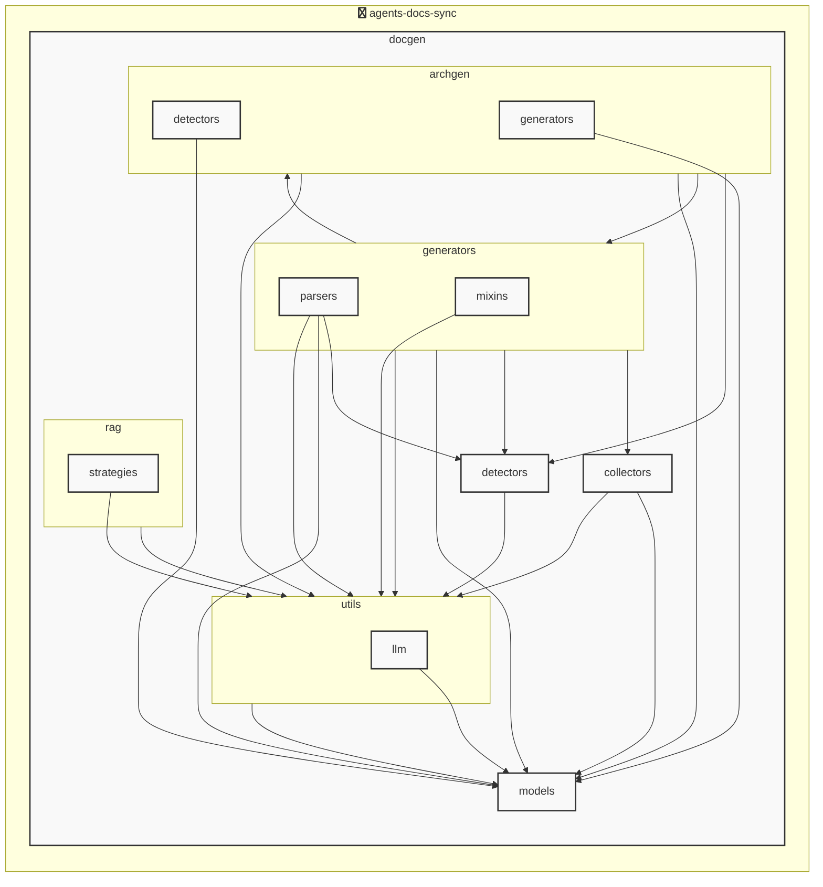

# AGENTS ドキュメント

自動生成日時: 2025-12-02 16:56:50

このドキュメントは、AIコーディングエージェントがプロジェクト内で効果的に作業するための指示とコンテキストを提供します。

---


<!-- MANUAL_START:description -->

<!-- MANUAL_END:description -->


- **目的**  
  `agents-docs-sync` は、Python/シェルベースのプロジェクトでコミットごとに自動的にテストを実行し、ドキュメント（Markdown）やアーキテクチャ図を生成・更新するパイプラインです。AGENTS.md などの主要な技術文書が常に最新状態になるよう設計されています。

- **CLI エントリポイント**  
  ```bash
  agents-docs-sync --help   # ヘルプ表示（docgen.docgen:main が実行）
  ```
  `agents_docs_sync` の別名も登録されているため、スクリプト呼び出しは柔軟に選べます。

- **主要コンポーネント**  
  | コンポーネント | 概要 |
  |-----------------|------|
  | *docgen.docgen* | CLI ハンドラ。`ProjectOverview`, `AgentsConfigSection`, `AgentsGenerationConfig`, `AgentsDocument` 等の Pydantic モデルをロードし、Jinja2 テンプレートで Markdown を生成します。 |
  | *auto_architecture_generator* | LLM を使用せずにプロジェクト構造から自動的にアーキテクチャ図（SVG/PNG）を作成するユーティリティです。`docs/architecture_diagram.md` に記載されているようなパイプラインの一部として実行されます。 |
  | *hooks*          | `agents_docs_sync hook install` コマンドで Git の pre‑commit/post‑merge フックを自動登録し、CI/CD スクリプトと同様にローカルでもドキュメント同期が可能です。 |

- **アーキテクチャ構成**  
  - **入力**：ソースコード（Python, Shell）＋ `architecture_manifest.yml` 等の設定ファイル
  - **処理フロー**  
    1. コミット検知 → テスト実行 (`pytest`, `coverage`)  
    2. ソース構造解析 → アーキテクチャ図生成（hnswlib + sentence‑transformers を使った類似度検索）  
    3. LLM（Anthropic/OpenAI, outlines）で自然言語要約・説明を作成  
    4. Jinja2 テンプレートにデータバインド → AGENTS.md、docs/*.md 作成/更新
  - **出力**：`AGENTS.md`, `docs/*.{md,png}`

- **主要ライブラリとその役割**
  | ライブラリ | 主な用途 |
  |------------|----------|
  | anthropic, openai | LLM API 呼び出し（要約・説明生成） |
  | outlines          | 大規模テキスト生成のテンプレート化 |
  | sentence‑transformers + hnswlib | コード片やドキュメント間で類似度検索を行い、関連情報を自動抽出 |
  | httpx             | API 通信（LLM, 外部サービス）|
  | jinja2            | Markdown テンプレートエンジン |
  | pydantic          | 設定・データモデルのバリデーション |
  | pytest / pytest‑cov| 単体テストとカバレッジ測定 |
  | ruff              | 静的コード解析（フォーマット/品質）|
  | torch             | 機械学習バックエンド (sentence-transformers) |

- **開発・CI 手順**  
  ```bash
  # 開発環境構築
  poetry install

  # テスト実行とカバレッジ確認
  pytest --cov=docgen

  # ドキュメント生成（ローカル）
  agents-docs-sync generate

  # Git フックのインストール (pre‑commit 等)
  agents_docs_sync hook install
  ```

- **拡張性**  
  - Pydantic モデル (`ProjectOverview`, `AgentsConfigSection` …) を追加・修正するだけで、生成されるドキュメント構造を柔軟に変更できます。  
  - テンプレートは Jinja2 によって任意の Markdown フォーマットへ容易にカスタマイズ可能です。  

- **まとめ**  
  `agents-docs-sync` は CI/CD パイプラインとローカル開発フローをシームレスにつなぎ、ドキュメント作成・更新を完全自動化します。LLM を活用した自然言語生成からアーキテクチャ図のコードベース解析まで、多様なツールを統合しつつも「構造的に管理」できる設計が特徴です。
**使用技術**: python, shell


## プロジェクト構造
```
agents-docs-sync/
 ├─ docgen/
 │  ├─ archgen/
 │  │  ├─ detectors/
 │  │  │  └─ python_detector.py
 │  │  └─ generators/
 │  │     └─ mermaid_generator.py
 │  ├─ collectors/
 │  │  ├─ collector_utils.py
 │  │  └─ project_info_collector.py
 │  ├─ detectors/
 │  │  ├─ configs/
 │  │  │  ├─ go.toml
 │  │  │  ├─ javascript.toml
 │  │  │  ├─ python.toml
 │  │  │  └─ typescript.toml
 │  │  ├─ base_detector.py
 │  │  ├─ detector_patterns.py
 │  │  ├─ plugin_registry.py
 │  │  └─ unified_detector.py
 │  ├─ generators/
 │  │  ├─ mixins/
 │  │  │  ├─ llm_mixin.py
 │  │  │  ├─ markdown_mixin.py
 │  │  │  └─ template_mixin.py
 │  │  ├─ parsers/
 │  │  │  ├─ base_parser.py
 │  │  │  ├─ generic_parser.py
 │  │  │  ├─ js_parser.py
 │  │  │  └─ python_parser.py
 │  │  ├─ agents_generator.py
 │  │  ├─ api_generator.py
 │  │  ├─ base_generator.py
 │  │  ├─ contributing_generator.py
 │  │  └─ readme_generator.py
 │  ├─ hooks/
 │  │  ├─ tasks/
 │  │  │  └─ base.py
 │  │  ├─ config.py
 │  │  └─ orchestrator.py
 │  ├─ index/
 │  │  └─ meta.json
 │  ├─ models/
 │  │  ├─ agents.py
 │  │  ├─ config.py
 │  │  └─ detector.py
 │  ├─ prompts/
 │  │  ├─ agents_prompts.toml
 │  │  ├─ commit_message_prompts.toml
 │  │  └─ readme_prompts.toml
 │  ├─ rag/
 │  │  ├─ embedder.py
 │  │  ├─ indexer.py
 │  │  ├─ retriever.py
 │  │  └─ validator.py
 │  ├─ utils/
 │  │  ├─ llm/
 │  │  │  ├─ base.py
 │  │  │  └─ local_client.py
 │  │  ├─ cache.py
 │  │  ├─ exceptions.py
 │  │  ├─ file_utils.py
 │  │  └─ prompt_loader.py
 │  ├─ config.toml
 │  ├─ config_manager.py
 │  ├─ docgen.py
 │  └─ hooks.toml
 ├─ docs/
 ├─ scripts/
 ├─ tests/
 ├─ AGENTS.md
 ├─ README.md
 ├─ pyproject.toml
 ├─ requirements-docgen.txt
 └─ requirements-test.txt
```


## アーキテクチャ

<!-- MANUAL_START:architecture -->
<!-- MANUAL_END:architecture -->


## Services

### agents-docs-sync
- **Type**: python
- **Description**: コミットするごとにテスト実行・ドキュメント生成・AGENTS.md の自動更新を行うパイプライン
- **Dependencies**: anthropic, hnswlib, httpx, jinja2, openai, outlines, pydantic, pytest, pytest-cov, pytest-mock, pyyaml, ruff, sentence-transformers, torch


---

## 開発環境のセットアップ

<!-- MANUAL_START:setup -->

<!-- MANUAL_END:setup -->
### 前提条件

- Python 3.12以上


### 依存関係のインストール


#### Python依存関係

```bash

uv sync

```


### LLM環境のセットアップ


#### ローカルLLMを使用する場合

1. **ローカルLLMのインストール**

   - Ollamaをインストール: https://ollama.ai/
   - モデルをダウンロード: `ollama pull llama3`
   - サービスを起動: `ollama serve`

2. **ローカルLLM使用時の注意事項**
   - モデルが起動していることを確認してください
   - ローカルリソース（メモリ、CPU）を監視してください


---


## ビルドおよびテスト手順

### ビルド手順


```bash
uv sync
uv build
uv run python3 docgen/docgen.py
```


### テスト実行


```bash
uv run pytest tests/ -v --tb=short
npm test
go test ./...
```


---

## コーディング規約

<!-- MANUAL_START:other -->

<!-- MANUAL_END:other -->


### リンター

- **ruff** を使用

  ```bash
  ruff check .
  ruff format .
  ```


---

## プルリクエストの手順

<!-- MANUAL_START:pr -->

<!-- MANUAL_END:pr -->
1. **ブランチの作成**
   ```bash
   git checkout -b feature/your-feature-name
   ```

2. **変更のコミット**
   - コミットメッセージは明確で説明的に
   - 関連するIssue番号を含める

3. **テストの実行**
   ```bash
   
   
   uv run pytest tests/ -v --tb=short
   
   npm test
   
   go test ./...
   
   
   ```

4. **プルリクエストの作成**
   - タイトル: `[種類] 簡潔な説明`
   - 説明: 変更内容、テスト結果、関連Issueを記載


---

*このAGENTS.mdは自動生成されています。最終更新: 2025-12-02 16:56:50*