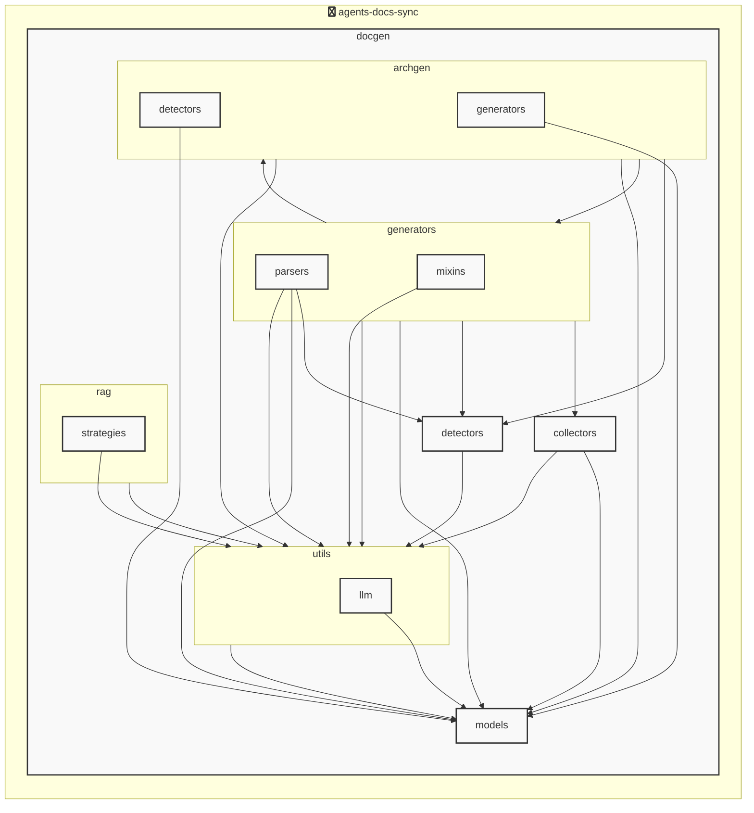

# AGENTS ドキュメント

自動生成日時: 2025-12-04 09:31:45

このドキュメントは、AIコーディングエージェントがプロジェクト内で効果的に作業するための指示とコンテキストを提供します。

---


<!-- MANUAL_START:description -->

<!-- MANUAL_END:description -->


コミットごとに自動でテスト実行・ドキュメント生成・AGENTS.md の更新を行うパイプラインです。  
Python 3.x とシェルスクリプトで構成され、`docgen` パッケージが中心のモジュール群となっています。

### 技術スタック
- **言語**: Python, Bash / Shell  
- **テスト & カバレッジ**: `pytest`, `pytest-cov`, `pytest-mock`  
- **コード品質**: `ruff`, `pydantic`（型定義）  
- **ドキュメント生成**: Jinja2 テンプレート、YAML で構成されたモデル (`AgentsConfig`, `AgentsDocument`)  
- **自動アーキテクチャ図作成**: リポジトリを解析し PlantUML/Mermaid を出力（LLM 不使用）  
- **検索・推論**: `hnswlib`, `sentence-transformers`、必要に応じて OpenAI / Anthropic API で補完  
- **HTTP クライアント**: `httpx`  
- **CLI エントリポイント**: `pyproject.toml` の `[project.scripts] agents_docs_sync = "docgen.docgen:main"`  

### アーキテクチャ
```
┌───────────────────────┐
│  CLI (agents_docs_sync) │  ← user entry point, parses args & config  
├─────────────▲──────────┤
│             │          │
│   orchestrator           │
│ (docgen.docgen.main)     │
├─────────────▼──────────┘
│ ┌───────────────────────┐
│ │  test_runner.py        │  → runs pytest, generates coverage report  
│ │  doc_generator.py      │  → renders Jinja2 templates into AGENTS.md  
│ │  arch_gen.py           │  ← scans repo tree → Mermaid/PlantUML diagram  
│ └───────────────────────┘
```

### 主な機能

- **自動テスト実行**: コミット時に `pytest` を走らせ、失敗した場合はビルドを中断。カバレッジ情報は CI レポートへ出力。
  
- **AGENTS.md 自動生成**:
  - ソースコードの docstring やメタデータから構造化モデル `AgentsDocument` を作成し、Jinja2 テンプレートで Markdown 化。  
  - YAML 設定 (`agents.yaml`) によりカスタマイズ可能。
  
- **アーキテクチャ図自動生成**:
  - リポジトリ構造を解析し、Python の import 関係やディレクトリ階層から Mermaid/PlantUML を作成。LLM は使用せず純粋にコードベースで推論。
  
- **CLI サブコマンド**:
  - `agents_docs_sync --help` – 利用可能オプション表示  
  - `agents_docs_sync hook install` – pre‑commit フックをインストールし、コミット前に自動実行。  

### 設定 & モデル

- **Configuration Guide (`docs/CONFIG_GUIDE.md`)** に詳細が記載されており、以下の Pydantic クラスで構成:
  - `AgentsConfig`  
  - `AgentsGenerationConfig`
  - `ProjectOverview`, `AgentsConfigSection`

### 実行例

```bash
# コミット時に自動実行（CI のステップとしても可）
git commit -m "Update docs"
agents_docs_sync   # → テスト→ドキュメント生成→AGENTS.md 更新

# pre-commit フックを手動でインストール
agents_docs_sync hook install
```

このパイプラインは、継続的なコード品質保持と最新のドキュメンテーション維持を一括して行うために設計されており、Python コミュニティ向けの標準化されたワークフローとして活用できます。
**使用技術**: python, shell
## プロジェクト構造
```
agents-docs-sync/
 ├─ docgen/
 │  ├─ archgen/
 │  │  ├─ detectors/
 │  │  │  └─ python_detector.py
 │  │  └─ generators/
 │  │     └─ mermaid_generator.py
 │  ├─ collectors/
 │  │  ├─ collector_utils.py
 │  │  └─ project_info_collector.py
 │  ├─ detectors/
 │  │  ├─ configs/
 │  │  │  ├─ go.toml
 │  │  │  ├─ javascript.toml
 │  │  │  ├─ python.toml
 │  │  │  └─ typescript.toml
 │  │  ├─ base_detector.py
 │  │  ├─ detector_patterns.py
 │  │  ├─ plugin_registry.py
 │  │  └─ unified_detector.py
 │  ├─ generators/
 │  │  ├─ mixins/
 │  │  │  ├─ llm_mixin.py
 │  │  │  ├─ markdown_mixin.py
 │  │  │  └─ template_mixin.py
 │  │  ├─ parsers/
 │  │  │  ├─ base_parser.py
 │  │  │  ├─ generic_parser.py
 │  │  │  ├─ js_parser.py
 │  │  │  └─ python_parser.py
 │  │  ├─ agents_generator.py
 │  │  ├─ api_generator.py
 │  │  ├─ base_generator.py
 │  │  ├─ contributing_generator.py
 │  │  └─ readme_generator.py
 │  ├─ hooks/
 │  │  ├─ tasks/
 │  │  │  └─ base.py
 │  │  ├─ config.py
 │  │  └─ orchestrator.py
 │  ├─ index/
 │  │  └─ meta.json
 │  ├─ models/
 │  │  ├─ agents.py
 │  │  ├─ config.py
 │  │  └─ detector.py
 │  ├─ prompts/
 │  │  ├─ agents_prompts.toml
 │  │  ├─ commit_message_prompts.toml
 │  │  └─ readme_prompts.toml
 │  ├─ rag/
 │  │  ├─ embedder.py
 │  │  ├─ indexer.py
 │  │  ├─ retriever.py
 │  │  └─ validator.py
 │  ├─ utils/
 │  │  ├─ llm/
 │  │  │  ├─ base.py
 │  │  │  └─ local_client.py
 │  │  ├─ cache.py
 │  │  ├─ exceptions.py
 │  │  ├─ file_utils.py
 │  │  └─ prompt_loader.py
 │  ├─ cli_handlers.py
 │  ├─ config.toml
 │  ├─ config_manager.py
 │  ├─ detector_config_loader.py
 │  ├─ docgen.py
 │  └─ hooks.toml
 ├─ docs/
 ├─ scripts/
 ├─ tests/
 ├─ AGENTS.md
 ├─ README.md
 ├─ pyproject.toml
 ├─ requirements-docgen.txt
 └─ requirements-test.txt
```
## アーキテクチャ

<!-- MANUAL_START:architecture -->

<!-- MANUAL_END:architecture -->


## Services

### agents-docs-sync
- **Type**: python
- **Description**: コミットするごとにテスト実行・ドキュメント生成・AGENTS.md の自動更新を行うパイプライン
- **Dependencies**: anthropic, hnswlib, httpx, jinja2, openai, outlines, pydantic, pytest, pytest-cov, pytest-mock, pyyaml, ruff, sentence-transformers, torch

---

## 開発環境のセットアップ

<!-- MANUAL_START:setup -->

<!-- MANUAL_END:setup -->
### 前提条件

- Python 3.12以上

### 依存関係のインストール
#### Python依存関係

```bash
uv sync
```

### LLM環境のセットアップ
#### ローカルLLMを使用する場合

1. **ローカルLLMのインストール**

   - Ollamaをインストール: https://ollama.ai/
   - モデルをダウンロード: `ollama pull llama3`
   - サービスを起動: `ollama serve`

2. **ローカルLLM使用時の注意事項**
   - モデルが起動していることを確認してください
   - ローカルリソース（メモリ、CPU）を監視してください

---


## ビルドおよびテスト手順

### ビルド手順
```bash
uv sync
uv build
uv run python3 docgen/docgen.py
```

### テスト実行
```bash
uv run pytest tests/ -v --tb=short
```
### 利用可能なコマンド

プロジェクトで定義されているスクリプトコマンド:

| コマンド | 説明 |
| --- | --- |
| `agents_docs_sync` | 汎用ドキュメント自動生成システム |
#### `agents_docs_sync` のオプション

| オプション | 説明 |
| --- | --- |
| `--config` | 設定ファイルのパス |
| `--detect-only` | 言語検出のみ実行 |
| `--no-api-doc` | APIドキュメントを生成しない |
| `--no-readme` | READMEを更新しない |
| `--build-index` | RAGインデックスをビルド |
| `--use-rag` | RAGを使用してドキュメント生成 |
| `--generate-arch` | アーキテクチャ図を生成（Mermaid形式） |
| `hook_name` | フック名（指定しない場合は全て） |
| `hook_name` | フック名（指定しない場合は全て） |
| `hook_name` | 実行するフック名 |
| `hook_args` | フック引数 |
| `--force` | 既存ファイルを強制上書き |

---

## コーディング規約

<!-- MANUAL_START:other -->

<!-- MANUAL_END:other -->
### リンター

- **ruff** を使用
  ```bash
  ruff check .
  ruff format .
  ```

---

## プルリクエストの手順

<!-- MANUAL_START:pr -->

<!-- MANUAL_END:pr -->
1. **ブランチの作成**
   ```bash
   git checkout -b feature/your-feature-name
   ```

2. **変更のコミット**
   - コミットメッセージは明確で説明的に
   - 関連するIssue番号を含める

3. **テストの実行**
   ```bash
   uv run pytest tests/ -v --tb=short
   ```

4. **プルリクエストの作成**
   - タイトル: `[種類] 簡潔な説明`
   - 説明: 変更内容、テスト結果、関連Issueを記載

---

*このAGENTS.mdは自動生成されています。最終更新: 2025-12-04 09:31:45*