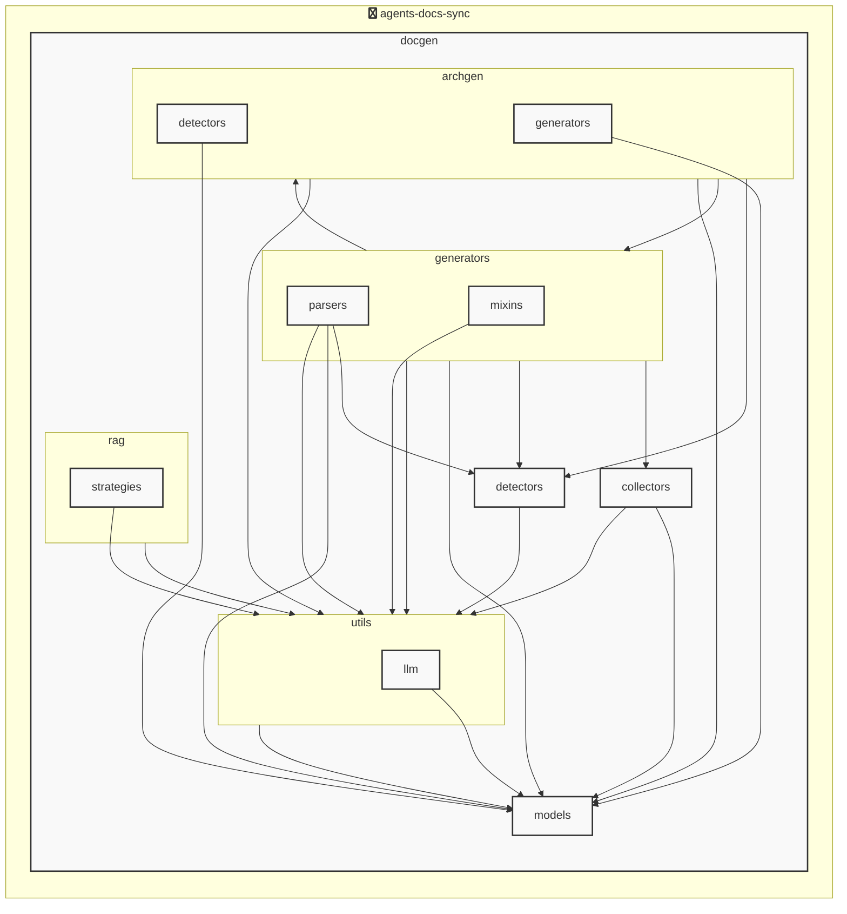

# AGENTS ドキュメント

自動生成日時: 2025-12-04 12:18:43

このドキュメントは、AIコーディングエージェントがプロジェクト内で効果的に作業するための指示とコンテキストを提供します。

---


<!-- MANUAL_START:description -->

<!-- MANUAL_END:description -->


`agents-docs-sync` は、リポジトリにコミットが入るたびに自動で以下を実行する CI/CD パイプラインです。  
- **テストの走査**：pytest + pytest‑cov でコード品質とカバレッジを確認し、失敗したらビルドは中断します。  
- **ドキュメント生成**：Jinja2 テンプレートに基づき `AGENTS.md` を再構築。テンプレートには Pydantic モデル（`AgentsConfig`, `AgentsGenerationConfig`, `AgentsDocument`）から抽出した情報を埋め込み、各エージェントの設定・生成ロジック・ドキュメント化された API 仕様が自動的に反映されます。  
- **アーキテクチャ図作成**：LLM を使わずに `auto_architecture_generator` がプロジェクト構造（Python パッケージ、YAML マニフェスト）を解析し、Graphviz 形式のダイアグラムを生成します。これにより、人間が手書きする必要なく最新状態の図が常に保持されます。

### 技術スタック
| カテゴリ | ライブラリ |
|----------|------------|
| **Python** | `pydantic`, `jinja2`, `httpx`, `openai` (オプション), `anthropic` (オプション) |
| **ML / NLP** | `sentence-transformers`, `hnswlib`, `torch` |
| **テスト & CI** | `pytest`, `pytest-cov`, `ruff`, `pyyaml` |
| **ドキュメント生成** | `outlines`（構造化データから Markdown へ変換） |

### エントリポイント
```bash
# CLI ヘルプ表示例
$ agents_docs_sync --help
```
- pyproject.toml の `[project.scripts]` により、実行時は `docgen.docgen:main` が呼び出されます。  
- 主要なサブコマンド:
  - `run`: テスト → ドキュメント生成 → アーキテクチャ図更新を順次実施
  - `hook install`: CI に必要なフック（pre‑commit, post‑push 等）をインストール

### Pydantic モデル構成 (`docgen/models/agents.py`)
| クラス | 用途 |
|--------|------|
| `ProjectOverview` | プロジェクト全体のメタ情報。YAML マニフェストから読み込みます。 |
| `AgentsConfigSection` / `AgentsGenerationConfig` | エージェントごとの設定・生成パラメータを保持し、ドキュメントテンプレートへ渡します。 |
| `AgentsDocument` | 生成される AGENTS.md の構造化データモデルであり、JSON/YAML 出力にも利用可能です。 |

### CI ワークフロー例（GitHub Actions）
```yaml
name: Docs Sync

on:
  push:
    branches: [ main ]

jobs:
  sync-docs:
    runs-on: ubuntu-latest
    steps:
      - uses: actions/checkout@v4
      - name: Set up Python
        uses: actions/setup-python@v5
        with:
          python-version: '3.12'
      - run: pip install poetry && poetry install --only main,dev
      - run: agents_docs_sync run
```

### 使い方サンプル（ローカル）
```bash
# 開発環境で手動実行
$ git checkout feature-branch
$ agents_docs_sync hook install   # 必要ならフックを再インストール

$ agents_docs_sync run            # テストとドキュメント更新を一括実施
```

### 成果物
1. **AGENTS.md** – 最新のエージェント構成・API仕様が自動で記載。  
2. **architecture_diagram.svg**（または .png）– プロジェクト全体と各モジュール間の関係を視覚化。  
3. **テストレポート & カバレッジ統計** – `pytest --cov` で生成され、GitHub Actions のコメントに表示。

---

このプロジェクトは「変更があった時だけ自動更新」するという原則に基づき設計されています。  
- **高速実行**：テストとドキュメント作成を同一スクリプトでまとめることで、CI 実行時間を最小化。  
- **可搬性**：Python 3.12+ と標準的なツールチェーン（Poetry, ruff）に依存しつつ、シェルスクリプトも併用可能。  

`agents-docs-sync` を導入すれば、ドキュメントの整合性を手動で保守する負担が大幅に軽減されます。
**使用技術**: python, shell
## プロジェクト構造
```
├── docgen//
│   ├── archgen//
│   │   ├── detectors//
│   │   │   └── python_detector.py
│   │   └── generators//
│   │       └── mermaid_generator.py
│   ├── collectors//
│   │   ├── collector_utils.py
│   │   └── project_info_collector.py
│   ├── detectors//
│   │   ├── configs//
│   │   │   ├── go.toml
│   │   │   ├── javascript.toml
│   │   │   ├── python.toml
│   │   │   └── typescript.toml
│   │   ├── base_detector.py
│   │   ├── detector_patterns.py
│   │   ├── plugin_registry.py
│   │   └── unified_detector.py
│   ├── generators//
│   │   ├── mixins//
│   │   │   ├── formatting_mixin.py
│   │   │   ├── llm_mixin.py
│   │   │   ├── markdown_mixin.py
│   │   │   └── template_mixin.py
│   │   ├── parsers//
│   │   │   ├── base_parser.py
│   │   │   ├── generic_parser.py
│   │   │   ├── js_parser.py
│   │   │   └── python_parser.py
│   │   ├── agents_generator.py
│   │   ├── api_generator.py
│   │   ├── base_generator.py
│   │   ├── contributing_generator.py
│   │   └── readme_generator.py
│   ├── hooks//
│   │   ├── tasks//
│   │   │   └── base.py
│   │   ├── config.py
│   │   └── orchestrator.py
│   ├── index//
│   │   └── meta.json
│   ├── models//
│   │   ├── agents.py
│   │   ├── config.py
│   │   └── detector.py
│   ├── prompts//
│   │   ├── agents_prompts.toml
│   │   ├── commit_message_prompts.toml
│   │   └── readme_prompts.toml
│   ├── rag//
│   │   ├── embedder.py
│   │   ├── indexer.py
│   │   ├── retriever.py
│   │   └── validator.py
│   ├── utils//
│   │   ├── llm//
│   │   │   ├── base.py
│   │   │   └── local_client.py
│   │   ├── cache.py
│   │   ├── exceptions.py
│   │   ├── file_utils.py
│   │   └── prompt_loader.py
│   ├── cli_handlers.py
│   ├── config.toml
│   ├── config_manager.py
│   ├── detector_config_loader.py
│   ├── docgen.py
│   ├── document_generator.py
│   └── hooks.toml
├── docs/
├── scripts/
├── tests/
├── AGENTS.md
├── README.md
├── pyproject.toml
├── requirements-docgen.txt
└── requirements-test.txt
```
## アーキテクチャ

<!-- MANUAL_START:architecture -->

<!-- MANUAL_END:architecture -->


## Services

### agents-docs-sync
- **Type**: python
- **Description**: コミットするごとにテスト実行・ドキュメント生成・AGENTS.md の自動更新を行うパイプライン
- **Dependencies**: anthropic, hnswlib, httpx, jinja2, openai, outlines, pydantic, pytest, pytest-cov, pytest-mock, pyyaml, ruff, sentence-transformers, torch

---

## 開発環境のセットアップ

<!-- MANUAL_START:setup -->

<!-- MANUAL_END:setup -->
### 前提条件

- Python 3.12以上

### 依存関係のインストール
#### Python依存関係

```bash
uv sync
```

### LLM環境のセットアップ
#### ローカルLLMを使用する場合

1. **ローカルLLMのインストール**

   - Ollamaをインストール: https://ollama.ai/
   - モデルをダウンロード: `ollama pull llama3`
   - サービスを起動: `ollama serve`

2. **ローカルLLM使用時の注意事項**
   - モデルが起動していることを確認してください
   - ローカルリソース（メモリ、CPU）を監視してください

---


## ビルドおよびテスト手順

### ビルド手順
```bash
uv sync
```
```bash
uv build
```
```bash
uv run python3 docgen/docgen.py
```

### テスト実行
```bash
bash scripts/run_tests.sh
```
```bash
uv run pytest tests/ -v --tb=short
```
### 利用可能なコマンド

プロジェクトで定義されているスクリプトコマンド:

| コマンド | 説明 |
| --- | --- |
| `agents_docs_sync` | 汎用ドキュメント自動生成システム |
#### `agents_docs_sync` のオプション

| オプション | 説明 |
| --- | --- |
| `--config` | 設定ファイルのパス |
| `--detect-only` | 言語検出のみ実行 |
| `--no-api-doc` | APIドキュメントを生成しない |
| `--no-readme` | READMEを更新しない |
| `--build-index` | RAGインデックスをビルド |
| `--use-rag` | RAGを使用してドキュメント生成 |
| `--generate-arch` | アーキテクチャ図を生成（Mermaid形式） |
| `hook_name` | フック名（指定しない場合は全て） |
| `hook_name` | フック名（指定しない場合は全て） |
| `hook_name` | 実行するフック名 |
| `hook_args` | フック引数 |
| `--force` | 既存ファイルを強制上書き |

---

## コーディング規約

<!-- MANUAL_START:other -->

<!-- MANUAL_END:other -->
### リンター

- **ruff** を使用
  ```bash
  ruff check .
  ruff format .
  ```

---

## プルリクエストの手順

<!-- MANUAL_START:pr -->

<!-- MANUAL_END:pr -->
1. **ブランチの作成**
   ```bash
   git checkout -b feature/your-feature-name
   ```

2. **変更のコミット**
   - コミットメッセージは明確で説明的に
   - 関連するIssue番号を含める

3. **テストの実行**
   ```bash
   bash scripts/run_tests.sh
   uv run pytest tests/ -v --tb=short
   ```

4. **プルリクエストの作成**
   - タイトル: `[種類] 簡潔な説明`
   - 説明: 変更内容、テスト結果、関連Issueを記載

---

*このAGENTS.mdは自動生成されています。最終更新: 2025-12-04 12:18:43*