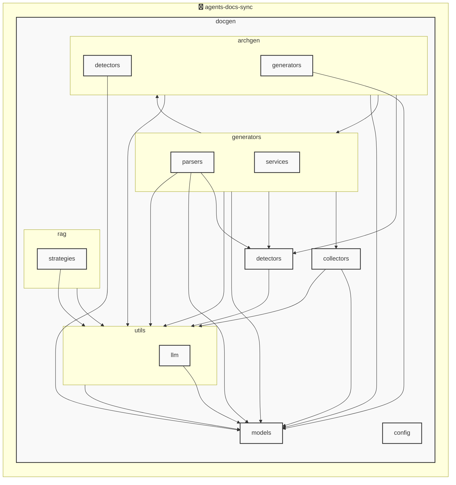

# AGENTS ドキュメント

自動生成日時: 2025-12-04 16:59:47

このドキュメントは、AIコーディングエージェントがプロジェクト内で効果的に作業するための指示とコンテキストを提供します。

---


<!-- MANUAL_START:description -->

<!-- MANUAL_END:description -->


このプロジェクトは、**コードベースの変更に応じて自動的にテストを実行し、ドキュメントと `AGENTS.md` を再生成するパイプライン**です。主な目的は次の通りです。

- コミットごとの品質保証（単体/統合テスト）  
- 最新コードに合わせた API / ユーザー向けドキュメントの自動更新  
- `AGENTS.md` を常に最新状態で保ち、AI エージェントや開発者が参照しやすい情報を提供  

---

### コアワークフロー

1. **変更検知** – Git のコミットイベント（GitHub Actions / pre‑commit フック）  
2. **依存関係解決** – `uv` を使用して Python 3.x 環境にパッケージをインストール (`pyyaml`, `pytest*`)  
3. **テスト実行** – `pytest --cov=. -q` により全ユニット/統合テストの実行とカバレッジ計測  
4. **ドキュメント生成** – ソースコードから自動で Markdown / MkDocs 形式を作成（docstring 抽出＋テンプレート埋め込み）  
5. **AGENTS.md 更新** – YAML/JSON 定義ファイルと `pyyaml` を利用して、エージェント一覧・メタ情報を書き直す  
6. **成果物のコミット / アップロード** – 変更があれば自動でプッシュ／GitHub Release に含める  

---

### 技術スタック

| 要素 | 詳細 |
|------|------|
| 言語 | Python (3.11+), Bash スクリプト |
| パッケージマネージャ | `uv`（高速、ローカルキャッシュ） |
| テストフレームワーク | pytest, pytest-cov, pytest-mock |
| YAML 解析 | pyyaml >=6.0.3 |
| CI/CD | GitHub Actions (default), 任意の CI プラットフォームへ移植可 |

---

### ローカルで実行する手順

```bash
# 仮想環境作成（uv は自動で管理）
uv venv .venv
source .venv/bin/activate

# 依存関係インストール
uv pip install -e .

# テスト + ドキュメント生成 (AGENTS.md を更新)
python scripts/run_pipeline.py --dry-run   # 本番実行は dry‑run オプション無しで
```

> **注意**  
> `scripts/run_pipeline.py` は以下のオプションをサポート：  
> - `--verbose`: 詳細ログ出力  
> - `--skip-tests`: テストステップスキップ（ドキュメントだけ更新したい場合）  

---

### CI への組み込み例 (GitHub Actions)

```yaml
name: Sync Docs & Agents

on:
  push:
    branches: [ main ]

jobs:
  sync:
    runs-on: ubuntu-latest
    steps:
      - uses: actions/checkout@v4
        with:
          fetch-depth: 0   # タグ取得が必要な場合は必須
      - name: Set up Python & uv
        uses: actions/setup-python@v5
        with:
          python-version: '3.11'
      - run: pip install uv && uv venv .venv
      - run: source .venv/bin/activate && uv pip install -e .
      - name: Run Pipeline
        env:
          GITHUB_TOKEN: ${{ secrets.GITHUB_TOKEN }}
        run: |
          source .venv/bin/activate
          python scripts/run_pipeline.py --commit-changes   # 変更をコミットして push

```

---

### 拡張性とカスタマイズポイント

| カテゴリ | 調整方法 |
|----------|-----------|
| **テストフレームワーク** | `pytest.ini` を編集し、追加のプラグインやフィクスチャを有効化 |
| **ドキュメントテンプレート** | `templates/` ディレクトリ内に Markdown / MkDocs テンプレートを書き換え |
| **AGENTS.md 生成ロジック** | `agents.yaml` の構造を拡張し、追加のメタ情報（例: 実行環境要件）を記述可能 |
| **CI トリガー条件** | GitHub Actions 外でも Docker コンテナ内で同様スクリプトを実行できる |

---

### 期待されるメリット

- コードとドキュメントの同期遅延がゼロになる  
- エージェント一覧（`AGENTS.md`）が常に最新かつ正確な情報を提供し、AI のナレッジベースとして活用できる  
- CI パイプラインで自動化することで、人為的ミスや手作業のコスト削減  

このパイプラインは「**変更 → 検証 → 文書更新」という一連のフローをシームレスに実行」し、開発者と AI エージェント双方が最新情報へ即座にアクセスできるよう設計されています。
**使用技術**: python, shell
## プロジェクト構造
```
├── docgen//
│   ├── archgen//
│   │   ├── detectors//
│   │   │   └── python_detector.py
│   │   └── generators//
│   │       └── mermaid_generator.py
│   ├── collectors//
│   │   ├── collector_utils.py
│   │   ├── command_help_extractor.py
│   │   └── project_info_collector.py
│   ├── config//
│   │   └── config_accessor.py
│   ├── detectors//
│   │   ├── configs//
│   │   │   ├── go.toml
│   │   │   ├── javascript.toml
│   │   │   ├── python.toml
│   │   │   └── typescript.toml
│   │   ├── base_detector.py
│   │   ├── detector_patterns.py
│   │   ├── plugin_registry.py
│   │   └── unified_detector.py
│   ├── generators//
│   │   ├── parsers//
│   │   │   ├── base_parser.py
│   │   │   ├── generic_parser.py
│   │   │   ├── js_parser.py
│   │   │   └── python_parser.py
│   │   ├── services//
│   │   │   ├── formatting_service.py
│   │   │   ├── llm_service.py
│   │   │   └── template_service.py
│   │   ├── agents_generator.py
│   │   ├── api_generator.py
│   │   ├── base_generator.py
│   │   ├── contributing_generator.py
│   │   ├── readme_generator.py
│   │   └── service_factory.py
│   ├── hooks//
│   │   ├── tasks//
│   │   │   └── base.py
│   │   ├── config.py
│   │   └── orchestrator.py
│   ├── index//
│   │   └── meta.json
│   ├── models//
│   │   ├── agents.py
│   │   ├── config.py
│   │   └── detector.py
│   ├── prompts//
│   │   ├── agents_prompts.toml
│   │   ├── commit_message_prompts.toml
│   │   └── readme_prompts.toml
│   ├── rag//
│   │   ├── embedder.py
│   │   ├── indexer.py
│   │   ├── retriever.py
│   │   └── validator.py
│   ├── utils//
│   │   ├── llm//
│   │   │   ├── base.py
│   │   │   └── local_client.py
│   │   ├── cache.py
│   │   ├── exceptions.py
│   │   ├── file_utils.py
│   │   └── prompt_loader.py
│   ├── cli_handlers.py
│   ├── config.toml
│   ├── config_manager.py
│   ├── detector_config_loader.py
│   ├── docgen.py
│   ├── document_generator.py
│   └── hooks.toml
├── docs/
├── scripts/
├── tests/
├── AGENTS.md
├── README.md
├── pyproject.toml
├── requirements-docgen.txt
└── requirements-test.txt
```
## アーキテクチャ

<!-- MANUAL_START:architecture -->

<!-- MANUAL_END:architecture -->


## Services

### agents-docs-sync
- **Type**: python
- **Description**: コミットするごとにテスト実行・ドキュメント生成・AGENTS.md の自動更新を行うパイプライン
- **Dependencies**: anthropic, hnswlib, httpx, jinja2, openai, outlines, pydantic, pytest, pytest-cov, pytest-mock, pyyaml, ruff, sentence-transformers, torch

---

## 開発環境のセットアップ

<!-- MANUAL_START:setup -->

<!-- MANUAL_END:setup -->
### 前提条件

- Python 3.12以上

### 依存関係のインストール
#### Python依存関係

```bash
uv sync
```

### LLM環境のセットアップ
#### ローカルLLMを使用する場合

1. **ローカルLLMのインストール**

   - Ollamaをインストール: https://ollama.ai/
   - モデルをダウンロード: `ollama pull llama3`
   - サービスを起動: `ollama serve`

2. **ローカルLLM使用時の注意事項**
   - モデルが起動していることを確認してください
   - ローカルリソース（メモリ、CPU）を監視してください

---


## ビルドおよびテスト手順

### ビルド手順
```bash
uv sync
uv build
uv run python3 docgen/docgen.py
```

### テスト実行
```bash
bash scripts/run_tests.sh
uv run pytest tests/ -v --tb=short
```
## コマンド

プロジェクトで利用可能なスクリプト:

| コマンド | 説明 |
| --- | --- |
| `agents_docs_sync` | 汎用ドキュメント自動生成システム |

### `agents_docs_sync` のオプション

| オプション | 説明 |
| --- | --- |
| `--config` | 設定ファイルのパス |
| `--detect-only` | 言語検出のみ実行 |
| `--no-api-doc` | APIドキュメントを生成しない |
| `--no-readme` | READMEを更新しない |
| `--build-index` | RAGインデックスをビルド |
| `--use-rag` | RAGを使用してドキュメント生成 |
| `--generate-arch` | アーキテクチャ図を生成（Mermaid形式） |

### `agents_docs_sync` のサブコマンド

| サブコマンド | 説明 |
| --- | --- |
| `agents_docs_sync commit-msg` | コミットメッセージ生成 |
| `agents_docs_sync hooks` | Git hooksの管理 |
| `agents_docs_sync init` | プロジェクトの初期化（必須ファイルを作成） |

#### `agents_docs_sync hooks` のサブコマンド

| サブコマンド | 説明 |
| --- | --- |
| `agents_docs_sync hooks list` | 利用可能なフックを表示 |
| `agents_docs_sync hooks enable` | フックを有効化 |
| `agents_docs_sync hooks disable` | フックを無効化 |
| `agents_docs_sync hooks run` | フックを手動実行 |
| `agents_docs_sync hooks validate` | フック設定を検証 |

##### `agents_docs_sync hooks enable` のオプション

| オプション | 説明 |
| --- | --- |
| `hook_name` | フック名（指定しない場合は全て） |

##### `agents_docs_sync hooks disable` のオプション

| オプション | 説明 |
| --- | --- |
| `hook_name` | フック名（指定しない場合は全て） |

##### `agents_docs_sync hooks run` のオプション

| オプション | 説明 |
| --- | --- |
| `hook_name` | 実行するフック名 |
| `hook_args` | フック引数 |

#### `agents_docs_sync init` のオプション

| オプション | 説明 |
| --- | --- |
| `--force` | 既存ファイルを強制上書き |
---

## コーディング規約

<!-- MANUAL_START:other -->

<!-- MANUAL_END:other -->
### リンター

- **ruff** を使用
  ```bash
  ruff check .
  ruff format .
  ```

---

## プルリクエストの手順

<!-- MANUAL_START:pr -->

<!-- MANUAL_END:pr -->
1. **ブランチの作成**
   ```bash
   git checkout -b feature/your-feature-name
   ```

2. **変更のコミット**
   - コミットメッセージは明確で説明的に
   - 関連するIssue番号を含める

3. **テストの実行**
   ```bash
   bash scripts/run_tests.sh
   uv run pytest tests/ -v --tb=short
   ```

4. **プルリクエストの作成**
   - タイトル: `[種類] 簡潔な説明`
   - 説明: 変更内容、テスト結果、関連Issueを記載

---

*このAGENTS.mdは自動生成されています。最終更新: 2025-12-04 16:59:47*