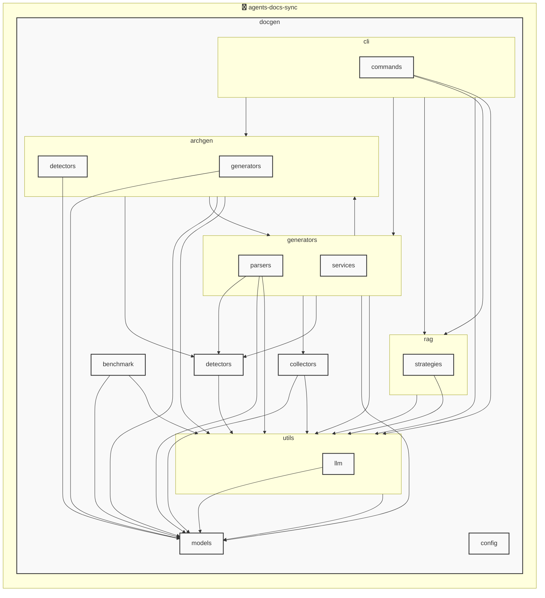

# AGENTS ドキュメント

自動生成日時: 2025-12-12 19:32:36

このドキュメントは、AIコーディングエージェントがプロジェクト内で効果的に作業するための指示とコンテキストを提供します。

---


<!-- MANUAL_START:description -->

<!-- MANUAL_END:description -->


`agents-docs-sync`は、コミットごとに自動でテスト実行・ドキュメント生成を行い、その結果から **AGENTS.md** を更新するCI/CDパイプラインです。  
主な構成要素とフローは以下の通りです。

- **言語/ツールチェーン**  
  - Python（3.10+）＋シェルスクリプトで実装され、`uv` がパッケージ管理を担います。  
  - 必須依存ライブラリ: `pyyaml>=6.0.3`, `pytest>=7.4.0`, `pytest-cov>=4.1.0`, `pytest-mock>=3.11.1`.  

- **テストフロー**  
  1. コミットが検知されると、CIは依存関係を`uv install --no-dev`でインストール。  
  2. `pytest -vvv --cov=agents_doc_sync tests/` を実行し、単体テストの失敗やカバレッジ不足を即座に検出します。

- **ドキュメント生成**  
  - Pythonスクリプトはプロジェクト内のYAML定義（エージェントメタ情報）とdocstring を解析し、Markdown形式で `docs/agents/*.md` に書き込みます。  
  - この段階では`pyyaml` が設定ファイルを読み込む役割を担い、ドキュメントの一貫性が保たれます。

- **AGENTS.md の自動更新**  
  - `scripts/update_agents_md.py`（またはシェルラッパー）により、最新生成されたMarkdownファイルとテスト結果からメタ情報を抽出し、テンプレート化した `AGENTS.md` を再構築します。  
  - これにより、新しいエージェントが追加・変更されても手動での編集作業は不要です。

- **ローカル実行**  
  プロジェクトルートには `make sync` や直接シェルスクリプトを呼び出すことで、CIと同等の処理を開発マシン上でも再現できます。  

このパイプラインは「コードが変更されたら必ずテストに合格し、ドキュメントも同期される」ことを保証するため、AIエージェントの設計・実装チームにとって信頼性の高い開発フローとなります。
**使用技術**: python, shell
## プロジェクト構造
```
├── docgen//
│   ├── archgen//
│   │   ├── detectors//
│   │   │   └── python_detector.py
│   │   └── generators//
│   │       └── mermaid_generator.py
│   ├── benchmark//
│   │   ├── comparator.py
│   │   ├── core.py
│   │   ├── recorder.py
│   │   └── reporter.py
│   ├── cli//
│   │   ├── commands//
│   │   │   └── hooks.py
│   │   └── runner.py
│   ├── collectors//
│   │   ├── collector_utils.py
│   │   ├── command_help_extractor.py
│   │   └── project_info_collector.py
│   ├── config//
│   │   └── config_accessor.py
│   ├── detectors//
│   │   ├── configs//
│   │   │   ├── go.toml
│   │   │   ├── javascript.toml
│   │   │   ├── python.toml
│   │   │   └── typescript.toml
│   │   ├── base_detector.py
│   │   ├── detector_patterns.py
│   │   ├── plugin_registry.py
│   │   └── unified_detector.py
│   ├── generators//
│   │   ├── parsers//
│   │   │   ├── base_parser.py
│   │   │   ├── generic_parser.py
│   │   │   ├── js_parser.py
│   │   │   └── python_parser.py
│   │   ├── services//
│   │   │   ├── formatting_service.py
│   │   │   ├── llm_service.py
│   │   │   └── template_service.py
│   │   ├── agents_generator.py
│   │   ├── api_generator.py
│   │   ├── base_generator.py
│   │   ├── contributing_generator.py
│   │   ├── readme_generator.py
│   │   └── service_factory.py
│   ├── hooks//
│   │   ├── tasks//
│   │   │   └── base.py
│   │   ├── config.py
│   │   └── orchestrator.py
│   ├── index//
│   │   └── meta.json
│   ├── models//
│   │   ├── agents.py
│   │   ├── config.py
│   │   └── detector.py
│   ├── prompts//
│   │   ├── agents_prompts.toml
│   │   ├── commit_message_prompts.toml
│   │   └── readme_prompts.toml
│   ├── rag//
│   │   ├── embedder.py
│   │   ├── indexer.py
│   │   ├── retriever.py
│   │   └── validator.py
│   ├── utils//
│   │   ├── llm//
│   │   │   ├── base.py
│   │   │   └── local_client.py
│   │   ├── cache.py
│   │   ├── exceptions.py
│   │   ├── file_utils.py
│   │   └── prompt_loader.py
│   ├── config.toml
│   ├── config_manager.py
│   ├── detector_config_loader.py
│   ├── docgen.py
│   ├── document_generator.py
│   └── hooks.toml
├── docs/
├── scripts/
├── tests/
├── AGENTS.md
├── BENCHMARK_PLAN.md
├── README.md
├── benchmark.md
├── pyproject.toml
├── requirements-docgen.txt
└── requirements-test.txt
```
## アーキテクチャ

<!-- MANUAL_START:architecture -->

<!-- MANUAL_END:architecture -->


## Services

### agents-docs-sync
- **Type**: python
- **Description**: コミットするごとにテスト実行・ドキュメント生成・AGENTS.md の自動更新を行うパイプライン
- **Dependencies**: anthropic, hnswlib, httpx, jinja2, openai, outlines, pip-licenses, psutil, pydantic, pytest, pytest-cov, pytest-mock, pyyaml, ruff, sentence-transformers, torch

---

## 開発環境のセットアップ

<!-- MANUAL_START:setup -->

<!-- MANUAL_END:setup -->
### 前提条件

- Python 3.12以上

### 依存関係のインストール
#### Python依存関係

```bash
uv sync
```

### LLM環境のセットアップ
#### ローカルLLMを使用する場合

1. **ローカルLLMのインストール**

   - Ollamaをインストール: https://ollama.ai/
   - モデルをダウンロード: `ollama pull llama3`
   - サービスを起動: `ollama serve`

2. **ローカルLLM使用時の注意事項**
   - モデルが起動していることを確認してください
   - ローカルリソース（メモリ、CPU）を監視してください

---


## ビルドおよびテスト手順

### ビルド手順
```bash
uv sync
uv build
uv run python3 docgen/docgen.py
```

### テスト実行
```bash
bash scripts/run_tests.sh
uv run pytest tests/ -v --tb=short
```
## コマンド

プロジェクトで利用可能なスクリプト:

| コマンド | 説明 |
| --- | --- |
| `agents_docs_sync` | docgen.docgen:main |

### `agents_docs_sync` のオプション

| オプション | 説明 |
| --- | --- |
| `--config` | 設定ファイルのパス |
| `--quiet` | 詳細メッセージを抑制 |
| `--detect-only` | 言語検出のみ実行 |
| `--no-api-doc` | APIドキュメントを生成しない |
| `--no-readme` | READMEを更新しない |
| `--build-index` | RAGインデックスをビルド |
| `--use-rag` | RAGを使用してドキュメント生成 |
| `--generate-arch` | アーキテクチャ図を生成（Mermaid形式） |

### `agents_docs_sync` のサブコマンド

| サブコマンド | 説明 |
| --- | --- |
| `agents_docs_sync init` | プロジェクトの初期化（必須ファイルを作成） |
| `agents_docs_sync commit-msg` | コミットメッセージ生成 |
| `agents_docs_sync hooks` | Git hooksの管理 |
| `agents_docs_sync benchmark` | ベンチマークを実行してレポートを生成 |

#### `agents_docs_sync init` のオプション

| オプション | 説明 |
| --- | --- |
| `--force` | 既存ファイルを強制上書き |

#### `agents_docs_sync hooks` のサブコマンド

| サブコマンド | 説明 |
| --- | --- |
| `agents_docs_sync hooks list` | 利用可能なフックを表示 |
| `agents_docs_sync hooks enable` | フックを有効化 |
| `agents_docs_sync hooks disable` | フックを無効化 |
| `agents_docs_sync hooks run` | フックを手動実行 |
| `agents_docs_sync hooks validate` | フック設定を検証 |

#### `agents_docs_sync benchmark` のオプション

| オプション | 説明 |
| --- | --- |
| `--targets` | 測定対象の処理（デフォルト: all） |
| `--format` | 出力形式（デフォルト: markdown） |
| `--output` | 出力ファイルのパス（指定しない場合は標準出力） |
| `--verbose` | 詳細情報を表示 |
| `--compare` | 2つのベンチマーク結果を比較（JSONファイルのパスを2つ指定） |
---

## コーディング規約

<!-- MANUAL_START:other -->

<!-- MANUAL_END:other -->
### リンター

- **ruff** を使用
  ```bash
  ruff check .
  ruff format .
  ```

---

## プルリクエストの手順

<!-- MANUAL_START:pr -->

<!-- MANUAL_END:pr -->
1. **ブランチの作成**
   ```bash
   git checkout -b feature/your-feature-name
   ```

2. **変更のコミット**
   - コミットメッセージは明確で説明的に
   - 関連するIssue番号を含める

3. **テストの実行**
   ```bash
   bash scripts/run_tests.sh
   uv run pytest tests/ -v --tb=short
   ```

4. **プルリクエストの作成**
   - タイトル: `[種類] 簡潔な説明`
   - 説明: 変更内容、テスト結果、関連Issueを記載

---

*このAGENTS.mdは自動生成されています。最終更新: 2025-12-12 19:32:36*