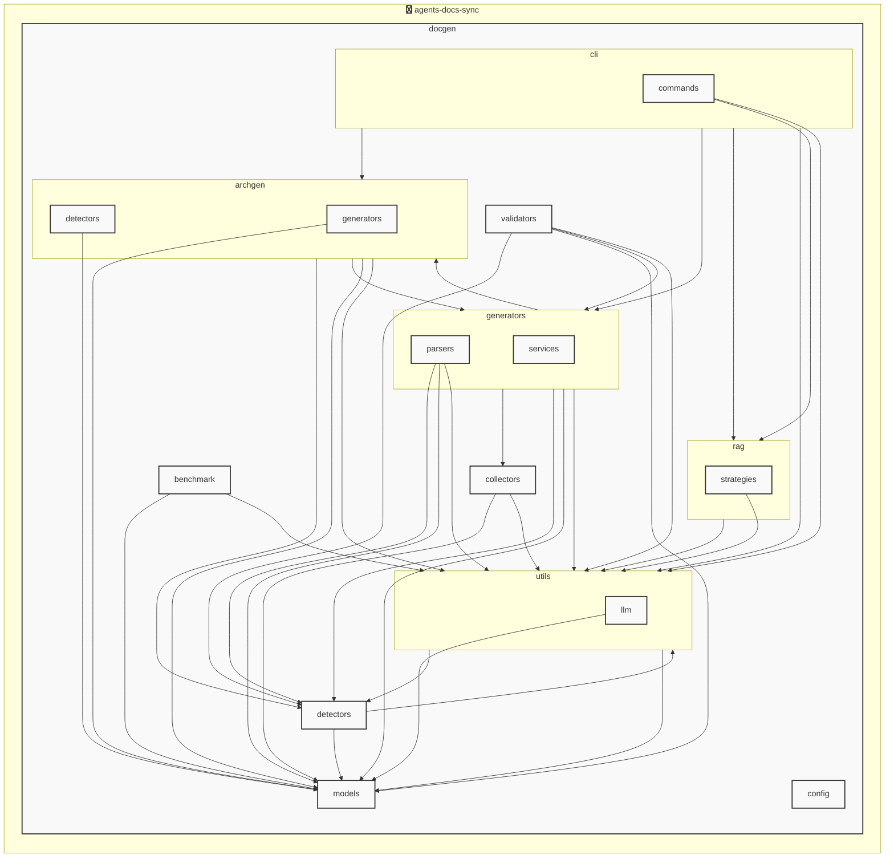

# AGENTS ドキュメント

自動生成日時: 2025-12-24 16:05:17

このドキュメントは、AIコーディングエージェントがプロジェクト内で効果的に作業するための指示とコンテキストを提供します。

---


<!-- MANUAL_START:description -->

<!-- MANUAL_END:description -->


本プロジェクトは、ソースコードをコミットするたびに自動でテスト実行・ドキュメント生成・AGENTS.md の更新という一連の作業をパイプラインとして統合したものです。  
主な機能と構成要素は以下の通りです。

- **CI/CD パイプライン**: GitHub Actions などで設定され、`push` や `pull_request` が発火すると実行されます。
- **テスト自動化**：Python の `pytest`, `pytest-cov`, `pytest-mock` を用いてユニット・統合テストを走らせ、カバレッジ情報も同時に取得します。  
  - テストはすべての Python ファイル（`tests/` ディレクトリ内）で実行されます。
- **ドキュメント生成**：Python スクリプト `docs/generate.py` がプロジェクト全体を走査し、YAML 設定 (`agents.yml`) から各エージェントの仕様書を Markdown に変換します。  
  - 依存ライブラリとして `pyyaml>=6.0.3` を使用しています。
- **AGENTS.md 自動更新**：生成したドキュメント（例: `docs/agents/*.md`）を結合し、プロジェクトルートの `AGENTS.md` に反映します。  
  - このファイルは AI エージェントが参照する主要な情報源であり、新しいエージェントや変更点が即座に可視化されます。
- **パッケージ管理**：Python の依存関係は `uv`（[https://github.com/astral-sh/uv](https://github.com/astral-sh/uv)）で解決します。  
  - `pyproject.toml` に必要なライブラリが明記されており、CI 環境でも同一構成を簡単に再現できます。

### 実行手順（ローカル環境）
1. **依存関係のインストール**  
   ```bash
   uv sync --dev  # dev には pytest 系が含まれる
   ```
2. **テスト実行**  
   ```bash
   python -m pytest tests/
   ```
3. **ドキュメント生成 & AGENTS.md 更新**  
   ```bash
   python docs/generate.py
   ```

### CI 用の設定例（GitHub Actions）
```yaml
name: Docs Sync

on:
  push:
    branches: [ main ]
jobs:
  build:
    runs-on: ubuntu-latest
    steps:
      - uses: actions/checkout@v4
      - name: Set up uv
        run: |
          curl -LsSf https://astral.sh/uv/install.sh | sh
          echo "$HOME/.cargo/bin" >> $GITHUB_PATH
      - name: Install dependencies
        run: uv sync --dev
      - name: Run tests
        run: python -m pytest tests/
      - name: Generate docs & update AGENTS.md
        run: python docs/generate.py
```

このパイプラインにより、コミット単位でエージェントの定義・ドキュメントが常に最新状態になり、AI エージェントを利用する開発者は変更点や追加情報を即座に把握できます。
**使用技術**: python, shell
## プロジェクト構造
```
├── docgen//
│   ├── archgen//
│   │   ├── detectors//
│   │   │   ├── generic_detector.py
│   │   │   └── python_detector.py
│   │   ├── generators//
│   │   │   └── mermaid_generator.py
│   │   └── models.py
│   ├── benchmark//
│   │   ├── comparator.py
│   │   ├── core.py
│   │   ├── recorder.py
│   │   └── reporter.py
│   ├── cli//
│   │   ├── commands//
│   │   │   └── hooks.py
│   │   └── runner.py
│   ├── collectors//
│   │   ├── collector_utils.py
│   │   ├── command_help_extractor.py
│   │   ├── language_info_collector.py
│   │   ├── project_info_collector.py
│   │   └── structure_analyzer.py
│   ├── config//
│   │   └── config_accessor.py
│   ├── detectors//
│   │   ├── configs//
│   │   │   ├── go.toml
│   │   │   ├── javascript.toml
│   │   │   ├── python.toml
│   │   │   └── typescript.toml
│   │   ├── base_detector.py
│   │   ├── detector_patterns.py
│   │   ├── plugin_registry.py
│   │   └── unified_detector.py
│   ├── generators//
│   │   ├── parsers//
│   │   │   ├── base_parser.py
│   │   │   ├── generic_parser.py
│   │   │   ├── js_parser.py
│   │   │   └── python_parser.py
│   │   ├── services//
│   │   │   ├── formatting_service.py
│   │   │   ├── llm_service.py
│   │   │   ├── rag_service.py
│   │   │   └── template_service.py
│   │   ├── agents_generator.py
│   │   ├── api_generator.py
│   │   ├── base_generator.py
│   │   ├── contributing_generator.py
│   │   ├── readme_generator.py
│   │   └── service_factory.py
│   ├── hooks//
│   │   ├── tasks//
│   │   │   └── base.py
│   │   ├── config.py
│   │   └── orchestrator.py
│   ├── index//
│   │   └── meta.json
│   ├── models//
│   │   ├── agents.py
│   │   ├── config.py
│   │   └── detector.py
│   ├── prompts//
│   │   ├── agents_prompts.toml
│   │   ├── agents_prompts_en.toml
│   │   ├── agents_prompts_ja.toml
│   │   ├── commit_message_prompts.toml
│   │   ├── readme_prompts.toml
│   │   ├── readme_prompts_en.toml
│   │   └── readme_prompts_ja.toml
│   ├── rag//
│   │   ├── strategies//
│   │   │   └── code_strategy.py
│   │   ├── embedder.py
│   │   ├── indexer.py
│   │   ├── retriever.py
│   │   └── validator.py
│   ├── utils//
│   │   ├── llm//
│   │   │   ├── base.py
│   │   │   └── local_client.py
│   │   ├── cache.py
│   │   ├── exceptions.py
│   │   ├── file_scanner.py
│   │   ├── file_utils.py
│   │   ├── gitignore_parser.py
│   │   ├── markdown_utils.py
│   │   └── prompt_loader.py
│   ├── validators//
│   │   └── implementation_validator.py
│   ├── config.toml
│   ├── config_manager.py
│   ├── detector_config_loader.py
│   ├── docgen.py
│   ├── document_generator.py
│   ├── hooks.toml
│   └── language_detector.py
├── docs/
├── scripts/
├── AGENTS.md
├── README.md
├── pyproject.toml
├── requirements-docgen.txt
└── requirements-test.txt
```
## アーキテクチャ

<!-- MANUAL_START:architecture -->

<!-- MANUAL_END:architecture -->


## Services

### agents-docs-sync
- **Type**: python
- **Description**: コミットするごとにテスト実行・ドキュメント生成・AGENTS.md の自動更新を行うパイプライン
- **Dependencies**: anthropic, hnswlib, httpx, jinja2, mypy, openai, outlines, pip-licenses, psutil, pydantic, pytest, pytest-cov, pytest-mock, pyyaml, radon, ruff, sentence-transformers, torch, types-pyyaml

---

## 開発環境のセットアップ

<!-- MANUAL_START:setup -->

<!-- MANUAL_END:setup -->
### 前提条件
- Python 3.12以上

### 依存関係のインストール
#### Python依存関係

```bash
uv sync
```

### LLM環境のセットアップ
#### ローカルLLMを使用する場合

1. **ローカルLLMのインストール**

   - Ollamaをインストール: https://ollama.ai/
   - モデルをダウンロード: `ollama pull llama3`
   - サービスを起動: `ollama serve`

2. **ローカルLLM使用時の注意事項**
   - モデルが起動していることを確認してください
   - ローカルリソース（メモリ、CPU）を監視してください

---


## ビルドおよびテスト手順

### ビルド手順
```bash
uv sync
uv build
uv run python3 docgen/docgen.py
```

### テスト実行
```bash
bash scripts/run_tests.sh
uv run pytest tests/ -v --tb=short
```
## コマンド

プロジェクトで利用可能なスクリプト:

| コマンド | 説明 |
| --- | --- |
| `agents_docs_sync` | docgen.docgen:main |
| `agents-docs-sync` | docgen.docgen:main |

### `agents_docs_sync` のオプション

| オプション | 説明 |
| --- | --- |
| `--config` | 設定ファイルのパス |
| `--quiet` | 詳細メッセージを抑制 |
| `--detect-only` | 言語検出のみ実行 |
| `--no-api-doc` | APIドキュメントを生成しない |
| `--no-readme` | READMEを更新しない |
| `--build-index` | RAGインデックスをビルド |
| `--use-rag` | RAGを使用してドキュメント生成 |
| `--generate-arch` | アーキテクチャ図を生成（Mermaid形式） |

### `agents_docs_sync` のサブコマンド

| サブコマンド | 説明 |
| --- | --- |
| `agents_docs_sync init` | プロジェクトの初期化（必須ファイルを作成） |
| `agents_docs_sync commit-msg` | コミットメッセージ生成 |
| `agents_docs_sync hooks` | Git hooksの管理 |
| `agents_docs_sync benchmark` | ベンチマークを実行してレポートを生成 |

#### `agents_docs_sync init` のオプション

| オプション | 説明 |
| --- | --- |
| `--force` | 既存ファイルを強制上書き |

#### `agents_docs_sync hooks` のサブコマンド

| サブコマンド | 説明 |
| --- | --- |
| `agents_docs_sync hooks list` | 利用可能なフックを表示 |
| `agents_docs_sync hooks enable` | フックを有効化 |
| `agents_docs_sync hooks disable` | フックを無効化 |
| `agents_docs_sync hooks run` | フックを手動実行 |
| `agents_docs_sync hooks validate` | フック設定を検証 |

#### `agents_docs_sync benchmark` のオプション

| オプション | 説明 |
| --- | --- |
| `--targets` | 測定対象の処理（デフォルト: all） |
| `--format` | 出力形式（デフォルト: markdown） |
| `--output` | 出力ファイルのパス（指定しない場合は標準出力） |
| `--verbose` | 詳細情報を表示 |
| `--compare` | 2つのベンチマーク結果を比較（JSONファイルのパスを2つ指定） |

### `agents-docs-sync` のオプション

| オプション | 説明 |
| --- | --- |
| `--config` | 設定ファイルのパス |
| `--quiet` | 詳細メッセージを抑制 |
| `--detect-only` | 言語検出のみ実行 |
| `--no-api-doc` | APIドキュメントを生成しない |
| `--no-readme` | READMEを更新しない |
| `--build-index` | RAGインデックスをビルド |
| `--use-rag` | RAGを使用してドキュメント生成 |
| `--generate-arch` | アーキテクチャ図を生成（Mermaid形式） |

### `agents-docs-sync` のサブコマンド

| サブコマンド | 説明 |
| --- | --- |
| `agents-docs-sync init` | プロジェクトの初期化（必須ファイルを作成） |
| `agents-docs-sync commit-msg` | コミットメッセージ生成 |
| `agents-docs-sync hooks` | Git hooksの管理 |
| `agents-docs-sync benchmark` | ベンチマークを実行してレポートを生成 |

#### `agents-docs-sync init` のオプション

| オプション | 説明 |
| --- | --- |
| `--force` | 既存ファイルを強制上書き |

#### `agents-docs-sync hooks` のサブコマンド

| サブコマンド | 説明 |
| --- | --- |
| `agents-docs-sync hooks list` | 利用可能なフックを表示 |
| `agents-docs-sync hooks enable` | フックを有効化 |
| `agents-docs-sync hooks disable` | フックを無効化 |
| `agents-docs-sync hooks run` | フックを手動実行 |
| `agents-docs-sync hooks validate` | フック設定を検証 |

#### `agents-docs-sync benchmark` のオプション

| オプション | 説明 |
| --- | --- |
| `--targets` | 測定対象の処理（デフォルト: all） |
| `--format` | 出力形式（デフォルト: markdown） |
| `--output` | 出力ファイルのパス（指定しない場合は標準出力） |
| `--verbose` | 詳細情報を表示 |
| `--compare` | 2つのベンチマーク結果を比較（JSONファイルのパスを2つ指定） |
---

## コーディング規約

<!-- MANUAL_START:other -->

<!-- MANUAL_END:other -->
### リンター

- **ruff** を使用
  ```bash
  ruff check .
  ruff format .
  ```

---

## プルリクエストの手順

<!-- MANUAL_START:pr -->

<!-- MANUAL_END:pr -->
1. **ブランチの作成**
   ```bash
   git checkout -b feature/your-feature-name
   ```

2. **変更のコミット**
   - コミットメッセージは明確で説明的に
   - 関連するIssue番号を含める

3. **テストの実行**
   ```bash
   bash scripts/run_tests.sh
   uv run pytest tests/ -v --tb=short
   ```

4. **プルリクエストの作成**
   - タイトル: `[種類] 簡潔な説明`
   - 説明: 変更内容、テスト結果、関連Issueを記載

---

*このAGENTS.mdは自動生成されています。最終更新: 2025-12-24 16:05:17*