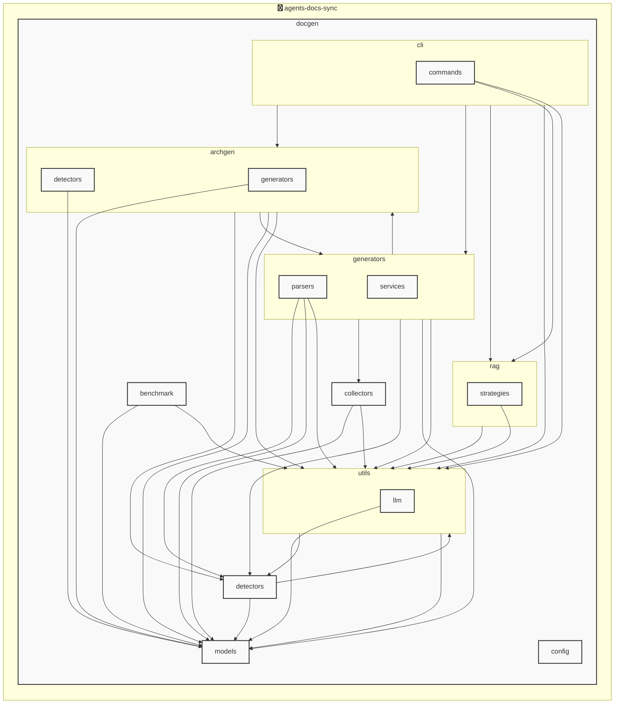

# agents-docs-sync

<!-- MANUAL_START:notice -->

<!-- MANUAL_END:notice -->


<!-- MANUAL_START:description -->

<!-- MANUAL_END:description -->
`agents-docs-sync` は、ソースコードのコミットごとに自動的に以下を実行するパイプラインです。

* **テスト実行** – `pytest` を使って単体・統合テストを走らせます。カバレッジは `pytest-cov` で測定し、結果が失敗した場合はコミットをブロックします。
* **ドキュメント生成** – プロジェクト内の Markdown / reStructuredText を収集・整形して最新の API ドキュメント（例：Sphinx の `docs/` ディレクトリ）へ書き出し、GitHub Actions などで自動公開されます。
* **AGENTS.md 自動更新** – YAML 設定ファイルからエージェント情報を抽出し、プロジェクトのルートにある `AGENTS.md` を再生成します。これによりドキュメントと実装が常に同期した状態になります。

## 主な特徴

| 機能 | 詳細 |
|------|------|
| **Python + Shell** | パイプラインロジックはシェルスクリプトで書かれ、Python ランタイム（`uv` で管理）を呼び出します。 |
| **依存関係の宣言** | `pyproject.toml` に `pyyaml`, `pytest`, `pytest-cov`, `pytest-mock` 等が列挙されており、CI 環境でも安定してインストール可能です。 |
| **高速な環境構築** | `uv install --no-dev` で依存のみを解決し、開発時は `--dev` を付けることでテスト用パッケージも取得します。 |
| **柔軟な設定** | `.agents.yaml`（または同等の名前）にエージェントごとのメタデータを書き込み、スクリプトが自動で `AGENTS.md` を更新できます。 |

## 使い方

```bash
# 開発環境をセットアップ
uv sync --dev          # 必要なパッケージ（テスト含む）をインストール

# パイプライン手動実行例
./scripts/run_pipeline.sh   # テスト → ドキュメント生成 → AGENTS.md 更新

# CI での利用は以下のように YAML に記述します。
# .github/workflows/pipeline.yml
name: Agents Docs Sync
on:
  push:
    branches: [ main ]
jobs:
  sync:
    runs-on: ubuntu-latest
    steps:
      - uses: actions/checkout@v4
      - name: Install uv
        run: curl https://astral.sh/uv/install.sh | sh && echo "$HOME/.cargo/bin" >> $GITHUB_PATH
      - name: Sync pipeline
        run: ./scripts/run_pipeline.sh
```

## 開発フロー

1. **コード変更** – `src/...` 内で機能追加・修正を行う。  
2. **ローカルテスト & ドキュメント確認** – 上記シェルスクリプトで実行し、生成されたドキュメントや `AGENTS.md` を確認する。  
3. **コミット & プッシュ** – コミット時に GitHub Actions が自動的にパイプラインを走らせます。失敗した場合は PR のマージがブロックされ、品質保証になります。

## 依存関係の概要

| パッケージ | バージョン |
|------------|-----------|
| `pyyaml`   | ≥6.0.3    |
| `pytest`   | ≥7.4.0    |
| `pytest-cov` | ≥4.1.0  |
| `pytest-mock` | ≥3.11.1 |

これらはすべて Python の仮想環境内で管理され、CI では `uv lock` によって固定化されています。

---

このプロジェクトにより、エージェントの実装とドキュメントが常に同期し、開発者間で最新情報を共有できるようになります。ぜひローカル環境や CI パイプラインへ組み込んでご活用ください。<!-- MANUAL_START:architecture -->

<!-- MANUAL_END:architecture -->


## Services

### agents-docs-sync
- **Type**: python
- **Description**: コミットするごとにテスト実行・ドキュメント生成・AGENTS.md の自動更新を行うパイプライン
- **Dependencies**: anthropic, hnswlib, httpx, jinja2, openai, outlines, pip-licenses, psutil, pydantic, pytest, pytest-cov, pytest-mock, pyyaml, ruff, sentence-transformers, torch

## 使用技術

- Python
- Shell

## 依存関係

- **Python**: `pyproject.toml` または `requirements.txt` を参照

## セットアップ


## 前提条件

- Python 3.12以上


## インストール


### Python

```bash
# uvを使用する場合
uv sync
```


## LLM環境のセットアップ

### APIを使用する場合

1. **APIキーの取得と設定**

   - OpenAI APIキーを取得: https://platform.openai.com/api-keys
   - 環境変数に設定: `export OPENAI_API_KEY=your-api-key-here`

2. **API使用時の注意事項**
   - APIレート制限に注意してください
   - コスト管理のために使用量を監視してください

### ローカルLLMを使用する場合

1. **ローカルLLMのインストール**

   - Ollamaをインストール: https://ollama.ai/
   - モデルをダウンロード: `ollama pull llama3`
   - サービスを起動: `ollama serve`

2. **ローカルLLM使用時の注意事項**
   - モデルが起動していることを確認してください
   - ローカルリソース（メモリ、CPU）を監視してください

## ビルドおよびテスト
### ビルド

```bash
uv sync
uv build
uv run python3 docgen/docgen.py
```
### テスト

```bash
bash scripts/run_tests.sh
uv run pytest tests/ -v --tb=short
```
## コマンド

プロジェクトで利用可能なスクリプト:

| コマンド | 説明 |
| --- | --- |
| `agents_docs_sync` | docgen.docgen:main |
| `agents-docs-sync` | docgen.docgen:main |

### `agents_docs_sync` のオプション

| オプション | 説明 |
| --- | --- |
| `--config` | 設定ファイルのパス |
| `--quiet` | 詳細メッセージを抑制 |
| `--detect-only` | 言語検出のみ実行 |
| `--no-api-doc` | APIドキュメントを生成しない |
| `--no-readme` | READMEを更新しない |
| `--build-index` | RAGインデックスをビルド |
| `--use-rag` | RAGを使用してドキュメント生成 |
| `--generate-arch` | アーキテクチャ図を生成（Mermaid形式） |

### `agents-docs-sync` のオプション

| オプション | 説明 |
| --- | --- |
| `--config` | 設定ファイルのパス |
| `--quiet` | 詳細メッセージを抑制 |
| `--detect-only` | 言語検出のみ実行 |
| `--no-api-doc` | APIドキュメントを生成しない |
| `--no-readme` | READMEを更新しない |
| `--build-index` | RAGインデックスをビルド |
| `--use-rag` | RAGを使用してドキュメント生成 |
| `--generate-arch` | アーキテクチャ図を生成（Mermaid形式） |

---

*このREADME.mdは自動生成されています。最終更新: 2025-12-24 05:48:47*