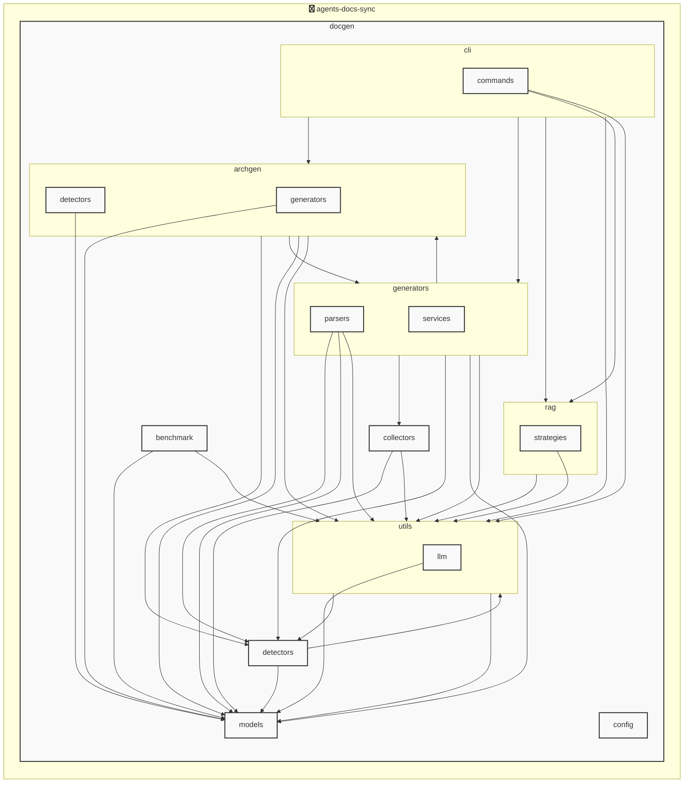

# agents-docs-sync

<!-- MANUAL_START:notice -->

<!-- MANUAL_END:notice -->


<!-- MANUAL_START:description -->

<!-- MANUAL_END:description -->
本プロジェクトは、ソースコードに対して **コミットごとに自動的に** 以下のタスクを実行するパイプラインです。

- **テストの実行**  
  `pytest` を用いてユニット・統合テストを走らせます。カバレッジ計測は `pytest-cov` が担当し、結果は HTML と XML の両形式で出力されます。
- **ドキュメント生成**  
  ソースコードの docstring やコメントから Sphinx（または MkDocs）を利用して API ドキュメント・ガイドラインを自動的に作成します。`pyyaml` を使って設定ファイルやメタデータを読み込み、必要な静的リソースも一括管理。
- **AGENTS.md の更新**  
  `agents/` ディレクトリ内の各エージェントクラス（またはスクリプト）から情報を抽出し、Markdown テンプレートに埋め込んで AGENTS.md を再生成します。これによりドキュメントと実装が常に同期した状態になります。

## 主要コンポーネント

| コンポーネント | 概要 |
|-----------------|------|
| **`scripts/ci.sh`** | CI 環境で呼び出すエントリポイント。テスト・ドキュメント生成・AGENTS.md 更新を順に実行します。 |
| **`docs/gen_docs.py`** | Sphinx/MkDocs のビルドプロセスをラップし、必要な設定ファイル (`conf.py`, `mkdocs.yml`) を自動で作成/更新します。 |
| **`agents/update_agents_md.py`** | エージェント情報（名前・概要・引数）をパースして Markdown テンプレートに挿入します。 |

## 開発環境のセットアップ

```bash
# uv が未インストールの場合は公式手順で取得
curl -LsSf https://astral.sh/uv/install.sh | sh

# 依存関係を同期（python パッケージのみ）
uv sync --dev
```

`requirements.txt` は自動生成されるため、直接編集しなくて済みます。  
開発中にテストだけ走らせたい場合は:

```bash
pytest -q
```

## 手動でパイプラインを実行する

CI のフローと同じ手順をローカルでも再現したい際には、以下のスクリプトが役立ちます。

```bash
# 全タスクを一括実行（テスト→ドキュメント生成→AGENTS.md 更新）
./scripts/ci.sh

# 個別に実行する場合は各サブコマンドを呼び出せるようになっています。
# 例: ドキュメントだけ
python docs/gen_docs.py --output ./docs/_build/html
```

## CI の設定例（GitHub Actions）

```yaml
name: CI

on:
  push:
    branches: [ main ]

jobs:
  build:
    runs-on: ubuntu-latest
    steps:
      - uses: actions/checkout@v4
      - name: Setup uv
        run: |
          curl -LsSf https://astral.sh/uv/install.sh | sh
          echo "$HOME/.cargo/bin" >> $GITHUB_PATH
      - name: Install dependencies
        run: uv sync --dev
      - name: Run CI pipeline
        run: ./scripts/ci.sh
```

## 依存関係

| ライブラリ | バージョン |
|------------|-----------|
| `pyyaml`   | ≥6.0.3     |
| `pytest`   | ≥7.4.0     |
| `pytest-cov` | ≥4.1.0   |
| `pytest-mock` | ≥3.11.1  |

これらはすべて **uv** を介してインストールされ、プロジェクトの `pyproject.toml` に明示的に宣言されています。  

---

このパイプラインを導入することで、コミットごとに品質保証・ドキュメント整合性が自動化できるため、開発者はコードへの集中力を高めつつ、最新の情報提供状態を保てます。<!-- MANUAL_START:architecture -->

<!-- MANUAL_END:architecture -->


## Services

### agents-docs-sync
- **Type**: python
- **Description**: コミットするごとにテスト実行・ドキュメント生成・AGENTS.md の自動更新を行うパイプライン
- **Dependencies**: anthropic, hnswlib, httpx, jinja2, openai, outlines, pip-licenses, psutil, pydantic, pytest, pytest-cov, pytest-mock, pyyaml, ruff, sentence-transformers, torch

### agents-docs-sync
- **Type**: shell
- **Description**: Shell project detected by source files

## 使用技術

- Python
- Shell

## 依存関係

- **Python**: `pyproject.toml` または `requirements.txt` を参照

## セットアップ


## 前提条件

- Python 3.12以上


## インストール


### Python

```bash
# uvを使用する場合
uv sync
```


## LLM環境のセットアップ

### APIを使用する場合

1. **APIキーの取得と設定**

   - OpenAI APIキーを取得: https://platform.openai.com/api-keys
   - 環境変数に設定: `export OPENAI_API_KEY=your-api-key-here`

2. **API使用時の注意事項**
   - APIレート制限に注意してください
   - コスト管理のために使用量を監視してください

### ローカルLLMを使用する場合

1. **ローカルLLMのインストール**

   - Ollamaをインストール: https://ollama.ai/
   - モデルをダウンロード: `ollama pull llama3`
   - サービスを起動: `ollama serve`

2. **ローカルLLM使用時の注意事項**
   - モデルが起動していることを確認してください
   - ローカルリソース（メモリ、CPU）を監視してください

## ビルドおよびテスト
### ビルド

```bash
uv sync
uv build
uv run python3 docgen/docgen.py
```
### テスト

```bash
bash scripts/run_tests.sh
uv run pytest tests/ -v --tb=short
```
## コマンド

プロジェクトで利用可能なスクリプト:

| コマンド | 説明 |
| --- | --- |
| `agents_docs_sync` | docgen.docgen:main |
| `agents-docs-sync` | docgen.docgen:main |

### `agents_docs_sync` のオプション

| オプション | 説明 |
| --- | --- |
| `--config` | 設定ファイルのパス |
| `--quiet` | 詳細メッセージを抑制 |
| `--detect-only` | 言語検出のみ実行 |
| `--no-api-doc` | APIドキュメントを生成しない |
| `--no-readme` | READMEを更新しない |
| `--build-index` | RAGインデックスをビルド |
| `--use-rag` | RAGを使用してドキュメント生成 |
| `--generate-arch` | アーキテクチャ図を生成（Mermaid形式） |

### `agents-docs-sync` のオプション

| オプション | 説明 |
| --- | --- |
| `--config` | 設定ファイルのパス |
| `--quiet` | 詳細メッセージを抑制 |
| `--detect-only` | 言語検出のみ実行 |
| `--no-api-doc` | APIドキュメントを生成しない |
| `--no-readme` | READMEを更新しない |
| `--build-index` | RAGインデックスをビルド |
| `--use-rag` | RAGを使用してドキュメント生成 |
| `--generate-arch` | アーキテクチャ図を生成（Mermaid形式） |

---

*このREADME.mdは自動生成されています。最終更新: 2025-12-23 16:26:40*