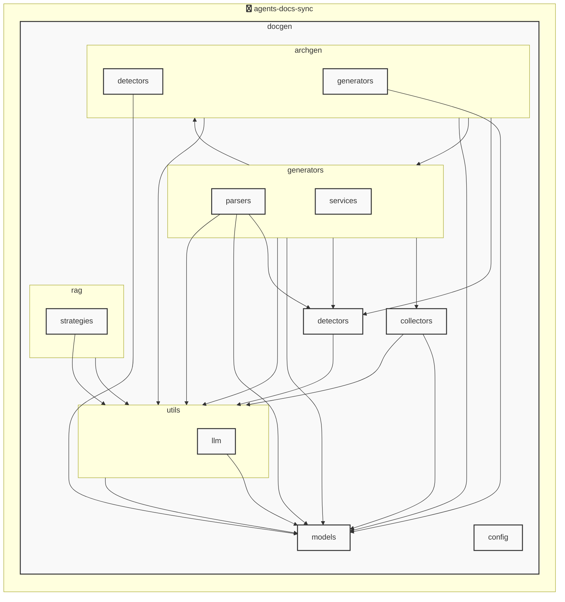

# agents-docs-sync

<!-- MANUAL_START:notice -->

<!-- MANUAL_END:notice -->


<!-- MANUAL_START:description -->

<!-- MANUAL_END:description -->
agents-docs-sync は、Git のコミットごとに自動的にテスト実行・ドキュメント生成・AGENTS.md 更新を行う CI パイプラインです。  
Python 3.x とシェルスクリプトのみで構成されており、依存関係は `uv` が管理します。

### 主な機能

- **テスト実行**：`pytest`（バージョン ≥7.4）を使いユニット・統合テスト全体を走らせます。失敗したケースは CI ステータスに反映され、即座に修正が促されます。
- **ドキュメント生成**：Sphinx などのツールでコードコメントやテスト結果から Markdown/Sphinx ドキュメントを自動作成します。`pyyaml ≥6.0.3` が YAML 設定ファイル（例: `agents.yaml`）をパースし、ドキュメント構造に反映。
- **AGENTS.md 自動更新**：プロジェクト内のエージェント情報が記述された設定ファイルから最新データを抽出し、`AGENTS.md` を再生成。変更は自動でコミットされるため手作業不要。

### 主要依存ライブラリ

| ライブラリ | バージョン要件 |
|------------|----------------|
| pyyaml     | >=6.0.3        |
| pytest     | >=7.4.0        |
| pytest-cov | >=4.1.0        |
| pytest-mock| >=3.11.1       |

### インストール & 実行

```bash
# 依存パッケージをインストール（uv が必要）
pip install uv
uv sync --dev   # 開発環境用の依存も含めて同期

# パイプラインスクリプト実行 (CI 環境で自動)
./scripts/run_pipeline.sh
```

`run_pipeline.sh` は内部で以下を順に呼び出します：

1. `pytest --cov=src tests/`
2. Sphinx ドキュメントビルド (`sphinx-build -b html docs build/docs`)
3. Python スクリプト `scripts/generate_agents_md.py` で AGENTS.md を生成
4. 必要に応じて変更を Git にコミット

### CI 設定例（GitHub Actions）

```yaml
name: Docs & Tests

on:
  push:
    branches: [main]

jobs:
  build:
    runs-on: ubuntu-latest
    steps:
      - uses: actions/checkout@v4
        with:
          fetch-depth: 0   # コミット履歴取得で差分判定に使用
      - name: Set up Python & uv
        uses: actions/setup-python@v5
        with:
          python-version: '3.12'
      - run: pip install uv
      - run: uv sync --dev
      - run: ./scripts/run_pipeline.sh
```

### カスタマイズ

- **テスト設定**：`pytest.ini` や `pyproject.toml` でカバレッジ閾値・フィルタリングを調整できます。
- **ドキュメントテーマ**：Sphinx のテーマや拡張機能（ex. autodoc, napoleon）を追加して外観と構造を自由に変更可能です。

このパイプラインは、コードベースと関連ドキュメントの同期性を保ちつつ手動更新作業を最小化し、高品質なリポジトリ運用を実現します。<!-- MANUAL_START:architecture -->

<!-- MANUAL_END:architecture -->


## Services

### agents-docs-sync
- **Type**: python
- **Description**: コミットするごとにテスト実行・ドキュメント生成・AGENTS.md の自動更新を行うパイプライン
- **Dependencies**: anthropic, hnswlib, httpx, jinja2, openai, outlines, pydantic, pytest, pytest-cov, pytest-mock, pyyaml, ruff, sentence-transformers, torch

## 使用技術

- Python
- Shell

## 依存関係

- **Python**: `pyproject.toml` または `requirements.txt` を参照

## セットアップ


## 前提条件

- Python 3.12以上


## インストール


### Python

```bash
# uvを使用する場合
uv sync
```


## LLM環境のセットアップ

### APIを使用する場合

1. **APIキーの取得と設定**

   - OpenAI APIキーを取得: https://platform.openai.com/api-keys
   - 環境変数に設定: `export OPENAI_API_KEY=your-api-key-here`

2. **API使用時の注意事項**
   - APIレート制限に注意してください
   - コスト管理のために使用量を監視してください

### ローカルLLMを使用する場合

1. **ローカルLLMのインストール**

   - Ollamaをインストール: https://ollama.ai/
   - モデルをダウンロード: `ollama pull llama3`
   - サービスを起動: `ollama serve`

2. **ローカルLLM使用時の注意事項**
   - モデルが起動していることを確認してください
   - ローカルリソース（メモリ、CPU）を監視してください

## ビルドおよびテスト
### ビルド

```bash
uv sync
uv build
uv run python3 docgen/docgen.py
```
### テスト

```bash
bash scripts/run_tests.sh
uv run pytest tests/ -v --tb=short
```
## コマンド

プロジェクトで利用可能なスクリプト:

| コマンド | 説明 |
| --- | --- |
| `agents_docs_sync` | 汎用ドキュメント自動生成システム |
### `agents_docs_sync` のオプション

| オプション | 説明 |
| --- | --- |
| `--config` | 設定ファイルのパス |
| `--detect-only` | 言語検出のみ実行 |
| `--no-api-doc` | APIドキュメントを生成しない |
| `--no-readme` | READMEを更新しない |
| `--build-index` | RAGインデックスをビルド |
| `--use-rag` | RAGを使用してドキュメント生成 |
| `--generate-arch` | アーキテクチャ図を生成（Mermaid形式） |
| `hook_name` | フック名（指定しない場合は全て） |
| `hook_name` | フック名（指定しない場合は全て） |
| `hook_name` | 実行するフック名 |
| `hook_args` | フック引数 |
| `--force` | 既存ファイルを強制上書き |

---

*このREADME.mdは自動生成されています。最終更新: 2025-12-04 14:37:03*