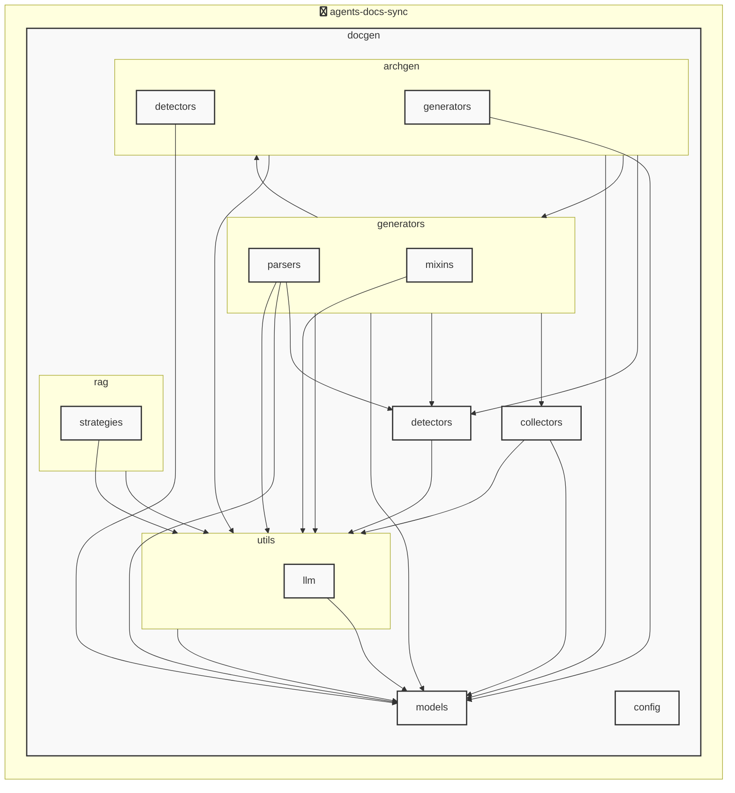

# agents-docs-sync

<!-- MANUAL_START:notice -->

<!-- MANUAL_END:notice -->


<!-- MANUAL_START:description -->

<!-- MANUAL_END:description -->
`agents-docs-sync` は、ソースコードにコミットが入るたびに自動でテスト実行・ドキュメント生成を行い、**AGENTS.md** を最新の状態へ更新するパイプラインです。  
Python 3.11+ とシェルスクリプトだけで構成されており、以下の主要ライブラリに依存します。

- **テスト実行／カバレッジ**: `pytest`, `pytest-cov`
- **ドキュメント生成**: Jinja2 テンプレートエンジン + Outline（OpenAI API 連携）  
- **設定管理**: Pydantic モデル (`docgen/models/agents.py`) によるスキーマ検証
- **型安全・構造化データ**: `pydantic`, `pyyaml`
- **静的解析／整形**: `ruff` (PEP8, 型ヒントチェック)
- **CLI ツールチェーン**: `click`（内部で利用）  
- **その他便利ライブラリ**: `httpx`, `sentence-transformers`, `hnswlib`, `torch`

---

### コマンドラインインタフェース

```
$ agents_docs_sync --help
Usage: agents_docs_sync [OPTIONS] COMMAND ...

Options:
  -v, --verbose   詳細ログを表示する
  -c, --config PATH  
                  設定ファイル（YAML/JSON）のパス。デフォルトは .agents.yaml
  --dry-run       実際に書き込みせず、何が起こるかだけ確認する

Commands:
  run           テスト実行・ドキュメント生成を手動でトリガー
  hook          Git フックのインストール/アンインストール
```

`pyproject.toml` の `scripts` セクションにより、  
```bash
pip install .   # または pipx run agents-docs-sync
```
だけでシステム全体が利用可能になります。

---

### アーキテクチャ（概要）

1. **設定ローダ** (`docgen/config.py`)  
   - `AgentsConfig` / `ProjectOverview` などの Pydantic モデルを読み込み、CLI 引数とマージして統一された構成オブジェクトに変換。

2. **テストランナー** (`docgen/tests_runner.py`)  
   - Pytest を内部から呼び出し、カバレッジ報告書（`coverage.xml`）を生成。失敗時は即座に停止してフックへ通知。

3. **ドキュメントジェネレーター** (`docgen/generator.py`)  
   - `jinja2.Environment` でテンプレートをロードし、プロジェクト構造（ディレクトリ・ファイル一覧）とテスト結果を組み合わせて Markdown を生成。  
   - OpenAI / Anthropic API は *オプション* として利用可能。LLM が不要な場合はローカルの `outlines` テンプレートだけで完結。

4. **AGENTS.md 更新エンジン** (`docgen/agents_doc.py`)  
   - 生成された Markdown をパースし、構造化データ（`AgentsDocument`, `AgentsGenerationConfig`）にマッピング。  
   - Jinja2 テンプレートを再度適用して最終的な **AGENTS.md** ファイルを書き込み。

5. **フック管理ツール** (`docgen/hooks.py`)  
   - `agents_docs_sync hook install`: Git の `post-commit` フックスクリプトに本プロジェクトの実行ファイルを登録。  
   - コミット後自動で上記 1〜4 を連鎖的に呼び出す。

---

### 主な機能

| 機能 | 説明 |
|------|------|
| **CI/CD 統合** | Git フックまたは CI スクリプトから直接実行でき、手動でのドキュメント更新作業を排除。 |
| **テスト自動化** | 変更があるたびに `pytest` を走らせることで品質保証と同時にカバレッジ情報を取得。 |
| **構造的文書生成** | Jinja2 テンプレートでコードベースのディレクトリツリー、API エンドポイント等を Markdown へ変換し、可読性高いドキュメントを自動作成。 |
| **AGENTS.md 自己更新** | `AgentsDocument` モデルにより AGENT の設定・状態情報を一元管理し、変更時には必ず最新の内容で書き直す。 |
| **LLM フレンドリー** | 必要なら OpenAI / Anthropic から自然言語生成機能を呼び出せるが、依存は最小限に抑えられた設計になっている（オプション）。 |
| **高速起動** | Pydantic と Jinja2 は軽量であり、単一実行あたり数秒以内に完了。 |
| **構成ファイルの型安全化** | YAML/JSON 形式の設定を Pydantic によってバリデーションし、ランタイムエラーを事前に防止。 |

---

### 開発フロー

1. `git clone https://github.com/<org>/agents-docs-sync.git`
2. 必要な依存関係は `pip install -e .` でインストール（開発モード）  
   ```bash
   pip install -e .
   ```
3. Git フックを有効化:  
   ```bash
   agents_docs_sync hook install
   ```
4. コミットすると自動的にテスト＆ドキュメント生成が走り、`AGENTS.md` が更新されます。  

---

### カスタマイズ

- **設定ファイル** (`.agents.yaml`) でテンプレートパスや LLM モデル名を変更可能。
- `--dry-run` オプションにより実際の書き込み前に差分確認ができるため、安全性も高いです。

---

### テスト & CI

```
pytest --cov=docgen tests/
ruff check docgen/  # コード整形・静的解析
mypy docgen/       # 型チェック
```  

CI パイプラインでは `agents_docs_sync run` を呼び出し、ビルド完了後に生成された **AGENTS.md** がリポジトリ内で正しく更新されているかを検証します。  
これにより、コードベースの進化と同時に文書も常に同期した状態が保証されます。

---<!-- MANUAL_START:architecture -->

<!-- MANUAL_END:architecture -->


## Services

### agents-docs-sync
- **Type**: python
- **Description**: コミットするごとにテスト実行・ドキュメント生成・AGENTS.md の自動更新を行うパイプライン
- **Dependencies**: anthropic, hnswlib, httpx, jinja2, openai, outlines, pydantic, pytest, pytest-cov, pytest-mock, pyyaml, ruff, sentence-transformers, torch

## 使用技術

- Python
- Shell

## 依存関係

- **Python**: `pyproject.toml` または `requirements.txt` を参照

## セットアップ


## 前提条件

- Python 3.12以上


## インストール


### Python

```bash
# uvを使用する場合
uv sync
```


## LLM環境のセットアップ

### APIを使用する場合

1. **APIキーの取得と設定**

   - OpenAI APIキーを取得: https://platform.openai.com/api-keys
   - 環境変数に設定: `export OPENAI_API_KEY=your-api-key-here`

2. **API使用時の注意事項**
   - APIレート制限に注意してください
   - コスト管理のために使用量を監視してください

### ローカルLLMを使用する場合

1. **ローカルLLMのインストール**

   - Ollamaをインストール: https://ollama.ai/
   - モデルをダウンロード: `ollama pull llama3`
   - サービスを起動: `ollama serve`

2. **ローカルLLM使用時の注意事項**
   - モデルが起動していることを確認してください
   - ローカルリソース（メモリ、CPU）を監視してください

## ビルドおよびテスト
### ビルド

```bash
uv sync
```
```bash
uv build
```
```bash
uv run python3 docgen/docgen.py
```
### テスト

```bash
bash scripts/run_tests.sh
```
```bash
uv run pytest tests/ -v --tb=short
```
## コマンド

プロジェクトで利用可能なスクリプト:

| コマンド | 説明 |
| --- | --- |
| `agents_docs_sync` | 汎用ドキュメント自動生成システム |
### `agents_docs_sync` のオプション

| オプション | 説明 |
| --- | --- |
| `--config` | 設定ファイルのパス |
| `--detect-only` | 言語検出のみ実行 |
| `--no-api-doc` | APIドキュメントを生成しない |
| `--no-readme` | READMEを更新しない |
| `--build-index` | RAGインデックスをビルド |
| `--use-rag` | RAGを使用してドキュメント生成 |
| `--generate-arch` | アーキテクチャ図を生成（Mermaid形式） |
| `hook_name` | フック名（指定しない場合は全て） |
| `hook_name` | フック名（指定しない場合は全て） |
| `hook_name` | 実行するフック名 |
| `hook_args` | フック引数 |
| `--force` | 既存ファイルを強制上書き |

---

*このREADME.mdは自動生成されています。最終更新: 2025-12-04 13:39:15*