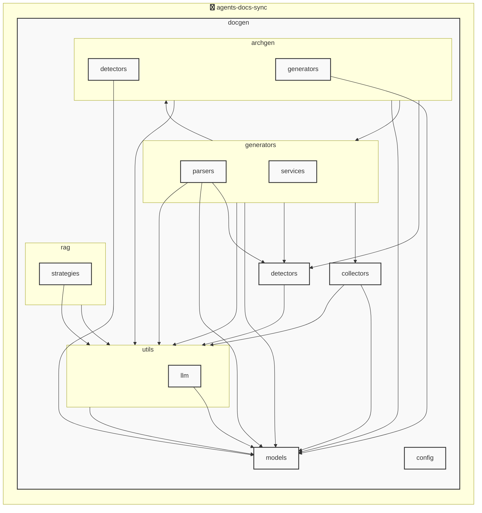

# agents-docs-sync

<!-- MANUAL_START:notice -->

<!-- MANUAL_END:notice -->


<!-- MANUAL_START:description -->

<!-- MANUAL_END:description -->
このプロジェクトは、リポジトリにコミットがあるたびに自動で以下のタスクを実行するパイプラインです。  
* **テスト実行** – `pytest` でユニット・統合テストを走らせます。  
* **ドキュメント生成** – Python ソースと YAML 設定から Markdown/HTML ドキュメント（Sphinx 等）を作成します。  
* **AGENTS.md の更新** – エージェント構成や設定情報が変更された場合に、`AGENTS.md` を最新状態へ自動反映させます。

---

## 技術スタック

| 項目 | 詳細 |
|------|-------|
| 言語 | Python 3.10+（テスト・ドキュメント生成）、Bash（パイプラインスクリプト） |
| パッケージマネージャー | `uv` (Python) |
| 主な依存ライブラリ | <ul><li>pyyaml ≥ 6.0.3 – YAML 解析</li><li>pytest ≥ 7.4.0 – テストフレームワーク</li><li>pytest-cov ≥ 4.1.0 – カバレッジ測定</li><li>pytest-mock ≥ 3.11.1 – モックサポート</li></ul>|

---

## 主要な機能とフロー

1. **コミット検知**  
   * Git の pre‑commit フックまたは CI ジョブで `git log` を監視し、変更があればパイプラインを起動。

2. **テスト実行 (`tests/run_tests.sh`)**  
   ```bash
   uv run pytest --cov=src tests/
   ```
   * 失敗した場合はビルドを中断し、エラーログを出力。

3. **ドキュメント生成 (`docs/generate_docs.py`)**  
   * ソースコードと `config/*.yaml` を解析して Markdown/HTML ドキュメントを `/site/docs` に書き込み。  
   * Sphinx でビルドする場合は `make html` を実行。

4. **AGENTS.md 更新 (`scripts/update_agents.sh`)**  
   * YAML 設定からエージェント情報（名前、バージョン、依存関係など）を抽出し、整形して `/docs/AGENTS.md` に書き込む。  

5. **成果物のコミット／プッシュ**  
   * 生成されたドキュメントと `AGENTS.md` を自動で Git に追加・コミットし、リモートへ push。

---

## ローカル実行手順

```bash
# 必要なパッケージをインストール（uv が未導入の場合は先に公式サイトから取得）
uv sync  # pyproject.toml を参照して依存関係を解決・インストール

# テスト＋カバレッジ確認
uv run pytest --cov=src tests/

# ドキュメント生成（Sphinx が必要な場合は `make html` 等実行）
python docs/generate_docs.py

# AGENTS.md を更新
bash scripts/update_agents.sh
```

---

## 拡張性・カスタマイズポイント  

| カスタマイズ項目 | 変更例 |
|-----------------|--------|
| テストフレームワークの切替 | `pytest` → `unittest`, `nose2` 等に置き換えるだけで実行スクリプトを更新可能。 |
| ドキュメント生成ツール | Sphinx のテーマや静的サイトジェネレーター（MkDocs, Hugo）へ差し替え可。 |
| AGENTS.md フォーマット | `scripts/update_agents.sh` 内のテンプレート文字列を書き換えるだけでレイアウト変更が可能。 |

---

このパイプラインを導入することで、コードベースに加わるたびに自動的にテスト結果・ドキュメント・エージェント情報が最新化され、一貫した品質と可視性の確保が実現します。<!-- MANUAL_START:architecture -->

<!-- MANUAL_END:architecture -->


## Services

### agents-docs-sync
- **Type**: python
- **Description**: コミットするごとにテスト実行・ドキュメント生成・AGENTS.md の自動更新を行うパイプライン
- **Dependencies**: anthropic, hnswlib, httpx, jinja2, openai, outlines, pydantic, pytest, pytest-cov, pytest-mock, pyyaml, ruff, sentence-transformers, torch

## 使用技術

- Python
- Shell

## 依存関係

- **Python**: `pyproject.toml` または `requirements.txt` を参照

## セットアップ


## 前提条件

- Python 3.12以上


## インストール


### Python

```bash
# uvを使用する場合
uv sync
```


## LLM環境のセットアップ

### APIを使用する場合

1. **APIキーの取得と設定**

   - OpenAI APIキーを取得: https://platform.openai.com/api-keys
   - 環境変数に設定: `export OPENAI_API_KEY=your-api-key-here`

2. **API使用時の注意事項**
   - APIレート制限に注意してください
   - コスト管理のために使用量を監視してください

### ローカルLLMを使用する場合

1. **ローカルLLMのインストール**

   - Ollamaをインストール: https://ollama.ai/
   - モデルをダウンロード: `ollama pull llama3`
   - サービスを起動: `ollama serve`

2. **ローカルLLM使用時の注意事項**
   - モデルが起動していることを確認してください
   - ローカルリソース（メモリ、CPU）を監視してください

## ビルドおよびテスト
### ビルド

```bash
uv sync
uv build
uv run python3 docgen/docgen.py
```
### テスト

```bash
bash scripts/run_tests.sh
uv run pytest tests/ -v --tb=short
```
## コマンド

プロジェクトで利用可能なスクリプト:

| コマンド | 説明 |
| --- | --- |
| `agents_docs_sync` | 汎用ドキュメント自動生成システム |

### `agents_docs_sync` のオプション

| オプション | 説明 |
| --- | --- |
| `--config` | 設定ファイルのパス |
| `--detect-only` | 言語検出のみ実行 |
| `--no-api-doc` | APIドキュメントを生成しない |
| `--no-readme` | READMEを更新しない |
| `--build-index` | RAGインデックスをビルド |
| `--use-rag` | RAGを使用してドキュメント生成 |
| `--generate-arch` | アーキテクチャ図を生成（Mermaid形式） |

---

*このREADME.mdは自動生成されています。最終更新: 2025-12-05 12:30:34*