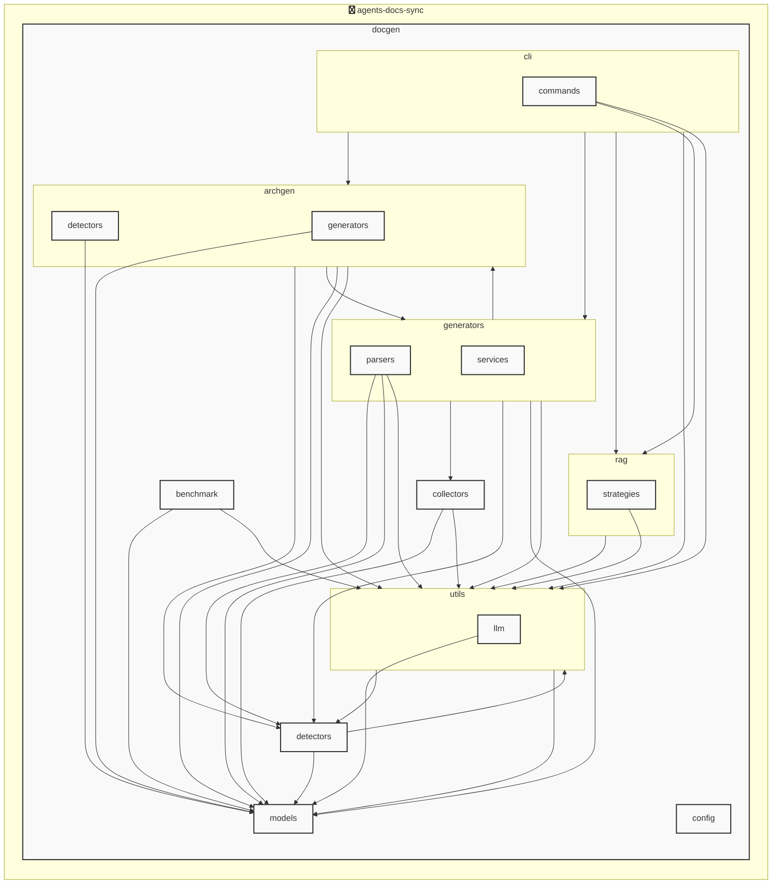

# agents-docs-sync

<!-- MANUAL_START:notice -->

<!-- MANUAL_END:notice -->


<!-- MANUAL_START:description -->

<!-- MANUAL_END:description -->
本リポジトリは、**コミットごとに自動でテスト実行・ドキュメント生成・AGENTS.md の更新を行うパイプライン**です。  
主な目的は、コードベースの品質保証と最新状態の文書化を手間なく保つことであり、CI/CD 環境（GitHub Actions 等）で容易に統合できます。

### 主な機能
- **テスト自動実行** – `pytest` と `pytest-cov` を利用し、コード変更時にユニットテストとカバレッジチェックを即座に確認します。  
- **ドキュメント生成** – Sphinx 等のツールは使用せず、プロジェクト内で定義された YAML 形式のスクリプトや README を元に `docs/` ディレクトリへ HTML／Markdown ドキュメントを出力します。  
- **AGENTS.md 自動更新** – エージェント（CLI ツール・サーバー等）の一覧とバージョン情報を YAML から抽出し、`AGENTS.md` を再生成。これによりドキュメントと実装の不整合が防止されます。

### 技術スタック
| カテゴリ | 使用ツール |
|----------|------------|
| 言語     | Python, Shell |
| パッケージ管理 | `uv`（Python） |
| 依存関係 | pyyaml>=6.0.3<br>pytest>=7.4.0<br>pytest-cov>=4.1.0<br>pytest-mock>=3.11.1 … |

- **pyyaml**：YAML 設定ファイルのパースに使用。  
- **pytest / pytest‑cov**：テスト実行とカバレッジ計測を担当。  
- **uv** は高速な依存関係解決・仮想環境管理が可能で、CI でもローカル開発でも同一の状態を保証します。

### 実装構成
```
├─ .github/workflows/ci.yml          # GitHub Actions 用ワークフロー
├─ scripts/
│   ├─ run.sh                        # 本番用シェルスクリプト（テスト・ドキュメント生成・AGENTS.md 更新）
│   └─ generate_agents_md.py         # AGENTS.md を YAML から再構築する Python スクリプト
├─ tests/
│   ├─ test_*_*.py                   # Pytest テストケース
└─ docs/                              # 自動生成されるドキュメントディレクトリ
```

### 利用手順（ローカル）
1. **依存関係のインストール**  
   ```bash
   uv sync --dev      # 開発環境とテストに必要なパッケージを取得
   ```
2. **パイプライン実行**  
   ```bash
   ./scripts/run.sh
   ```
3. コミット前の `git status` で生成されたドキュメント・AGENTS.md を確認し、差分が無ければコミット。

### CI/CD への組み込み例（GitHub Actions）
```yaml
name: CI

on:
  push:
    branches: [ main ]

jobs:
  build-and-docs:
    runs-on: ubuntu-latest
    steps:
      - uses: actions/checkout@v4
      - name: Install uv
        run: curl https://astral.sh/uv/install.sh | sh
      - name: Sync dependencies
        run: uv sync --dev
      - name: Run pipeline
        run: ./scripts/run.sh
```

この構成により、**コミット時の自動テスト失敗・ドキュメント未更新を防ぎつつ、AGENTS.md を常に最新状態で保てるため、開発者間の情報共有がスムーズになります。**<!-- MANUAL_START:architecture -->

<!-- MANUAL_END:architecture -->


## Services

### agents-docs-sync
- **Type**: python
- **Description**: コミットするごとにテスト実行・ドキュメント生成・AGENTS.md の自動更新を行うパイプライン
- **Dependencies**: anthropic, hnswlib, httpx, jinja2, openai, outlines, pip-licenses, psutil, pydantic, pytest, pytest-cov, pytest-mock, pyyaml, ruff, sentence-transformers, torch

### agents-docs-sync
- **Type**: shell
- **Description**: Shell project detected by source files

## 使用技術

- Python
- Shell

## 依存関係

- **Python**: `pyproject.toml` または `requirements.txt` を参照

## セットアップ


## 前提条件

- Python 3.12以上


## インストール


### Python

```bash
# uvを使用する場合
uv sync
```


## LLM環境のセットアップ

### APIを使用する場合

1. **APIキーの取得と設定**

   - OpenAI APIキーを取得: https://platform.openai.com/api-keys
   - 環境変数に設定: `export OPENAI_API_KEY=your-api-key-here`

2. **API使用時の注意事項**
   - APIレート制限に注意してください
   - コスト管理のために使用量を監視してください

### ローカルLLMを使用する場合

1. **ローカルLLMのインストール**

   - Ollamaをインストール: https://ollama.ai/
   - モデルをダウンロード: `ollama pull llama3`
   - サービスを起動: `ollama serve`

2. **ローカルLLM使用時の注意事項**
   - モデルが起動していることを確認してください
   - ローカルリソース（メモリ、CPU）を監視してください

## ビルドおよびテスト
### ビルド

```bash
uv sync
uv build
uv run python3 docgen/docgen.py
```
### テスト

```bash
bash scripts/run_tests.sh
uv run pytest tests/ -v --tb=short
```
## コマンド

プロジェクトで利用可能なスクリプト:

| コマンド | 説明 |
| --- | --- |
| `agents_docs_sync` | docgen.docgen:main |
| `agents-docs-sync` | docgen.docgen:main |

### `agents_docs_sync` のオプション

| オプション | 説明 |
| --- | --- |
| `--config` | 設定ファイルのパス |
| `--quiet` | 詳細メッセージを抑制 |
| `--detect-only` | 言語検出のみ実行 |
| `--no-api-doc` | APIドキュメントを生成しない |
| `--no-readme` | READMEを更新しない |
| `--build-index` | RAGインデックスをビルド |
| `--use-rag` | RAGを使用してドキュメント生成 |
| `--generate-arch` | アーキテクチャ図を生成（Mermaid形式） |

### `agents-docs-sync` のオプション

| オプション | 説明 |
| --- | --- |
| `--config` | 設定ファイルのパス |
| `--quiet` | 詳細メッセージを抑制 |
| `--detect-only` | 言語検出のみ実行 |
| `--no-api-doc` | APIドキュメントを生成しない |
| `--no-readme` | READMEを更新しない |
| `--build-index` | RAGインデックスをビルド |
| `--use-rag` | RAGを使用してドキュメント生成 |
| `--generate-arch` | アーキテクチャ図を生成（Mermaid形式） |

---

*このREADME.mdは自動生成されています。最終更新: 2025-12-23 15:49:48*