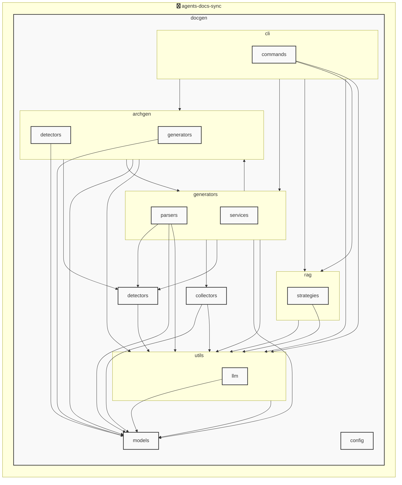

# agents-docs-sync

<!-- MANUAL_START:notice -->

<!-- MANUAL_END:notice -->


<!-- MANUAL_START:description -->

<!-- MANUAL_END:description -->
`agents-docs-sync` は、ソースコードをコミットするたびに自動で以下の三つのタスクを実行し、プロジェクト全体の品質とドキュメント整合性を保ちます。

1. **テスト実行** – `pytest` とカバレッジツール（`pytest-cov`）を使用してユニット・統合テストを走らせる。失敗した場合は CI ビルドが停止し、エラー内容がすぐに確認できるようになっています。
2. **ドキュメント生成** – コードベースから自動で API ドキュメント（Markdown 形式）や設定ファイルのサンプルを作成。`pyyaml` を利用して YAML 設定例をパースし、整形したテーブルとして出力します。
3. **AGENTS.md の更新** – プロジェクト内にあるエージェント構成（例えば `agents.yaml`）から情報を抽出し、最新の状態で `AGENTS.md` を書き換えます。これによりドキュメントと実際の設定が常に同期します。

### 主な技術スタック
| カテゴリ | ツール/ライブラリ |
|----------|------------------|
| 言語 | Python 3.11+, Bash（シェルスクリプト） |
| パッケージマネージャー | `uv` (Python) |
| テストフレームワーク | `pytest`, `pytest-cov`, `pytest-mock` |
| ドキュメント生成 | Python スクリプト + Markdown（標準ライブラリ） |
| YAML 解析 | `pyyaml >=6.0.3` |

### 使用方法
1. **依存関係をインストール**  
   ```bash
   uv sync --frozen
   ```
2. **パイプラインの手動実行（開発時に便利）**  
   ```bash
   ./scripts/run_pipeline.sh  # シェルスクリプトでテスト・ドキュメント生成・AGENTS.md 更新を順次呼び出す
   ```
3. **CI 設定例** – GitHub Actions や GitLab CI の `.yml` ファイルに `run_pipeline.sh` を実行させるだけです。

### 期待できるメリット
- コミット単位での自動検証により、バグ混入リスクを低減します。  
- ドキュメントとコードが常に同期しているため、新規開発者や外部コントリビューターへのハンドオフがスムーズになります。  
- 依存関係管理は `uv` が高速かつ正確な解決を提供し、CI のビルド時間短縮にも寄与します。

このプロジェクトにより、コード品質と文書整合性の両立が実現できるため、大規模チームやオープンソース開発で特に有用です。<!-- MANUAL_START:architecture -->

<!-- MANUAL_END:architecture -->


## Services

### agents-docs-sync
- **Type**: python
- **Description**: コミットするごとにテスト実行・ドキュメント生成・AGENTS.md の自動更新を行うパイプライン
- **Dependencies**: anthropic, hnswlib, httpx, jinja2, openai, outlines, pip-licenses, pydantic, pytest, pytest-cov, pytest-mock, pyyaml, ruff, sentence-transformers, torch

## 使用技術

- Python
- Shell

## 依存関係

- **Python**: `pyproject.toml` または `requirements.txt` を参照

## セットアップ


## 前提条件

- Python 3.12以上


## インストール


### Python

```bash
# uvを使用する場合
uv sync
```


## LLM環境のセットアップ

### APIを使用する場合

1. **APIキーの取得と設定**

   - OpenAI APIキーを取得: https://platform.openai.com/api-keys
   - 環境変数に設定: `export OPENAI_API_KEY=your-api-key-here`

2. **API使用時の注意事項**
   - APIレート制限に注意してください
   - コスト管理のために使用量を監視してください

### ローカルLLMを使用する場合

1. **ローカルLLMのインストール**

   - Ollamaをインストール: https://ollama.ai/
   - モデルをダウンロード: `ollama pull llama3`
   - サービスを起動: `ollama serve`

2. **ローカルLLM使用時の注意事項**
   - モデルが起動していることを確認してください
   - ローカルリソース（メモリ、CPU）を監視してください

## ビルドおよびテスト
### ビルド

```bash
uv sync
uv build
uv run python3 docgen/docgen.py
```
### テスト

```bash
bash scripts/run_tests.sh
uv run pytest tests/ -v --tb=short
```
## コマンド

プロジェクトで利用可能なスクリプト:

| コマンド | 説明 |
| --- | --- |
| `agents_docs_sync` | docgen.docgen:main |

### `agents_docs_sync` のオプション

| オプション | 説明 |
| --- | --- |
| `--config` | 設定ファイルのパス |
| `--quiet` | 詳細メッセージを抑制 |
| `--detect-only` | 言語検出のみ実行 |
| `--no-api-doc` | APIドキュメントを生成しない |
| `--no-readme` | READMEを更新しない |
| `--build-index` | RAGインデックスをビルド |
| `--use-rag` | RAGを使用してドキュメント生成 |
| `--generate-arch` | アーキテクチャ図を生成（Mermaid形式） |

---

*このREADME.mdは自動生成されています。最終更新: 2025-12-12 00:19:28*