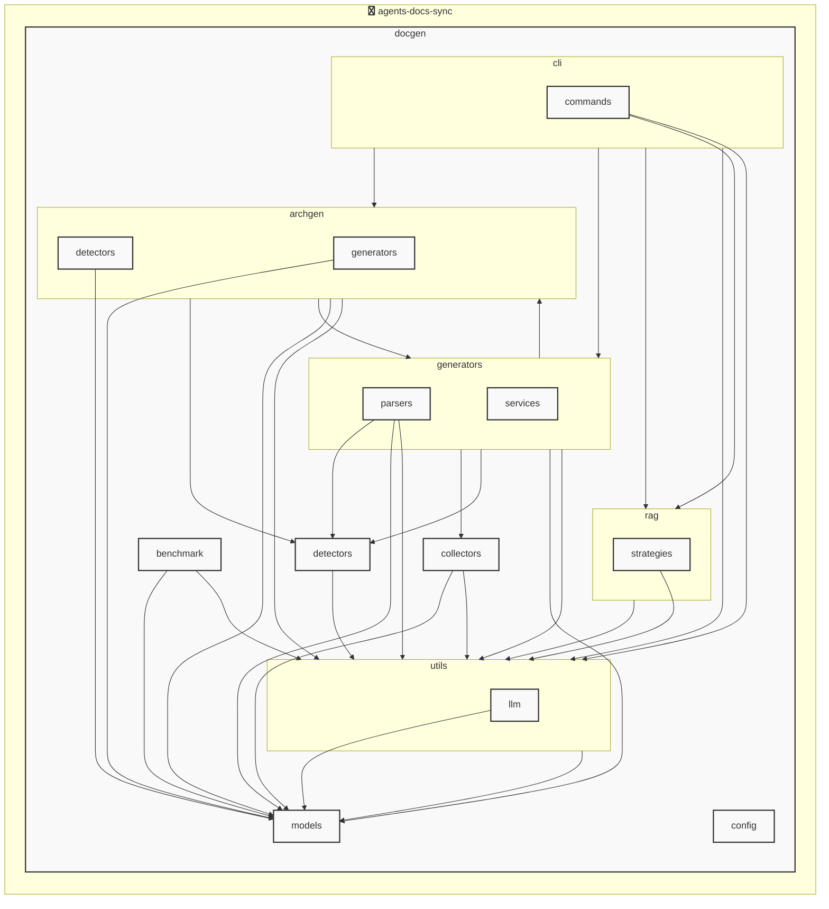

# agents-docs-sync

<!-- MANUAL_START:notice -->

<!-- MANUAL_END:notice -->


<!-- MANUAL_START:description -->

<!-- MANUAL_END:description -->
このリポジトリは、**agents-docs-sync** という名前の自動化パイプラインを提供します。  
コミットごとに以下の処理が実行されるよう設計されています。

- **テスト実行** – `pytest` を用いて単体・統合テストを走らせ、カバレッジは `coverage.py` で測定。
- **ドキュメント生成** – ソースコードの docstring や Markdown ファイルから最新の API ドキュメント（Sphinx / MkDocs 等）をビルド。  
- **AGENTS.md の更新** – プロジェクト内に存在するエージェント実装ファイル (`agents/*.py`) をスキャンし、名前・概要・使用方法などを抽出して `AGENTS.md` に自動反映。

## 技術スタック

| カテゴリ | ツール / ライブラリ |
|----------|--------------------|
| **言語** | Python 3.11+, Bash (Shell) |
| **パッケージ管理** | uv（Python の高速なインストーラ） |
| **テスティング** | `pytest`、`pytest-cov`、`pytest-mock` |
| **ドキュメント生成** | Sphinx / MkDocs など (設定は `docs/conf.py`) |
| **CI/CD** | GitHub Actions（または任意の CI サーバ） |

## 主な依存関係

```toml
[project]
dependencies = [
    "pyyaml>=6.0.3",
    "pytest>=7.4.0",
    "pytest-cov>=4.1.0",
    "pytest-mock>=3.11.1",
]
```

## ワークフロー概要

```text
┌───────────────────────┐
│ ① Git コミット (push) │
├───────────────▲─────────┤
│               │         │
│   ──> CI パイプライン実行 │
│               ▼         │
├─────┬───────▼─────┬──────┘
│     │             │     
│ ② テスト      │ ③ ドキュメント生成  
│     │             │     
│   ──> 結果確認    │   └─→ docs/ に出力   
├──────────────▲───────────────────────┤
│              │                       │
│          ④ AGENTS.md 更新            │
│              ▼                       │
└───────────────────────────────────────┘
```

1. **テスト**  
   `pytest -q --cov=agents` を実行し、失敗があればビルドを停止。カバレッジは 80% 超であることを期待。

2. **ドキュメント生成**  
   Sphinx の場合: `make html`（または `sphinx-build -b html docs/ _build/html/`）  
   MkDocs の場合: `mkdocs build`

3. **AGENTS.md 更新**  
   スクリプト `scripts/update_agents_md.py` がエージェントモジュールを走査し、最新情報でファイルを書き換える。変更があれば Git にコミットされる。

## ローカル実行

```bash
# 依存関係のインストール（uv のみ）
$ uv sync --dev

# テストとカバレッジ確認
$ uv run pytest -q --cov=agents tests/

# ドキュメント生成 (Sphinx)
$ cd docs && make html

# AGENTS.md 更新
$ python scripts/update_agents_md.py
```

## 使い方のヒント

- **CI の設定**  
  `workflow.yml` を作成し、上記ステップを順に呼び出すことで GitHub Actions 上で自動化できます。  

- **ローカル開発時**  
  コミット前に手動でパイプラインの各フェーズ（テスト・ドキュメント生成）を実行し、`AGENTS.md` が正しく更新されることを確認してから push。

- **拡張性**  
  `scripts/` 配下には新しいスクリプトやユーティリティを追加でき、必要に応じて他のドキュメントツール（MkDocs, Mkdocs Material）へ切り替えるだけで動作します。  

---

このプロジェクトは、**コードベースとドキュメントが常に同期した状態を保つこと** を主眼として設計されました。  
開発者の手間を最小化しながら品質保証（テスト）・情報共有（docs/AGENTS.md）の両立を実現しています。<!-- MANUAL_START:architecture -->

<!-- MANUAL_END:architecture -->


## Services

### agents-docs-sync
- **Type**: python
- **Description**: コミットするごとにテスト実行・ドキュメント生成・AGENTS.md の自動更新を行うパイプライン
- **Dependencies**: anthropic, hnswlib, httpx, jinja2, openai, outlines, pip-licenses, psutil, pydantic, pytest, pytest-cov, pytest-mock, pyyaml, ruff, sentence-transformers, torch

## 使用技術

- Python
- Shell

## 依存関係

- **Python**: `pyproject.toml` または `requirements.txt` を参照

## セットアップ


## 前提条件

- Python 3.12以上


## インストール


### Python

```bash
# uvを使用する場合
uv sync
```


## LLM環境のセットアップ

### APIを使用する場合

1. **APIキーの取得と設定**

   - OpenAI APIキーを取得: https://platform.openai.com/api-keys
   - 環境変数に設定: `export OPENAI_API_KEY=your-api-key-here`

2. **API使用時の注意事項**
   - APIレート制限に注意してください
   - コスト管理のために使用量を監視してください

### ローカルLLMを使用する場合

1. **ローカルLLMのインストール**

   - Ollamaをインストール: https://ollama.ai/
   - モデルをダウンロード: `ollama pull llama3`
   - サービスを起動: `ollama serve`

2. **ローカルLLM使用時の注意事項**
   - モデルが起動していることを確認してください
   - ローカルリソース（メモリ、CPU）を監視してください

## ビルドおよびテスト
### ビルド

```bash
uv sync
uv build
uv run python3 docgen/docgen.py
```
### テスト

```bash
bash scripts/run_tests.sh
uv run pytest tests/ -v --tb=short
```
## コマンド

プロジェクトで利用可能なスクリプト:

| コマンド | 説明 |
| --- | --- |
| `agents_docs_sync` | docgen.docgen:main |

### `agents_docs_sync` のオプション

| オプション | 説明 |
| --- | --- |
| `--config` | 設定ファイルのパス |
| `--quiet` | 詳細メッセージを抑制 |
| `--detect-only` | 言語検出のみ実行 |
| `--no-api-doc` | APIドキュメントを生成しない |
| `--no-readme` | READMEを更新しない |
| `--build-index` | RAGインデックスをビルド |
| `--use-rag` | RAGを使用してドキュメント生成 |
| `--generate-arch` | アーキテクチャ図を生成（Mermaid形式） |

---

*このREADME.mdは自動生成されています。最終更新: 2025-12-12 19:56:31*