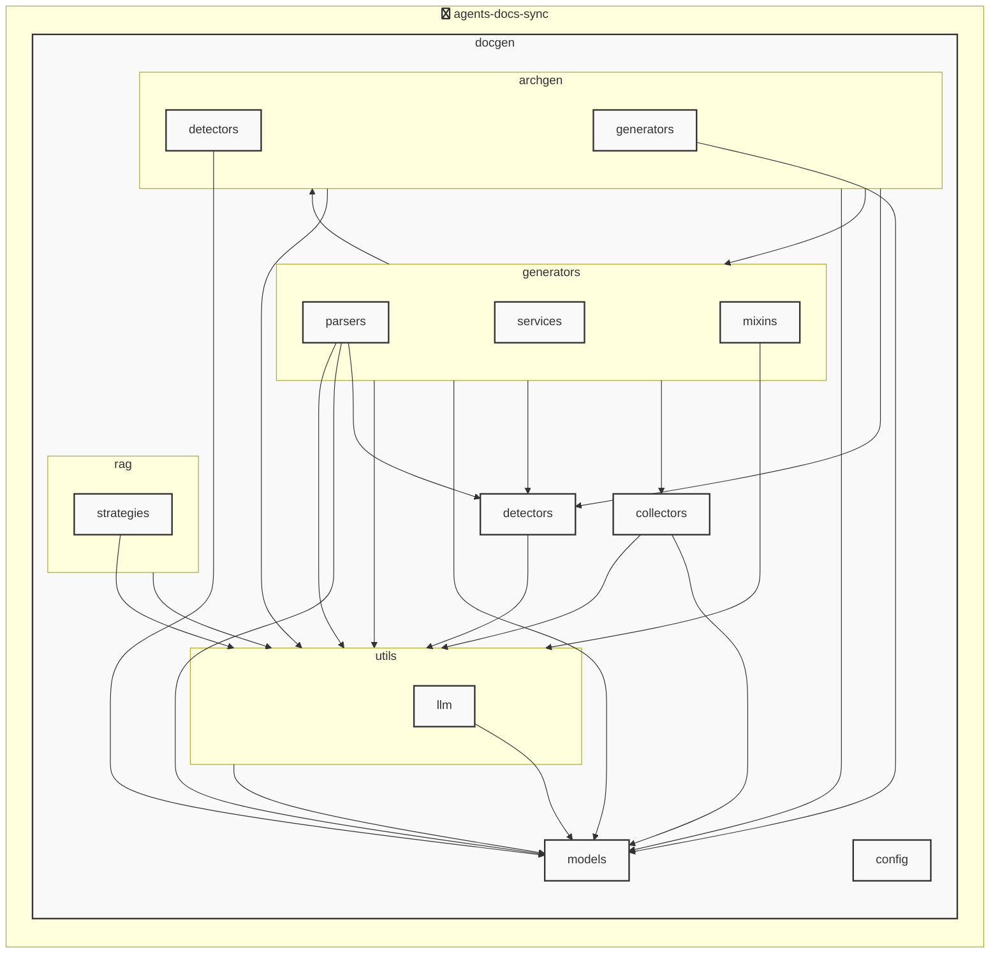

# agents-docs-sync

<!-- MANUAL_START:notice -->

<!-- MANUAL_END:notice -->


<!-- MANUAL_START:description -->

<!-- MANUAL_END:description -->
`agents‑docs‑sync` は、リポジトリへコミットが入るたびに自動でテスト実行・ドキュメント生成・AGENTS.md の更新を担うパイプラインです。  
Python とシェルスクリプトの組み合わせで構築されており、CLI エントリポイントは `agents_docs_sync = "docgen.docgen:main"`（`pyproject.toml`）に定義されています。

- **実行フロー**  
  - Git のコミット後に CI が起動 → `pytest --cov=.` を走らせてテストとカバレッジを確認。  
  - 成功した場合、docgen モジュールがコードベースからドキュメント構造（`AgentsDocument`）を抽出し、Jinja2 テンプレートで AGENTS.md を再生成。  
  - 同時に `auto_architecture_generator.py` がプロジェクト構成ファイル (`architecture_manifest.yml`) やソースコードの依存関係からアーキテクチャ図（PNG）を静的解析のみで作り出す。

- **主要コンポーネント**  
  | コンポーネント | 主な役割 |
  |----------------|----------|
  | `docgen.docgen` | CLI ハンドラ、設定読み込み (`AgentsConfig`, `ProjectOverview`) を行い、テスト実行・ドキュメント生成を制御。 |
  | `models/agents.py` | Pydantic ベースのデータモデル（`AgentsConfigSection`, `AgentsGenerationConfig`, `AgentsDocument`）で構造化設定と出力フォーマットを定義。 |
  | `hooks/install.sh` | CI 用フックをインストールし、コミット時に自動実行されるよう登録 (`agents_docs_sync hook install`)。 |

- **依存ライブラリ**  
  - *テスト/品質*: pytest, pytest‑cov, ruff.  
  - *ドキュメント生成*: jinja2, pyyaml, outlines (テンプレートエンジン拡張).  
  - *LLM・ベクトル検索*（オプション）: anthropic, openai, sentence-transformers, hnswlib, torch.  
  - *HTTP & API*: httpx。  

- **設定**  
  `docs/CONFIG_GUIDE.md` に従い、`.agents.yml` 等の構成ファイルでビルドオプションや LLM の使用有無を切り替え可能です。

- **使い方例**  
```bash
# クローン＆セットアップ
git clone https://github.com/your-org/agents-docs-sync.git
cd agents-docs-sync

# フックインストール（CI で自動実行）
agents_docs_sync hook install

# 手動起動テスト・ドキュメント生成
agents_docs_sync --help   # オプション確認
```

- **ビジョン**  
  - コミット単位での文書整合性保証。  
  - LLM を介さずにコードベースからアーキテクチャ図を自動作成し、ドメイン知識を可視化。  
  - CI/CD パイプラインへのシームレス統合と拡張可能なフック設計で開発プロセスの効率向上。

これにより、ソフトウェア品質・文書整備が同時進行し、一貫したドキュメント管理を実現します。<!-- MANUAL_START:architecture -->

<!-- MANUAL_END:architecture -->


## Services

### agents-docs-sync
- **Type**: python
- **Description**: コミットするごとにテスト実行・ドキュメント生成・AGENTS.md の自動更新を行うパイプライン
- **Dependencies**: anthropic, hnswlib, httpx, jinja2, openai, outlines, pydantic, pytest, pytest-cov, pytest-mock, pyyaml, ruff, sentence-transformers, torch

## 使用技術

- Python
- Shell

## 依存関係

- **Python**: `pyproject.toml` または `requirements.txt` を参照

## セットアップ


## 前提条件

- Python 3.12以上


## インストール


### Python

```bash
# uvを使用する場合
uv sync
```


## LLM環境のセットアップ

### APIを使用する場合

1. **APIキーの取得と設定**

   - OpenAI APIキーを取得: https://platform.openai.com/api-keys
   - 環境変数に設定: `export OPENAI_API_KEY=your-api-key-here`

2. **API使用時の注意事項**
   - APIレート制限に注意してください
   - コスト管理のために使用量を監視してください

### ローカルLLMを使用する場合

1. **ローカルLLMのインストール**

   - Ollamaをインストール: https://ollama.ai/
   - モデルをダウンロード: `ollama pull llama3`
   - サービスを起動: `ollama serve`

2. **ローカルLLM使用時の注意事項**
   - モデルが起動していることを確認してください
   - ローカルリソース（メモリ、CPU）を監視してください

## ビルドおよびテスト
### ビルド

```bash
uv sync
```
```bash
uv build
```
```bash
uv run python3 docgen/docgen.py
```
### テスト

```bash
bash scripts/run_tests.sh
```
```bash
uv run pytest tests/ -v --tb=short
```
## コマンド

プロジェクトで利用可能なスクリプト:

| コマンド | 説明 |
| --- | --- |
| `agents_docs_sync` | 汎用ドキュメント自動生成システム |
### `agents_docs_sync` のオプション

| オプション | 説明 |
| --- | --- |
| `--config` | 設定ファイルのパス |
| `--detect-only` | 言語検出のみ実行 |
| `--no-api-doc` | APIドキュメントを生成しない |
| `--no-readme` | READMEを更新しない |
| `--build-index` | RAGインデックスをビルド |
| `--use-rag` | RAGを使用してドキュメント生成 |
| `--generate-arch` | アーキテクチャ図を生成（Mermaid形式） |
| `hook_name` | フック名（指定しない場合は全て） |
| `hook_name` | フック名（指定しない場合は全て） |
| `hook_name` | 実行するフック名 |
| `hook_args` | フック引数 |
| `--force` | 既存ファイルを強制上書き |

---

*このREADME.mdは自動生成されています。最終更新: 2025-12-04 14:09:18*