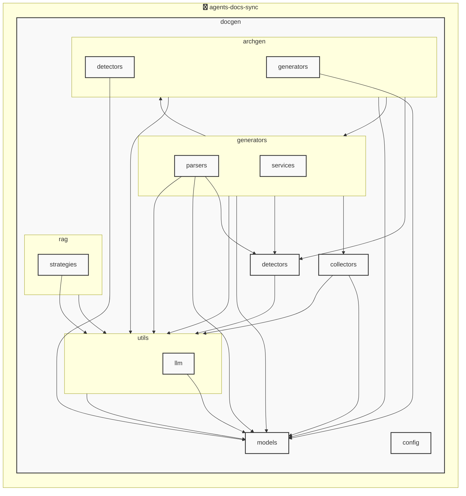

# agents-docs-sync

<!-- MANUAL_START:notice -->

<!-- MANUAL_END:notice -->


<!-- MANUAL_START:description -->

<!-- MANUAL_END:description -->
agents-docs-sync は、ソースコードの変更がコミットされるたびに自動で以下の処理を実行します。

- **テスト実行**：Python 3.x 用の `uv` 環境下で `pytest`（+ `pytest-cov`, `pytest-mock`）を用いてユニット・統合テストを走らせ、カバレッジ情報も収集します。  
- **ドキュメント生成**：プロジェクト内の docstring や Markdown ファイルから Sphinx で API ドキュメントをビルドし、`docs/` ディレクトリに出力します。また `pyyaml` を利用して設定ファイル（例: `_config.yml`, `agents.yaml`）を読み込み、必要なメタ情報も埋め込む仕組みです。  
- **AGENTS.md 自動更新**：各エージェントの定義が記載された YAML/JSON ファイルから最新情報を抽出し、`AGENTS.md` を再生成します。これによりドキュメントと実際のコードベース間で整合性が保たれます。

### 技術スタック
- **言語**：Python（3.10+）＋ Bash  
- **パッケージマネージャ**：`uv` (高速な Python 環境構築)  
- **主要依存ライブラリ**  
  - `pyyaml>=6.0.3` – 設定・メタ情報の読み込み  
  - `pytest>=7.4.0`, `pytest-cov>=4.1.0`, `pytest-mock>=3.11.1` – テスト実行とカバレッジ測定  
- **CI/CD**：GitHub Actions（または任意の CI サーバ）で `push/main` イベントをトリガーし、上記スクリプトが順次走るように構成。

### ワークフロー
1. コミット → GitHub に Push  
2. CI が起動：テスト→ドキュメント生成→AGENTS.md 更新  
3. すべて成功した場合のみマージ／デプロイを許可  

このパッケージは、コード品質と最新の開発者向け資料が常に同期された状態で保たれることを保証し、大規模なエージェントベースアプリケーションやライブラリ開発に最適です。<!-- MANUAL_START:architecture -->

<!-- MANUAL_END:architecture -->


## Services

### agents-docs-sync
- **Type**: python
- **Description**: コミットするごとにテスト実行・ドキュメント生成・AGENTS.md の自動更新を行うパイプライン
- **Dependencies**: anthropic, hnswlib, httpx, jinja2, openai, outlines, pydantic, pytest, pytest-cov, pytest-mock, pyyaml, ruff, sentence-transformers, torch

## 使用技術

- Python
- Shell

## 依存関係

- **Python**: `pyproject.toml` または `requirements.txt` を参照

## セットアップ


## 前提条件

- Python 3.12以上


## インストール


### Python

```bash
# uvを使用する場合
uv sync
```


## LLM環境のセットアップ

### APIを使用する場合

1. **APIキーの取得と設定**

   - OpenAI APIキーを取得: https://platform.openai.com/api-keys
   - 環境変数に設定: `export OPENAI_API_KEY=your-api-key-here`

2. **API使用時の注意事項**
   - APIレート制限に注意してください
   - コスト管理のために使用量を監視してください

### ローカルLLMを使用する場合

1. **ローカルLLMのインストール**

   - Ollamaをインストール: https://ollama.ai/
   - モデルをダウンロード: `ollama pull llama3`
   - サービスを起動: `ollama serve`

2. **ローカルLLM使用時の注意事項**
   - モデルが起動していることを確認してください
   - ローカルリソース（メモリ、CPU）を監視してください

## ビルドおよびテスト
### ビルド

```bash
uv sync
uv build
uv run python3 docgen/docgen.py
```
### テスト

```bash
bash scripts/run_tests.sh
uv run pytest tests/ -v --tb=short
```
## コマンド

プロジェクトで利用可能なスクリプト:

| コマンド | 説明 |
| --- | --- |
| `agents_docs_sync` | 汎用ドキュメント自動生成システム |

### `agents_docs_sync` のオプション

| オプション | 説明 |
| --- | --- |
| `--config` | 設定ファイルのパス |
| `--detect-only` | 言語検出のみ実行 |
| `--no-api-doc` | APIドキュメントを生成しない |
| `--no-readme` | READMEを更新しない |
| `--build-index` | RAGインデックスをビルド |
| `--use-rag` | RAGを使用してドキュメント生成 |
| `--generate-arch` | アーキテクチャ図を生成（Mermaid形式） |

---

*このREADME.mdは自動生成されています。最終更新: 2025-12-04 16:59:08*