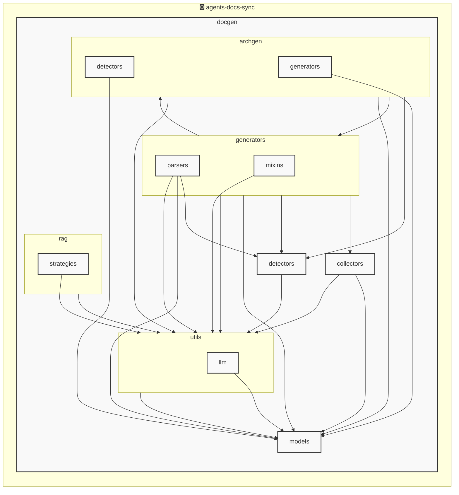

# agents-docs-sync

<!-- MANUAL_START:notice -->

<!-- MANUAL_END:notice -->


<!-- MANUAL_START:description -->

<!-- MANUAL_END:description -->
- **プロジェクト名**: `agents-docs-sync`  
  コミットごとにテスト実行・ドキュメント生成・AGENTS.md の自動更新を行うパイプライン。Python とシェルスクリプトで構成され、エントリポイントは **pyproject.toml** に `agents_docs_sync = "docgen.docgen:main"` として登録。

- **主な依存ライブラリ**  
  - *テスト/品質*: pytest, pytest-cov, pytest-mock, ruff, pydantic
  - *ドキュメント生成*: jinja2、pyyaml
  - *AI / 分析* (オプション): openai, anthropic, sentence-transformers, torch, hnswlib  
    ※アーキテクチャ図は LLM を使用せずにコードベースから静的解析で自動生成する設計。
  - *HTTP/データ取得*: httpx

- **構成ファイルとモデル**  
  - `docgen/models/agents.py` に Pydantic モデル群が定義されている。主なクラスは  
    - `ProjectOverview`: プロジェクト全体のメタ情報を保持  
    - `AgentsConfig`: エージェントドキュメント用設定（例: 生成対象ファイル、テンプレートパス）  
    - `AgentsGenerationConfig`: ドキュメント生成時に使用するオプション集合  
    - `AgentsDocument`: AGENTS.md の構造化データモデル。これをもとに Jinja2 テンプレートから Markdown を出力。

- **実行フロー**  
  1. コミット後、CI/CD がトリガーされる（例: GitHub Actions）。  
  2. `pytest` と `coverage.py` によりテストスイートを走査。失敗時はビルドが停止。  
  3. 成功したら `docgen.docgen.main()` を呼び出し、設定ファイル (`agents.yaml`) を読み込み、Pydantic モデルへ変換。  
  4. テンプレートエンジン Jinja2 が AGENTS.md のテンプレートとデータモデルを組み合わせて Markdown ファイルを書き込む。  
  5. 静的解析モジュールがコードベースからクラス・関数間の依存図を抽出し、Graphviz 等で SVG/PNG を生成してドキュメントに埋め込み。  

- **CLI インターフェイス**  
  - `agents_docs_sync --help`：全コマンドとオプション表示（例: `hook install`, `generate-docs`, `test-run`）。  
  - `agents_docs_sync hook install`: CI/CD 環境に必要なフックをインストール。  

- **ビルド・開発環境**  
  - Python 3.10+ を想定。仮想環境は Poetry/venv 推奨。  
  - コード品質チェックには `ruff`、型検査は Pydantic が実行時に担うため追加の static type checker は必須ではないが、開発者向けで mypy を併用可能。

- **拡張性**  
  - アーキテクチャ図生成ロジックをプラグイン化し、新しい解析手法（例: ASTベース vs. 静的コード検索）へ簡単に切り替えができる。  
  - `AgentsConfig` のフィールドを増やすことで、他のドキュメント形式 (e.g., Swagger, OpenAPI) を同一パイプラインで生成可能。

- **メリット**  
  - コミットごとに自動テスト・文書化が保証されるため、品質低下リスクを最小限。  
  - 設定ファイルだけでドキュメント構成を変更できるので、プロジェクトの拡張時も手間が少ない。  
  - LLM を使わずにアーキテクチャ図を生成することで、外部サービスへの依存・コスト削減とプライバシー保護を実現。

この構成で `agents-docs-sync` は継続的インテグレーション環境下でも安定したドキュメント更新パイプラインとして機能し、開発者がコードベースの変更だけに集中できるよう設計されています。<!-- MANUAL_START:architecture -->

<!-- MANUAL_END:architecture -->


## Services

### agents-docs-sync
- **Type**: python
- **Description**: コミットするごとにテスト実行・ドキュメント生成・AGENTS.md の自動更新を行うパイプライン
- **Dependencies**: anthropic, hnswlib, httpx, jinja2, openai, outlines, pydantic, pytest, pytest-cov, pytest-mock, pyyaml, ruff, sentence-transformers, torch

## 使用技術

- Python
- Shell

## 依存関係

- **Python**: `pyproject.toml` または `requirements.txt` を参照

## セットアップ


## 前提条件

- Python 3.12以上


## インストール


### Python

```bash
# uvを使用する場合
uv sync
```


## LLM環境のセットアップ

### APIを使用する場合

1. **APIキーの取得と設定**

   - OpenAI APIキーを取得: https://platform.openai.com/api-keys
   - 環境変数に設定: `export OPENAI_API_KEY=your-api-key-here`

2. **API使用時の注意事項**
   - APIレート制限に注意してください
   - コスト管理のために使用量を監視してください

### ローカルLLMを使用する場合

1. **ローカルLLMのインストール**

   - Ollamaをインストール: https://ollama.ai/
   - モデルをダウンロード: `ollama pull llama3`
   - サービスを起動: `ollama serve`

2. **ローカルLLM使用時の注意事項**
   - モデルが起動していることを確認してください
   - ローカルリソース（メモリ、CPU）を監視してください

## ビルドおよびテスト
### ビルド

```bash
uv sync
```
```bash
uv build
```
```bash
uv run python3 docgen/docgen.py
```
### テスト

```bash
bash scripts/run_tests.sh
```
```bash
uv run pytest tests/ -v --tb=short
```
## コマンド

プロジェクトで利用可能なスクリプト:

| コマンド | 説明 |
| --- | --- |
| `agents_docs_sync` | 汎用ドキュメント自動生成システム |
### `agents_docs_sync` のオプション

| オプション | 説明 |
| --- | --- |
| `--config` | 設定ファイルのパス |
| `--detect-only` | 言語検出のみ実行 |
| `--no-api-doc` | APIドキュメントを生成しない |
| `--no-readme` | READMEを更新しない |
| `--build-index` | RAGインデックスをビルド |
| `--use-rag` | RAGを使用してドキュメント生成 |
| `--generate-arch` | アーキテクチャ図を生成（Mermaid形式） |
| `hook_name` | フック名（指定しない場合は全て） |
| `hook_name` | フック名（指定しない場合は全て） |
| `hook_name` | 実行するフック名 |
| `hook_args` | フック引数 |
| `--force` | 既存ファイルを強制上書き |

---

*このREADME.mdは自動生成されています。最終更新: 2025-12-04 12:17:34*