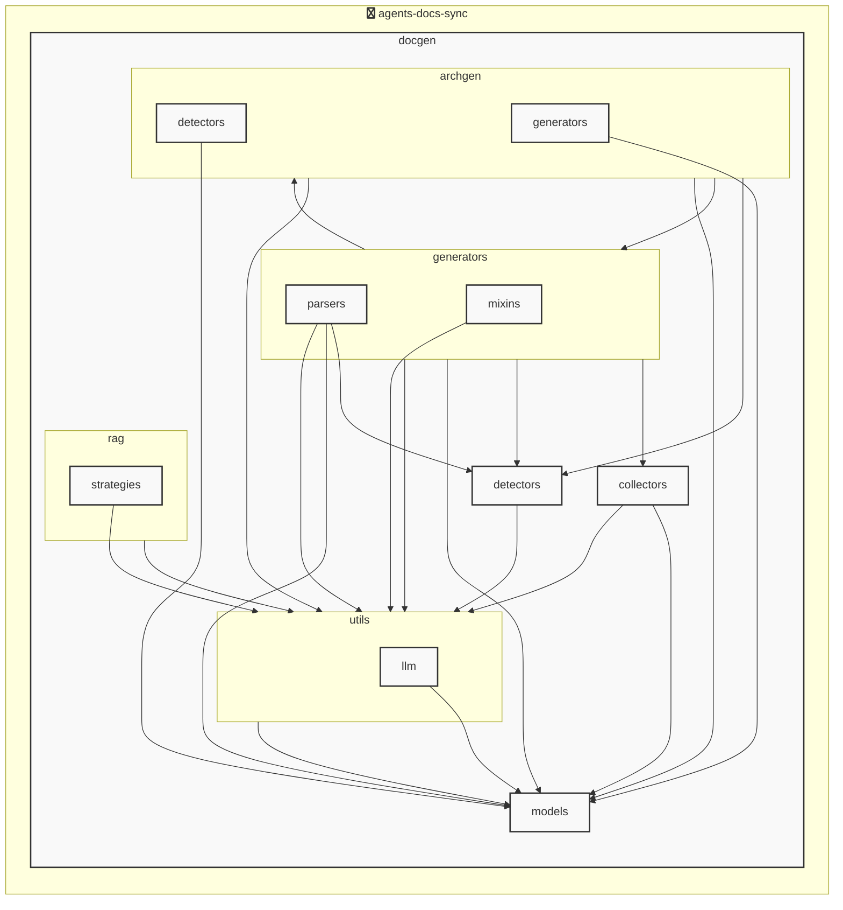

# agents-docs-sync

<!-- MANUAL_START:notice -->

<!-- MANUAL_END:notice -->


<!-- MANUAL_START:description -->

<!-- MANUAL_END:description -->
`agents-docs-sync` は、コミットごとに以下を自動実行するパイプラインです。  
- **テストの走査**：pytest で全ユニット／統合テストを実行し、結果は `coverage.xml` に出力します。  
- **ドキュメント生成**：Jinja2 テンプレートと outlines を組み合わせて API/コードコメントから Markdown を作成。  
- **AGENTS.md の更新**：Pydantic で定義された `AgentsDocument` モデルを元に、最新のエージェント構成情報を書き出します。

### 技術スタック
| ライブラリ | 用途 |
|------------|------|
| python, shell | スクリプト実行環境 |
| pytest, pytest‑cov, pytest-mock | テストフレームワーク・カバレッジ測定 |
| jinja2, outlines | ドキュメントテンプレート生成 |
| pydantic | 設定/モデルのスキーマ化（`ProjectOverview`, `AgentsConfig`, etc.） |
| httpx, openai, anthropic | 必要に応じて外部 API 呼び出し（LLM ではなく、構造解析のみ使用） |
| hnswlib, sentence‑transformers, torch | エンベッディング生成／検索 (将来的な RAG 用) |
| ruff | コード品質チェック |

### アーキテクチャ
1. **CLI (`agents_docs_sync`)** – `pyproject.toml` でエントリポイントとして登録。  
   ```bash
   agents-docs-sync --help
   ```
2. **設定読み込み** – `docgen/models/agents.py` の Pydantic クラスを利用し、`.yaml/.json` 設定ファイルから構成情報取得。  
3. **テスト実行モジュール** – Pytest API を呼び出して自動で全テスト走査。失敗時はビルド停止。  
4. **DocGen モジュール** – `docgen/docgen.py` がテンプレートをレンダリングし、API 仕様・コードコメントから Markdown ファイルへ書き込み。  
5. **AGENTS.md 更新モジュール** – `AgentsDocument` を再構築してファイルに反映。変更検知は Git のフックで自動化可能 (`agents_docs_sync hook install`)。  

### 主な機能
- **CI/CD 連携**：GitHub Actions 等のワークフローから呼び出し、コミット時点でドキュメントを最新状態に保つ。
- **カスタムテンプレートサポート**：`templates/` ディレクトリ内の Jinja2 ファイルを自由に編集できる。  
- **自動アーキテクチャ図生成（実験）**：プロジェクト構造から `architecture_diagram.md` を作成し、ビジュアル化された概要が提供されます。
- **フックインストール** (`agents_docs_sync hook install`) – Git の pre‑commit で自動起動設定を行い、人手不要にパイプライン走査。  
- **ヘルプ／ドキュメント表示**：`--help`, `--version` オプションで使用方法・バージョン確認が可能。

### 実装ポイント
| ファイル | 役割 |
|----------|------|
| `docgen/docgen.py` | CLI エントリ、テスト実行、ドキュメント生成ロジック。 |
| `docgen/models/agents.py` | Pydantic モデル (`ProjectOverview`, `AgentsConfigSection`, etc.) によるスキーマ管理。 |
| `docs/api.md` | 公式 API ドキュメンテーション（自動生成される Markdown）。 |

### 実行手順
```bash
# インストール
pip install .

# ヘルプ確認
agents-docs-sync --help

# フックインストール (Git pre‑commit)
agents_docs_sync hook install
```

このパイプラインにより、コードベースの進化と同時にドキュメントが自動で同期し、開発者は常に最新情報を参照できる環境を提供します。<!-- MANUAL_START:architecture -->

<!-- MANUAL_END:architecture -->


## Services

### agents-docs-sync
- **Type**: python
- **Description**: コミットするごとにテスト実行・ドキュメント生成・AGENTS.md の自動更新を行うパイプライン
- **Dependencies**: anthropic, hnswlib, httpx, jinja2, openai, outlines, pydantic, pytest, pytest-cov, pytest-mock, pyyaml, ruff, sentence-transformers, torch

## 使用技術

- Python
- Shell

## 依存関係

- **Python**: `pyproject.toml` または `requirements.txt` を参照

## セットアップ


## 前提条件

- Python 3.12以上


## インストール


### Python

```bash
# uvを使用する場合
uv sync
```


## LLM環境のセットアップ

### APIを使用する場合

1. **APIキーの取得と設定**

   - OpenAI APIキーを取得: https://platform.openai.com/api-keys
   - 環境変数に設定: `export OPENAI_API_KEY=your-api-key-here`

2. **API使用時の注意事項**
   - APIレート制限に注意してください
   - コスト管理のために使用量を監視してください

### ローカルLLMを使用する場合

1. **ローカルLLMのインストール**

   - Ollamaをインストール: https://ollama.ai/
   - モデルをダウンロード: `ollama pull llama3`
   - サービスを起動: `ollama serve`

2. **ローカルLLM使用時の注意事項**
   - モデルが起動していることを確認してください
   - ローカルリソース（メモリ、CPU）を監視してください

## ビルドおよびテスト
### ビルド

```bash
uv sync
```
```bash
uv build
```
```bash
uv run python3 docgen/docgen.py
```
### テスト

```bash
uv run pytest tests/ -v --tb=short
```
## コマンド

プロジェクトで利用可能なスクリプト:

| コマンド | 説明 |
| --- | --- |
| `agents_docs_sync` | 汎用ドキュメント自動生成システム |
### `agents_docs_sync` のオプション

| オプション | 説明 |
| --- | --- |
| `--config` | 設定ファイルのパス |
| `--detect-only` | 言語検出のみ実行 |
| `--no-api-doc` | APIドキュメントを生成しない |
| `--no-readme` | READMEを更新しない |
| `--build-index` | RAGインデックスをビルド |
| `--use-rag` | RAGを使用してドキュメント生成 |
| `--generate-arch` | アーキテクチャ図を生成（Mermaid形式） |
| `hook_name` | フック名（指定しない場合は全て） |
| `hook_name` | フック名（指定しない場合は全て） |
| `hook_name` | 実行するフック名 |
| `hook_args` | フック引数 |
| `--force` | 既存ファイルを強制上書き |

---

*このREADME.mdは自動生成されています。最終更新: 2025-12-04 09:29:57*