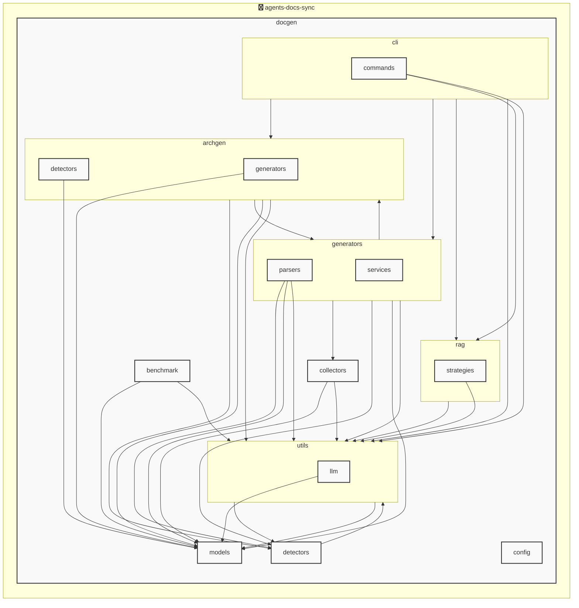

# agents-docs-sync

<!-- MANUAL_START:notice -->

<!-- MANUAL_END:notice -->


<!-- MANUAL_START:description -->

<!-- MANUAL_END:description -->
`agents-docs-sync` は、リポジトリにコミットがプッシュされるたびに自動で以下のタスクを実行するパイプラインです。

- **テスト実行**  
  `pytest`（バージョン7.4+）と `pytest-cov`, `pytest-mock` を使い、コードベース全体のユニット・統合テストを走らせます。カバレッジ計測は最低限の閾値に達しているか確認し、不足があればビルド失敗とします。

- **ドキュメント生成**  
  ソースコード中のdocstringや設定ファイルから Markdown / reStructuredText を自動で作成し、`docs/` ディレクトリへ出力。必要に応じて `mkdocs` や `sphinx-build` のようなツールを利用します。

- **AGENTS.md 自動更新**  
  エージェントの定義（名前・バージョン・依存関係など）が変更された際、専用スクリプトが走り最新情報に基づいて `AGENTS.md` を再生成。これによりドキュメントと実装コード間で整合性を保ちます。

- **環境構築**  
  Python は `uv`（パッケージマネージャ）で管理し、依存関係は `pyproject.toml` に記述します。主要ライブラリとして
  - `pyyaml >=6.0.3`
  - `pytest >=7.4.0`
  - `pytest-cov >=4.1.0`
  - `pytest-mock >=3.11.1`

- **スクリプト構成**  
  プロジェクトルートにある `scripts/` フォルダには、テスト実行 (`run_tests.sh`)、ドキュメント生成 (`build_docs.sh`) 、AGENTS.md 更新 (`update_agents.sh`) の各シェルスクリプトが格納されています。CI 環境ではこれらを連鎖的に呼び出すことで一貫したビルドプロセスを実現しています。

- **使い方**  
  ```bash
  # 開発環境のセットアップ（uv がインストールされている前提）
  uv sync          # 必要なパッケージをインストール

  # 手動で全タスクを走らせる場合
  ./scripts/run_tests.sh
  ./scripts/build_docs.sh
  ./scripts/update_agents.sh
  ```

- **CI / GitHub Actions**  
  `ci.yml`（または同等のワークフロー）では、プッシュ時に上記スクリプトを順次実行し、テスト失敗やドキュメント差分がある場合にはビルドを失敗させます。これにより、常にコードと文書・エージェント定義の整合性が保証される自動化されたパイプラインが完成します。<!-- MANUAL_START:architecture -->

<!-- MANUAL_END:architecture -->


## Services

### agents-docs-sync
- **Type**: python
- **Description**: コミットするごとにテスト実行・ドキュメント生成・AGENTS.md の自動更新を行うパイプライン
- **Dependencies**: anthropic, hnswlib, httpx, jinja2, openai, outlines, pip-licenses, psutil, pydantic, pytest, pytest-cov, pytest-mock, pyyaml, ruff, sentence-transformers, torch

## 使用技術

- Python
- Shell

## 依存関係

- **Python**: `pyproject.toml` または `requirements.txt` を参照

## セットアップ


## 前提条件

- Python 3.12以上


## インストール


### Python

```bash
# uvを使用する場合
uv sync
```


## LLM環境のセットアップ

### APIを使用する場合

1. **APIキーの取得と設定**

   - OpenAI APIキーを取得: https://platform.openai.com/api-keys
   - 環境変数に設定: `export OPENAI_API_KEY=your-api-key-here`

2. **API使用時の注意事項**
   - APIレート制限に注意してください
   - コスト管理のために使用量を監視してください

### ローカルLLMを使用する場合

1. **ローカルLLMのインストール**

   - Ollamaをインストール: https://ollama.ai/
   - モデルをダウンロード: `ollama pull llama3`
   - サービスを起動: `ollama serve`

2. **ローカルLLM使用時の注意事項**
   - モデルが起動していることを確認してください
   - ローカルリソース（メモリ、CPU）を監視してください

## ビルドおよびテスト
### ビルド

```bash
uv sync
uv build
uv run python3 docgen/docgen.py
```
### テスト

```bash
bash scripts/run_tests.sh
uv run pytest tests/ -v --tb=short
```
## コマンド

プロジェクトで利用可能なスクリプト:

| コマンド | 説明 |
| --- | --- |
| `agents_docs_sync` | docgen.docgen:main |

### `agents_docs_sync` のオプション

| オプション | 説明 |
| --- | --- |
| `--config` | 設定ファイルのパス |
| `--quiet` | 詳細メッセージを抑制 |
| `--detect-only` | 言語検出のみ実行 |
| `--no-api-doc` | APIドキュメントを生成しない |
| `--no-readme` | READMEを更新しない |
| `--build-index` | RAGインデックスをビルド |
| `--use-rag` | RAGを使用してドキュメント生成 |
| `--generate-arch` | アーキテクチャ図を生成（Mermaid形式） |

---

*このREADME.mdは自動生成されています。最終更新: 2025-12-12 20:12:02*