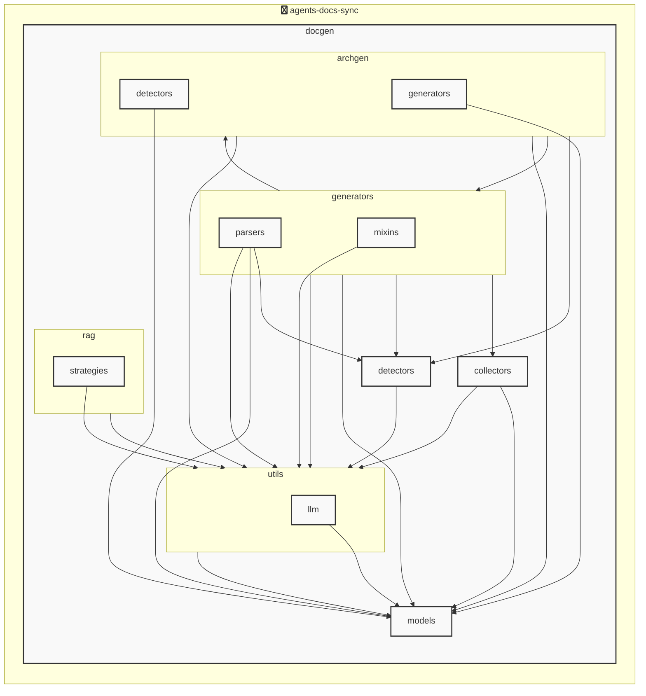

# agents-docs-sync

<!-- MANUAL_START:description -->
> **IMPORTANT!!**
>
> まだドキュメント出力が安定していないため、内容については正確性に欠けます。プルリクエスト待ってます。
<!-- MANUAL_END:description -->


## プロジェクト構造

```
agents-docs-sync/
 ├─ docgen/
 │  ├─ archgen/
 │  │  ├─ detectors/
 │  │  │  └─ python_detector.py
 │  │  └─ generators/
 │  │     └─ mermaid_generator.py
 │  ├─ collectors/
 │  │  ├─ collector_utils.py
 │  │  └─ project_info_collector.py
 │  ├─ detectors/
 │  │  ├─ configs/
 │  │  │  ├─ go.toml
 │  │  │  ├─ javascript.toml
 │  │  │  ├─ python.toml
 │  │  │  └─ typescript.toml
 │  │  ├─ base_detector.py
 │  │  ├─ detector_patterns.py
 │  │  ├─ plugin_registry.py
 │  │  └─ unified_detector.py
 │  ├─ generators/
 │  │  ├─ mixins/
 │  │  │  ├─ llm_mixin.py
 │  │  │  ├─ markdown_mixin.py
 │  │  │  └─ template_mixin.py
 │  │  ├─ parsers/
 │  │  │  ├─ base_parser.py
 │  │  │  ├─ generic_parser.py
 │  │  │  ├─ js_parser.py
 │  │  │  └─ python_parser.py
 │  │  ├─ agents_generator.py
 │  │  ├─ api_generator.py
 │  │  ├─ base_generator.py
 │  │  ├─ contributing_generator.py
 │  │  └─ readme_generator.py
 │  ├─ hooks/
 │  │  ├─ tasks/
 │  │  │  └─ base.py
 │  │  ├─ config.py
 │  │  └─ orchestrator.py
 │  ├─ index/
 │  │  └─ meta.json
 │  ├─ models/
 │  │  ├─ agents.py
 │  │  ├─ config.py
 │  │  └─ detector.py
 │  ├─ prompts/
 │  │  ├─ agents_prompts.toml
 │  │  ├─ commit_message_prompts.toml
 │  │  └─ readme_prompts.toml
 │  ├─ rag/
 │  │  ├─ embedder.py
 │  │  ├─ indexer.py
 │  │  ├─ retriever.py
 │  │  └─ validator.py
 │  ├─ utils/
 │  │  ├─ llm/
 │  │  │  ├─ base.py
 │  │  │  └─ local_client.py
 │  │  ├─ cache.py
 │  │  ├─ exceptions.py
 │  │  ├─ file_utils.py
 │  │  └─ prompt_loader.py
 │  ├─ config.toml
 │  ├─ config_manager.py
 │  ├─ docgen.py
 │  └─ hooks.toml
 ├─ docs/
 ├─ scripts/
 ├─ tests/
 ├─ AGENTS.md
 ├─ README.md
 ├─ pyproject.toml
 ├─ requirements-docgen.txt
 └─ requirements-test.txt
```


<!-- MANUAL_START:architecture -->

<!-- MANUAL_END:architecture -->


## Services

### agents-docs-sync
- **Type**: python
- **Description**: コミットするごとにテスト実行・ドキュメント生成・AGENTS.md の自動更新を行うパイプライン
- **Dependencies**: anthropic, hnswlib, httpx, jinja2, openai, outlines, pydantic, pytest, pytest-cov, pytest-mock, pyyaml, ruff, sentence-transformers, torch

## 使用技術

- Python
- Shell

## 依存関係

- **Python**: `pyproject.toml` または `requirements.txt` を参照

## セットアップ


## 前提条件

- Python 3.12以上


## インストール


### Python

```bash
# uvを使用する場合
uv sync
```


## LLM環境のセットアップ

### APIを使用する場合

1. **APIキーの取得と設定**

   - OpenAI APIキーを取得: https://platform.openai.com/api-keys
   - 環境変数に設定: `export OPENAI_API_KEY=your-api-key-here`

2. **API使用時の注意事項**
   - APIレート制限に注意してください
   - コスト管理のために使用量を監視してください

### ローカルLLMを使用する場合

1. **ローカルLLMのインストール**

   - Ollamaをインストール: https://ollama.ai/
   - モデルをダウンロード: `ollama pull llama3`
   - サービスを起動: `ollama serve`

2. **ローカルLLM使用時の注意事項**
   - モデルが起動していることを確認してください
   - ローカルリソース（メモリ、CPU）を監視してください


## 使用方法

<!-- MANUAL_START:usage -->
```bash
# ドキュメントの生成
uv run agents-docs-sync generate

# Gitフックのインストール（コミット時に自動更新）
uv run agents-docs-sync hook install
```
<!-- MANUAL_END:usage -->
```bash
# ドキュメントの生成
uv run agents-docs-sync generate

# Gitフックのインストール（コミット時に自動更新）
uv run agents-docs-sync hook install
```

## ビルドおよびテスト

### ビルド

```bash
uv sync
```
```bash
uv build
```
```bash
uv run python3 docgen/docgen.py
```

### テスト

```bash
uv run pytest tests/ -v --tb=short
```

## コマンド

プロジェクトで利用可能なスクリプト:

| コマンド | 説明 |
| --- | --- |

| `agents-docs-sync` | 汎用ドキュメント自動生成システム |

| `agents_docs_sync` | 汎用ドキュメント自動生成システム |


### `agents-docs-sync` のオプション

| オプション | 説明 |
| --- | --- |

| `--config` | 設定ファイルのパス |

| `--detect-only` | 言語検出のみ実行 |

| `--no-api-doc` | APIドキュメントを生成しない |

| `--no-readme` | READMEを更新しない |

| `--build-index` | RAGインデックスをビルド |

| `--use-rag` | RAGを使用してドキュメント生成 |

| `--generate-arch` | アーキテクチャ図を生成（Mermaid形式） |

| `hook_name` | フック名（指定しない場合は全て） |

| `hook_name` | フック名（指定しない場合は全て） |

| `hook_name` | 実行するフック名 |

| `hook_args` | フック引数 |

| `--force` | 既存ファイルを強制上書き |


### `agents_docs_sync` のオプション

| オプション | 説明 |
| --- | --- |

| `--config` | 設定ファイルのパス |

| `--detect-only` | 言語検出のみ実行 |

| `--no-api-doc` | APIドキュメントを生成しない |

| `--no-readme` | READMEを更新しない |

| `--build-index` | RAGインデックスをビルド |

| `--use-rag` | RAGを使用してドキュメント生成 |

| `--generate-arch` | アーキテクチャ図を生成（Mermaid形式） |

| `hook_name` | フック名（指定しない場合は全て） |

| `hook_name` | フック名（指定しない場合は全て） |

| `hook_name` | 実行するフック名 |

| `hook_args` | フック引数 |

| `--force` | 既存ファイルを強制上書き |


---

*このREADME.mdは自動生成されています。最終更新: 2025-12-02 17:57:32*