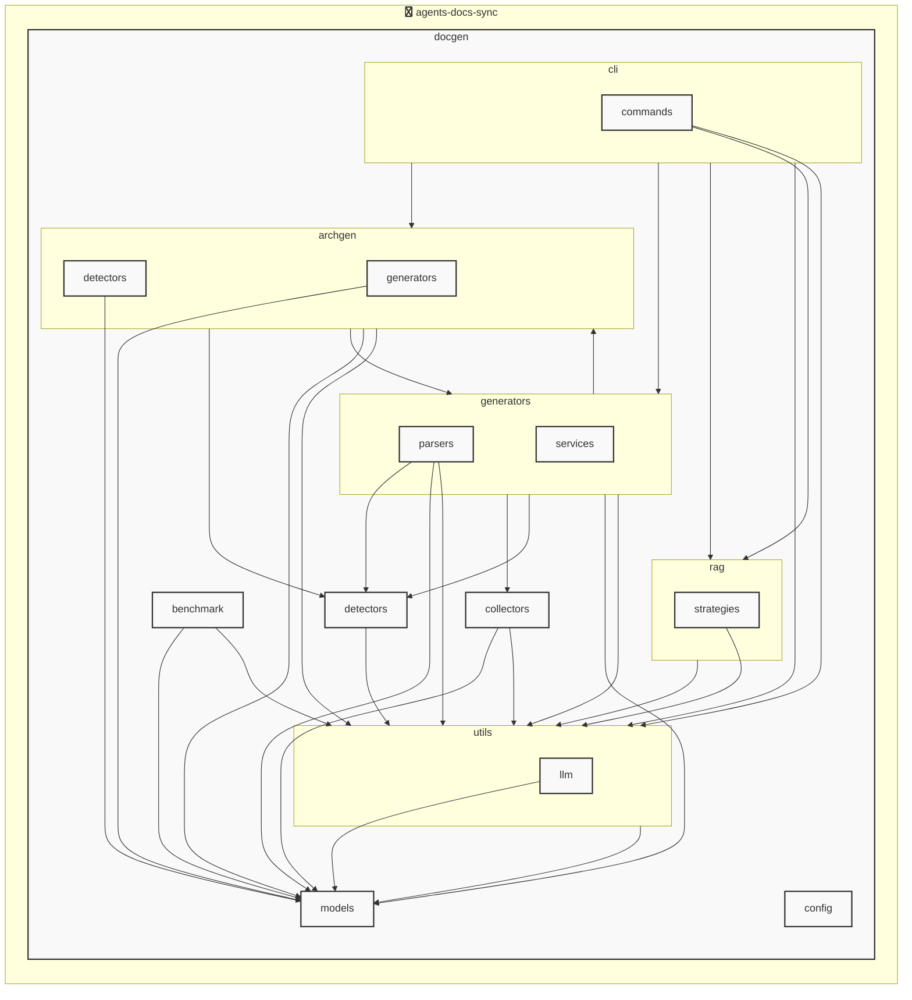

# agents-docs-sync

<!-- MANUAL_START:notice -->

<!-- MANUAL_END:notice -->


<!-- MANUAL_START:description -->

<!-- MANUAL_END:description -->
agents-docs-sync は、ソースコードにコミットがあるたびに自動的にテストを実行し、ドキュメントを生成して `AGENTS.md` を最新状態へ更新する CI パイプラインです。  
Python で書かれたプロジェクトの依存関係は **uv**（高速なパッケージマネージャ）により管理され、テスト実行には `pytest`, カバレッジ測定用 `pytest-cov` とモックライブラリ `pytest-mock` が組み込まれています。  
シェルスクリプトはビルド・デプロイの補助として使用し、CI で走る一連のコマンドを簡潔にまとめた `run.sh` を通じて実行されます。  

パイプラインの流れ:  
1. **コード検証** – `uv sync --frozen` により依存関係がロックファイルと一致していることを確認し、テスト環境を構築します。  
2. **ユニットテスト実行** – `pytest -q --cov=src --cov-report xml` でコードの正当性とカバレッジをチェック。失敗するとビルドは停止します。  
3. **ドキュメント生成** – 自前または外部ツール（例: pdoc, mkdocs）により API ドキュメントを `docs/` ディレクトリへ出力し、変更があれば自動で Git にコミットされます。  
4. **AGENTS.md 更新** – プロジェクト内のエージェントクラスや機能一覧を抽出して `AGENTS.md` を再生成します。このファイルはプロダクトドキュメントとして重要なリソースです。  

このワークフローにより、コードベースが常にテスト済みかつ最新のドキュメントであることを保証し、新しい機能追加やバグ修正時にも手作業による更新ミスを防止できます。また `uv` を使ったローカル実行は高速なビルドと一貫した環境提供が可能です。<!-- MANUAL_START:architecture -->

<!-- MANUAL_END:architecture -->


## Services

### agents-docs-sync
- **Type**: python
- **Description**: コミットするごとにテスト実行・ドキュメント生成・AGENTS.md の自動更新を行うパイプライン
- **Dependencies**: anthropic, hnswlib, httpx, jinja2, openai, outlines, pip-licenses, psutil, pydantic, pytest, pytest-cov, pytest-mock, pyyaml, ruff, sentence-transformers, torch

## 使用技術

- Python
- Shell

## 依存関係

- **Python**: `pyproject.toml` または `requirements.txt` を参照

## セットアップ


## 前提条件

- Python 3.12以上


## インストール


### Python

```bash
# uvを使用する場合
uv sync
```


## LLM環境のセットアップ

### APIを使用する場合

1. **APIキーの取得と設定**

   - OpenAI APIキーを取得: https://platform.openai.com/api-keys
   - 環境変数に設定: `export OPENAI_API_KEY=your-api-key-here`

2. **API使用時の注意事項**
   - APIレート制限に注意してください
   - コスト管理のために使用量を監視してください

### ローカルLLMを使用する場合

1. **ローカルLLMのインストール**

   - Ollamaをインストール: https://ollama.ai/
   - モデルをダウンロード: `ollama pull llama3`
   - サービスを起動: `ollama serve`

2. **ローカルLLM使用時の注意事項**
   - モデルが起動していることを確認してください
   - ローカルリソース（メモリ、CPU）を監視してください

## ビルドおよびテスト
### ビルド

```bash
uv sync
uv build
uv run python3 docgen/docgen.py
```
### テスト

```bash
bash scripts/run_tests.sh
uv run pytest tests/ -v --tb=short
```
## コマンド

プロジェクトで利用可能なスクリプト:

| コマンド | 説明 |
| --- | --- |
| `agents_docs_sync` | docgen.docgen:main |

### `agents_docs_sync` のオプション

| オプション | 説明 |
| --- | --- |
| `--config` | 設定ファイルのパス |
| `--quiet` | 詳細メッセージを抑制 |
| `--detect-only` | 言語検出のみ実行 |
| `--no-api-doc` | APIドキュメントを生成しない |
| `--no-readme` | READMEを更新しない |
| `--build-index` | RAGインデックスをビルド |
| `--use-rag` | RAGを使用してドキュメント生成 |
| `--generate-arch` | アーキテクチャ図を生成（Mermaid形式） |

---

*このREADME.mdは自動生成されています。最終更新: 2025-12-12 19:50:45*