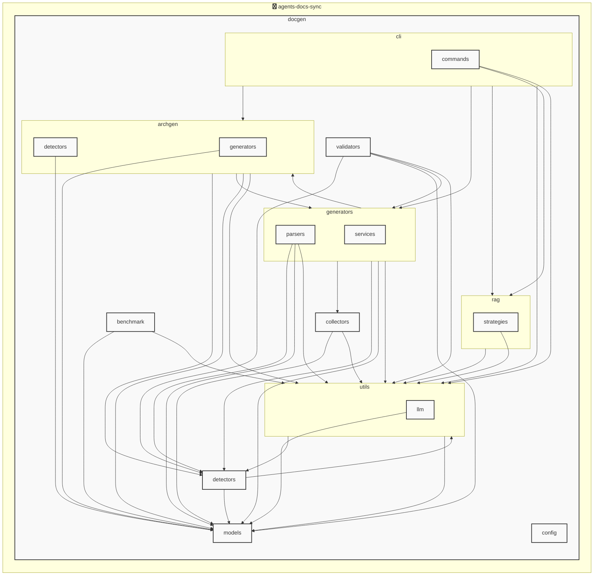

# agents-docs-sync

<!-- MANUAL_START:notice -->

<!-- MANUAL_END:notice -->


<!-- MANUAL_START:description -->

<!-- MANUAL_END:description -->
agents-docs-sync は、ソースコードをコミットするたびに自動的にテストの実行・ドキュメント生成・AGENTS.md の更新を行う CI パイプラインです。  
- **継続的検証**：`pytest`, `pytest-cov`, `pytest-mock` を使用してコードベース全体でユニット／統合テストが走り、失敗した変更は即座にフィードバックされます。  
- **ドキュメント自動生成**：Python ソースや YAML 設定ファイルから API ドキュメントを抽出し、Markdown 形式の `docs/` ディレクトリへ書き込みます。これにより手作業で更新する必要がなくなります。  
- **AGENTS.md の自動同期**：プロジェクト内のエージェント定義（Python クラスや YAML ファイル）を解析し、最新状態を `AGENTS.md` に反映させます。CI 失敗時に差分だけがコミットされるため、ドキュメントと実装が常に整合します。  
- **技術スタック**：Python（3.11+）＋シェルスクリプトで構成し、依存管理は `uv` を利用しています。主要ライブラリとして `pyyaml>=6.0.3`, `pytest>=7.4.0`, `pytest-cov>=4.1.0`, `pytest-mock>=3.11.1` などを使用します。  
- **導入の簡便さ**：プロジェクトルートに `.github/workflows/agents-sync.yml` を置くだけで GitHub Actions に統合でき、ローカルでは `uv run agents-docs-sync` コマンドで同等機能が実行可能です。  

このパイプラインを活用することで、開発サイクル中に常に正確なテスト結果と最新のドキュメント・エージェント一覧を保持できるため、品質保証とメンテナンスコストの低減が実現します。<!-- MANUAL_START:architecture -->
<!-- MANUAL_END:architecture -->


## Services

### agents-docs-sync
- **Type**: python
- **Description**: コミットするごとにテスト実行・ドキュメント生成・AGENTS.md の自動更新を行うパイプライン
- **Dependencies**: anthropic, hnswlib, httpx, jinja2, openai, outlines, pip-licenses, psutil, pydantic, pytest, pytest-cov, pytest-mock, pyyaml, ruff, sentence-transformers, torch

## 使用技術

- Python
- Shell

## 依存関係

- **Python**: `pyproject.toml` または `requirements.txt` を参照

## セットアップ


## 前提条件

- Python 3.12以上


## インストール


### Python

```bash
# uvを使用する場合
uv sync
```


## LLM環境のセットアップ

### APIを使用する場合

1. **APIキーの取得と設定**

   - OpenAI APIキーを取得: https://platform.openai.com/api-keys
   - 環境変数に設定: `export OPENAI_API_KEY=your-api-key-here`

2. **API使用時の注意事項**
   - APIレート制限に注意してください
   - コスト管理のために使用量を監視してください

### ローカルLLMを使用する場合

1. **ローカルLLMのインストール**

   - Ollamaをインストール: https://ollama.ai/
   - モデルをダウンロード: `ollama pull llama3`
   - サービスを起動: `ollama serve`

2. **ローカルLLM使用時の注意事項**
   - モデルが起動していることを確認してください
   - ローカルリソース（メモリ、CPU）を監視してください

## ビルドおよびテスト
### ビルド

```bash
uv sync
uv build
uv run python3 docgen/docgen.py
```
### テスト

```bash
bash scripts/run_tests.sh
uv run pytest tests/ -v --tb=short
```
## コマンド

プロジェクトで利用可能なスクリプト:

| コマンド | 説明 |
| --- | --- |
| `agents_docs_sync` | docgen.docgen:main |
| `agents-docs-sync` | docgen.docgen:main |

### `agents_docs_sync` のオプション

| オプション | 説明 |
| --- | --- |
| `--config` | 設定ファイルのパス |
| `--quiet` | 詳細メッセージを抑制 |
| `--detect-only` | 言語検出のみ実行 |
| `--no-api-doc` | APIドキュメントを生成しない |
| `--no-readme` | READMEを更新しない |
| `--build-index` | RAGインデックスをビルド |
| `--use-rag` | RAGを使用してドキュメント生成 |
| `--generate-arch` | アーキテクチャ図を生成（Mermaid形式） |

### `agents-docs-sync` のオプション

| オプション | 説明 |
| --- | --- |
| `--config` | 設定ファイルのパス |
| `--quiet` | 詳細メッセージを抑制 |
| `--detect-only` | 言語検出のみ実行 |
| `--no-api-doc` | APIドキュメントを生成しない |
| `--no-readme` | READMEを更新しない |
| `--build-index` | RAGインデックスをビルド |
| `--use-rag` | RAGを使用してドキュメント生成 |
| `--generate-arch` | アーキテクチャ図を生成（Mermaid形式） |

---

*このREADME.mdは自動生成されています。最終更新: 2025-12-24 06:57:14*