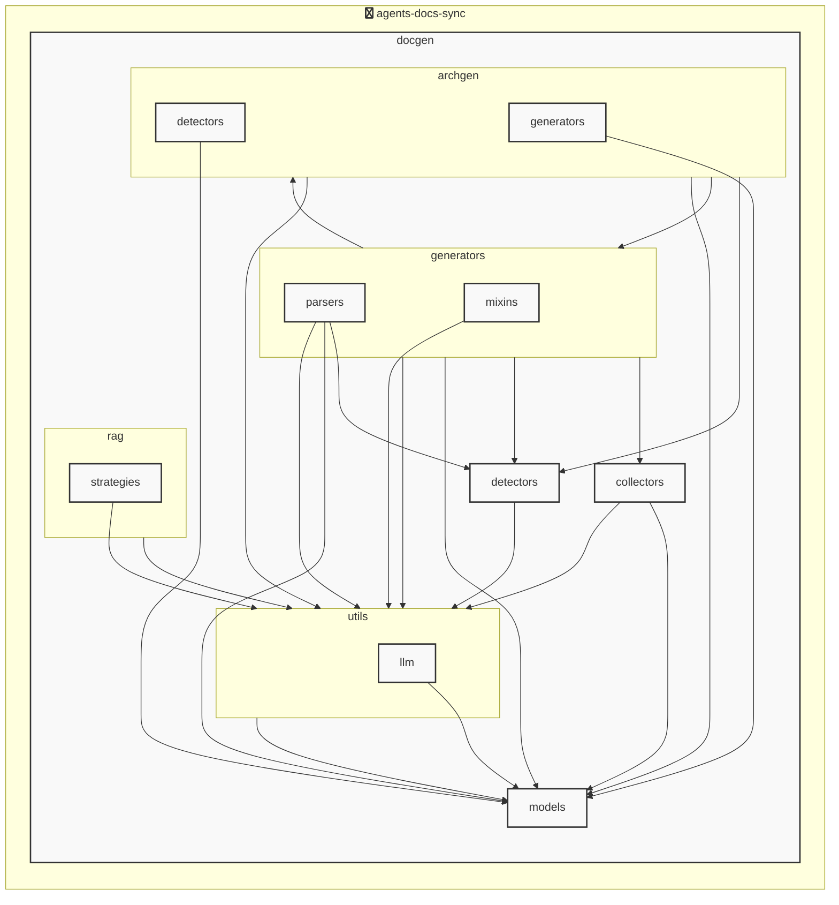

# agents-docs-sync

<!-- MANUAL_START:notice -->
<!-- MANUAL_END:notice -->


<!-- MANUAL_START:description -->
<!-- MANUAL_END:description -->
コミットごとに自動でテスト実行・ドキュメント生成・AGENTS.md 更新を行うパイプラインです。  
Python とシェルスクリプトの組み合わせで構成され、CLI エントリポイント `agents_docs_sync`（pyproject.toml の `[project.scripts]` から提供）により以下の処理が実装されています。

- **テストとカバレッジ**  
  - `pytest`, `pytest-cov` を使用し単体・統合テストを走らせ、結果は CI で利用できる形式（JUnit XML 等）へ出力。  

- **ドキュメント生成**  
  - Jinja2 テンプレートと Outline の組み合わせにより Markdown ドキュメントを構造化して作成。  
  - `docgen/models/agents.py` に定義された Pydantic モデル（`ProjectOverview`, `AgentsConfigSection`, `AgentsGenerationConfig`, `AgentsDocument` 等）から設定情報とメタデータを取得し、テンプレートへ注入します。  

- **AGENTS.md 自動更新**  
  - コードベースに埋め込まれたエージェント定義（関数・クラスの docstring や `AgentsConfig` による宣言）を解析し、構造化データとしてまとめます。  
  - この情報は Jinja2 テンプレートで整形され、AGENTS.md が最新版へ差分更新されます。

- **アーキテクチャ図自動生成**（LLM 不使用）  
  - プロジェクト構造とエージェント間の依存関係を静的解析し、Mermaid / PlantUML 用に描画指令を書き出します。  
  - `docgen` 内で実装された分析モジュールが `hnswlib`, `sentence-transformers`, `torch` を活用してクラス・メソッド間の類似性を判定し、視覚化可能な図にまとめます。

- **CLI とフック**  
  ```bash
  # ヘルプ表示
  agents_docs_sync --help

  # Git フックスクリプトをインストール（pre‑commit 等）
  agents_docs_sync hook install
  ```
  - `hook install` はリポジトリ内にシェルスクリプトを書き込み、コミット前または push 時点で自動実行されるよう設定します。  

- **依存ライブラリ**  
  - anthropic, openai（必要時 LLM 呼び出し）、httpx（API 通信）  
  - jinja2 (テンプレート)、outlines (ドキュメント生成ロジック)  
  - pydantic、pyyaml（設定ファイル解析）  
  - ruff（静的コードチェック）  

- **CI / GitHub Actions**  
  - `agents_docs_sync` をジョブの一部として組み込み、プッシュ時に自動実行。テスト失敗やドキュメント差分がある場合はビルドを失敗させることで品質保証します。

- **設定ファイル構造**  
  - `agents.yaml`（または `.yml`) に全体のプロジェクト情報と各エージェント固有設定 (`AgentsConfigSection`, `AgentsGenerationConfig`) を記述。  
  - YAML は Pydantic モデルでバリデートされ、型安全な構成管理が可能です。

このパイプラインにより、コード変更ごとのドキュメント整合性を保証しつつ、人手による更新作業の負担を大幅に削減します。


<!-- MANUAL_START:architecture -->
<!-- MANUAL_END:architecture -->


## Services

### agents-docs-sync
- **Type**: python
- **Description**: コミットするごとにテスト実行・ドキュメント生成・AGENTS.md の自動更新を行うパイプライン
- **Dependencies**: anthropic, hnswlib, httpx, jinja2, openai, outlines, pydantic, pytest, pytest-cov, pytest-mock, pyyaml, ruff, sentence-transformers, torch

## 使用技術

- Python
- Shell

## 依存関係

- **Python**: `pyproject.toml` または `requirements.txt` を参照

## セットアップ


## 前提条件

- Python 3.12以上


## インストール


### Python

```bash
# uvを使用する場合
uv sync
```


## LLM環境のセットアップ

### APIを使用する場合

1. **APIキーの取得と設定**

   - OpenAI APIキーを取得: https://platform.openai.com/api-keys
   - 環境変数に設定: `export OPENAI_API_KEY=your-api-key-here`

2. **API使用時の注意事項**
   - APIレート制限に注意してください
   - コスト管理のために使用量を監視してください

### ローカルLLMを使用する場合

1. **ローカルLLMのインストール**

   - Ollamaをインストール: https://ollama.ai/
   - モデルをダウンロード: `ollama pull llama3`
   - サービスを起動: `ollama serve`

2. **ローカルLLM使用時の注意事項**
   - モデルが起動していることを確認してください
   - ローカルリソース（メモリ、CPU）を監視してください


## ビルドおよびテスト

### ビルド

```bash
uv sync
```
```bash
uv build
```
```bash
uv run python3 docgen/docgen.py
```

### テスト

```bash
uv run pytest tests/ -v --tb=short
```

## コマンド

プロジェクトで利用可能なスクリプト:

| コマンド | 説明 |
| --- | --- |

| `agents_docs_sync` | 汎用ドキュメント自動生成システム |


### `agents_docs_sync` のオプション

| オプション | 説明 |
| --- | --- |

| `--config` | 設定ファイルのパス |

| `--detect-only` | 言語検出のみ実行 |

| `--no-api-doc` | APIドキュメントを生成しない |

| `--no-readme` | READMEを更新しない |

| `--build-index` | RAGインデックスをビルド |

| `--use-rag` | RAGを使用してドキュメント生成 |

| `--generate-arch` | アーキテクチャ図を生成（Mermaid形式） |

| `hook_name` | フック名（指定しない場合は全て） |

| `hook_name` | フック名（指定しない場合は全て） |

| `hook_name` | 実行するフック名 |

| `hook_args` | フック引数 |

| `--force` | 既存ファイルを強制上書き |


---

*このREADME.mdは自動生成されています。最終更新: 2025-12-02 19:07:04*