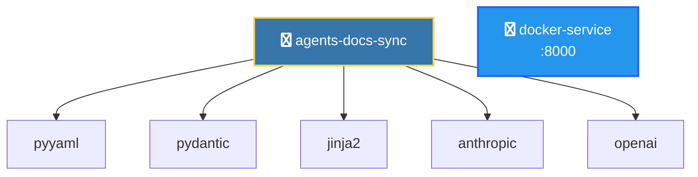

# アーキテクチャ自動生成機能 — 実装仕様書

## 概要

`agents-docs-sync` プロジェクトに **LLM を使用せずに**、プロジェクト構造から自動的にアーキテクチャ図を生成する機能を追加します。

### 目的

- プロジェクトの依存関係とコンポーネント構造を自動的に可視化
- `docs/architecture/` ディレクトリに視覚的なアーキテクチャ図を出力
- CI/CD との統合により、コード変更時に自動更新
- **システム依存なし**（デフォルト）でユーザー環境を汚染しない

### 技術選択

**Mermaid.js（デフォルト）:**
- ✅ システムパッケージ不要（Graphviz 不要）
- ✅ GitHub/GitLab でネイティブレンダリング
- ✅ テキストベースで Git friendly
- ✅ 手動編集が容易

**blockdiag（推奨：画像出力）:**
- ✅ システムパッケージ不要（Pillow のみ）
- ✅ テキストベースの DSL
- ✅ PNG/SVG/PDF 出力
- ✅ シンプルで読みやすい構文
- ✅ 日本語ドキュメント充実

**matplotlib + networkx（オプション）:**
- ✅ Python 依存のみ（システム依存なし）
- ✅ PNG/SVG/PDF 出力
- ✅ プレゼンテーション向け

### 非目標

- LLM による動的解析（静的解析のみ）
- リアルタイム実行トレース
- 外部サービス依存の可視化
- Graphviz などシステムパッケージへの依存

---

## アーキテクチャ設計

### コンポーネント構成

```
docgen/
  archgen/                    # アーキテクチャ生成モジュール
    __init__.py
    cli.py                   # CLI エントリポイント
    models.py                # Pydantic データモデル
    scanner.py               # リポジトリスキャナー
    renderer.py              # 図の生成とレンダリング
    detectors/               # 各種検出器
      __init__.py
      docker_detector.py     # Docker 構成検出
      python_detector.py     # Python プロジェクト検出
      language_detector.py   # 言語検出（既存の統合）
    generators/              # 図生成器
      __init__.py
      mermaid_generator.py   # Mermaid.js形式（依存なし、GitHub向け）
      blockdiag_generator.py # blockdiag形式（Pillow依存、画像出力推奨）
      matplotlib_generator.py # matplotlib + networkx（オプション）
```

### データフロー

```
1. Scanner → プロジェクトを走査
    ↓
2. Detectors → 構成ファイルを検出・解析
    ↓
3. Models → データを構造化（Pydantic）
    ↓
4. Renderer → 図を生成
    ↓
5. Output → docs/architecture/ へ保存
```

---

## データモデル設計

### ArchitectureManifest

プロジェクト全体のアーキテクチャを表現するメインモデル。

```python
from pydantic import BaseModel, Field
from typing import List, Dict, Optional

class Service(BaseModel):
    """個別サービス/コンポーネント"""
    name: str
    type: str  # "python", "docker", "database", "external", etc.
    description: Optional[str] = None
    ports: List[int] = Field(default_factory=list)
    dependencies: List[str] = Field(default_factory=list)
    metadata: Dict[str, Any] = Field(default_factory=dict)

class ArchitectureManifest(BaseModel):
    """アーキテクチャマニフェスト"""
    project_name: str
    version: str = "1.0"
    services: List[Service] = Field(default_factory=list)
    metadata: Dict[str, Any] = Field(default_factory=dict)

    def to_yaml(self, path: Path) -> None:
        """YAML形式で保存"""
        ...

    @classmethod
    def from_yaml(cls, path: Path) -> "ArchitectureManifest":
        """YAML形式から読み込み"""
        ...
```

---

## 実装手順

### Phase 1: 基盤構築

#### ステップ 1.1: ディレクトリ構造とモデル作成

**作成ファイル:**
- `docgen/archgen/__init__.py`
- `docgen/archgen/models.py`

**実装内容:**
```python
# docgen/archgen/models.py
from pydantic import BaseModel, Field
from pathlib import Path
from typing import List, Dict, Any, Optional
import yaml

class Service(BaseModel):
    name: str
    type: str
    description: Optional[str] = None
    ports: List[int] = Field(default_factory=list)
    dependencies: List[str] = Field(default_factory=list)
    metadata: Dict[str, Any] = Field(default_factory=dict)

class ArchitectureManifest(BaseModel):
    project_name: str
    version: str = "1.0"
    services: List[Service] = Field(default_factory=list)
    metadata: Dict[str, Any] = Field(default_factory=dict)

    def to_yaml(self, path: Path) -> None:
        path.parent.mkdir(parents=True, exist_ok=True)
        with open(path, 'w', encoding='utf-8') as f:
            yaml.dump(self.model_dump(), f, allow_unicode=True)

    @classmethod
    def from_yaml(cls, path: Path) -> "ArchitectureManifest":
        with open(path, 'r', encoding='utf-8') as f:
            data = yaml.safe_load(f)
        return cls(**data)
```

**テスト:**
```python
# tests/test_archgen/test_models.py
def test_architecture_manifest_creation():
    service = Service(name="api", type="python", ports=[8000])
    manifest = ArchitectureManifest(
        project_name="test-project",
        services=[service]
    )
    assert len(manifest.services) == 1
    assert manifest.services[0].name == "api"
```

#### ステップ 1.2: スキャナー実装

**作成ファイル:**
- `docgen/archgen/scanner.py`

**実装内容:**
```python
# docgen/archgen/scanner.py
from pathlib import Path
from typing import List
from .models import ArchitectureManifest, Service
from .detectors.python_detector import PythonDetector
from .detectors.docker_detector import DockerDetector

class ProjectScanner:
    """プロジェクトをスキャンしてアーキテクチャを抽出"""

    def __init__(self, project_root: Path):
        self.project_root = project_root
        self.detectors = [
            PythonDetector(),
            DockerDetector(),
        ]

    def scan(self) -> ArchitectureManifest:
        """プロジェクトをスキャン"""
        services = []
        for detector in self.detectors:
            detected = detector.detect(self.project_root)
            services.extend(detected)

        return ArchitectureManifest(
            project_name=self.project_root.name,
            services=services
        )
```

### Phase 2: 検出器実装

#### ステップ 2.1: Python 検出器

**作成ファイル:**
- `docgen/archgen/detectors/__init__.py`
- `docgen/archgen/detectors/python_detector.py`

**実装内容:**
```python
# docgen/archgen/detectors/python_detector.py
from pathlib import Path
from typing import List
from ..models import Service

class PythonDetector:
    """Python プロジェクトを検出"""

    def detect(self, project_root: Path) -> List[Service]:
        services = []

        # pyproject.toml の検出
        pyproject = project_root / "pyproject.toml"
        if pyproject.exists():
            service = self._parse_pyproject(pyproject)
            if service:
                services.append(service)

        # requirements.txt の検出
        requirements = project_root / "requirements-docgen.txt"
        if requirements.exists():
            # 依存関係を抽出
            deps = self._parse_requirements(requirements)
            if services:
                services[0].dependencies.extend(deps)

        return services

    def _parse_pyproject(self, path: Path) -> Service | None:
        """pyproject.toml をパース"""
        try:
            import tomllib
            with open(path, 'rb') as f:
                data = tomllib.load(f)

            project = data.get('project', {})
            return Service(
                name=project.get('name', 'unknown'),
                type='python',
                description=project.get('description', ''),
                metadata={'version': project.get('version', '0.0.0')}
            )
        except Exception as e:
            return None

    def _parse_requirements(self, path: Path) -> List[str]:
        """requirements.txt から依存パッケージを抽出"""
        deps = []
        with open(path, 'r') as f:
            for line in f:
                line = line.strip()
                if line and not line.startswith('#'):
                    # パッケージ名のみ抽出（バージョン指定を除く）
                    pkg = line.split('>=')[0].split('==')[0].split('<')[0]
                    deps.append(pkg)
        return deps
```

#### ステップ 2.2: Docker 検出器

**作成ファイル:**
- `docgen/archgen/detectors/docker_detector.py`

**実装内容:**
```python
# docgen/archgen/detectors/docker_detector.py
from pathlib import Path
from typing import List
import re
from ..models import Service

class DockerDetector:
    """Docker 構成を検出"""

    def detect(self, project_root: Path) -> List[Service]:
        services = []

        # Dockerfile の検出
        dockerfile = project_root / "Dockerfile"
        if dockerfile.exists():
            service = self._parse_dockerfile(dockerfile)
            if service:
                services.append(service)

        return services

    def _parse_dockerfile(self, path: Path) -> Service | None:
        """Dockerfile をパース"""
        ports = []
        with open(path, 'r') as f:
            for line in f:
                # EXPOSE 行を探す
                if line.strip().startswith('EXPOSE'):
                    port_match = re.search(r'EXPOSE\s+(\d+)', line)
                    if port_match:
                        ports.append(int(port_match.group(1)))

        if ports:
            return Service(
                name='docker-service',
                type='docker',
                ports=ports,
                description='Dockerized service'
            )
        return None
```

### Phase 3: 図生成器実装

#### ステップ 3.1: Mermaid ジェネレータ（推奨）

**依存関係追加:**
```toml
# pyproject.toml - 追加依存なし！
# Mermaid.js はテキストベースの図形式のため、ランタイム依存が不要
```

**作成ファイル:**
- `docgen/archgen/generators/__init__.py`
- `docgen/archgen/generators/mermaid_generator.py`

**実装内容:**
```python
# docgen/archgen/generators/mermaid_generator.py
from pathlib import Path
from ..models import ArchitectureManifest, Service

class MermaidGenerator:
    """Mermaid.js形式でアーキテクチャ図を生成（依存なし）"""

    # タイプごとのアイコン（Mermaid font-awesome対応）
    TYPE_ICONS = {
        'python': 'fa:fa-python',
        'docker': 'fa:fa-docker',
        'database': 'fa:fa-database',
        'api': 'fa:fa-server',
        'external': 'fa:fa-cloud',
    }

    def generate(self, manifest: ArchitectureManifest, output_dir: Path) -> Path:
        """Mermaid形式のアーキテクチャ図を生成"""
        output_dir.mkdir(parents=True, exist_ok=True)
        output_path = output_dir / "architecture.mmd"

        mermaid_code = self._generate_mermaid(manifest)

        # .mmd ファイルとして保存
        output_path.write_text(mermaid_code, encoding='utf-8')

        # Markdown埋め込み形式も生成
        md_path = output_dir / "architecture_diagram.md"
        md_content = f"""# {manifest.project_name} Architecture

```mermaid
{mermaid_code}
```

## Services

{self._generate_service_list(manifest)}
"""
        md_path.write_text(md_content, encoding='utf-8')

        return output_path

    def _generate_mermaid(self, manifest: ArchitectureManifest) -> str:
        """Mermaidコードを生成"""
        lines = ["graph TB"]
        lines.append("    %% Auto-generated architecture diagram")
        lines.append("")

        # ノードを定義
        for service in manifest.services:
            node_id = self._sanitize_id(service.name)
            icon = self.TYPE_ICONS.get(service.type, 'fa:fa-cube')
            label = service.name

            if service.ports:
                label += f"<br/>:{','.join(map(str, service.ports))}"

            # タイプ別のスタイル
            if service.type == 'python':
                lines.append(f'    {node_id}["{icon} {label}"]:::pythonStyle')
            elif service.type == 'docker':
                lines.append(f'    {node_id}["{icon} {label}"]:::dockerStyle')
            elif service.type == 'database':
                lines.append(f'    {node_id}[("{icon} {label}")]:::dbStyle')
            else:
                lines.append(f'    {node_id}["{icon} {label}"]')

        lines.append("")

        # 依存関係をエッジとして追加
        for service in manifest.services:
            node_id = self._sanitize_id(service.name)
            for dep in service.dependencies:
                dep_id = self._sanitize_id(dep)
                lines.append(f'    {node_id} --> {dep_id}')

        lines.append("")

        # スタイル定義
        lines.append("    classDef pythonStyle fill:#3776ab,stroke:#ffd43b,stroke-width:2px,color:#fff")
        lines.append("    classDef dockerStyle fill:#2496ed,stroke:#1d63ed,stroke-width:2px,color:#fff")
        lines.append("    classDef dbStyle fill:#336791,stroke:#6b9cd6,stroke-width:2px,color:#fff")

        return '\n'.join(lines)

    def _sanitize_id(self, name: str) -> str:
        """Mermaid IDとして使える形式に変換"""
        return name.replace('-', '_').replace('.', '_').replace(' ', '_')

    def _generate_service_list(self, manifest: ArchitectureManifest) -> str:
        """サービスリストを生成"""
        lines = []
        for service in manifest.services:
            lines.append(f"### {service.name}")
            lines.append(f"- **Type**: {service.type}")
            if service.description:
                lines.append(f"- **Description**: {service.description}")
            if service.ports:
                lines.append(f"- **Ports**: {', '.join(map(str, service.ports))}")
            if service.dependencies:
                lines.append(f"- **Dependencies**: {', '.join(service.dependencies)}")
            lines.append("")
        return '\n'.join(lines)
```

**利点:**
- ✅ **依存なし**: システムパッケージ不要
- ✅ **GitHub対応**: `.md`ファイルでそのままレンダリング
- ✅ **軽量**: テキストベースで git friendly
- ✅ **編集可能**: 手動での微調整が容易

#### ステップ 3.2: matplotlib ジェネレータ（オプション）

画像ファイルが必要な場合のオプション実装。

**依存関係追加:**
```toml
# pyproject.toml に追加
[dependency-groups]
archgen = [
    "matplotlib>=3.7.0",
    "networkx>=3.0",
]
```

**作成ファイル:**
- `docgen/archgen/generators/matplotlib_generator.py`

**実装内容:**
```python
# docgen/archgen/generators/matplotlib_generator.py
from pathlib import Path
import matplotlib.pyplot as plt
import matplotlib.patches as mpatches
import networkx as nx
from ..models import ArchitectureManifest, Service

class MatplotlibGenerator:
    """matplotlib + networkx でアーキテクチャ図を生成（Python依存のみ）"""

    # タイプ別の色設定
    TYPE_COLORS = {
        'python': '#3776ab',
        'docker': '#2496ed',
        'database': '#336791',
        'api': '#4caf50',
        'external': '#ff9800',
    }

    def generate(
        self,
        manifest: ArchitectureManifest,
        output_dir: Path,
        format: str = "png"
    ) -> Path:
        """matplotlib/networkxでアーキテクチャ図を生成"""
        output_dir.mkdir(parents=True, exist_ok=True)
        output_path = output_dir / f"architecture.{format}"

        # グラフを構築
        G = nx.DiGraph()

        # ノードを追加
        node_colors = []
        for service in manifest.services:
            G.add_node(service.name)
            color = self.TYPE_COLORS.get(service.type, '#607d8b')
            node_colors.append(color)

        # エッジを追加
        for service in manifest.services:
            for dep in service.dependencies:
                if dep in [s.name for s in manifest.services]:
                    G.add_edge(service.name, dep)

        # 図を描画
        plt.figure(figsize=(12, 8))
        plt.title(f"{manifest.project_name} Architecture", fontsize=16, fontweight='bold')

        # レイアウト計算
        pos = nx.spring_layout(G, k=2, iterations=50)

        # ノードを描画
        nx.draw_networkx_nodes(
            G, pos,
            node_color=node_colors,
            node_size=3000,
            alpha=0.9,
            edgecolors='white',
            linewidths=2
        )

        # エッジを描画
        nx.draw_networkx_edges(
            G, pos,
            edge_color='gray',
            arrows=True,
            arrowsize=20,
            arrowstyle='->',
            width=2,
            alpha=0.6
        )

        # ラベルを描画
        nx.draw_networkx_labels(
            G, pos,
            font_size=10,
            font_weight='bold',
            font_color='white'
        )

        # 凡例を追加
        legend_elements = [
            mpatches.Patch(facecolor=color, label=type_name.capitalize())
            for type_name, color in self.TYPE_COLORS.items()
        ]
        plt.legend(handles=legend_elements, loc='upper left', framealpha=0.9)

        plt.axis('off')
        plt.tight_layout()

        # 保存
        plt.savefig(output_path, format=format, dpi=300, bbox_inches='tight',
                    facecolor='white', edgecolor='none')
        plt.close()

        return output_path
```

- ✅ **Python依存のみ**: システムパッケージ不要
- ✅ **高品質出力**: PNG/SVG/PDF対応
- ✅ **カスタマイズ可能**: Pythonコードで完全制御

#### ステップ 3.3: blockdiag ジェネレータ（推奨：画像出力）

**依存関係追加:**
```toml
# pyproject.toml に追加
[dependency-groups]
archgen = [
    "blockdiag>=3.0.0",
]
```

**作成ファイル:**
- `docgen/archgen/generators/blockdiag_generator.py`

**実装内容:**
```python
# docgen/archgen/generators/blockdiag_generator.py
from pathlib import Path
from ..models import ArchitectureManifest, Service

class BlockdiagGenerator:
    """blockdiag でアーキテクチャ図を生成（Pillow のみ依存）"""

    # タイプ別の色設定
    TYPE_COLORS = {
        'python': '#3776ab',
        'docker': '#2496ed',
        'database': '#336791',
        'api': '#4caf50',
        'external': '#ff9800',
    }

    # タイプ別の形状
    TYPE_SHAPES = {
        'python': 'box',
        'docker': 'roundedbox',
        'database': 'ellipse',
        'api': 'box',
        'external': 'cloud',
    }

    def generate(
        self,
        manifest: ArchitectureManifest,
        output_dir: Path,
        format: str = "png"
    ) -> Path:
        """blockdiag でアーキテクチャ図を生成"""
        output_dir.mkdir(parents=True, exist_ok=True)

        # blockdiag DSL を生成
        diag_code = self._generate_blockdiag(manifest)

        # .diag ファイルとして保存（テキストベース）
        diag_path = output_dir / "architecture.diag"
        diag_path.write_text(diag_code, encoding='utf-8')

        # 画像を生成
        output_path = output_dir / f"architecture.{format}"
        self._render_diagram(diag_code, output_path, format)

        return output_path

    def _generate_blockdiag(self, manifest: ArchitectureManifest) -> str:
        """blockdiag DSL を生成"""
        lines = ["{"]

        # グラフ全体の設定
        lines.append("  // Auto-generated architecture diagram")
        lines.append("  orientation = portrait;")
        lines.append("  default_fontsize = 14;")
        lines.append("  node_width = 200;")
        lines.append("  node_height = 60;")
        lines.append("  span_width = 80;")
        lines.append("  span_height = 60;")
        lines.append("")

        # ノードを定義
        for service in manifest.services:
            node_id = self._sanitize_id(service.name)
            label = service.name

            if service.ports:
                label += f"\\n:{','.join(map(str, service.ports))}"

            color = self.TYPE_COLORS.get(service.type, '#607d8b')
            shape = self.TYPE_SHAPES.get(service.type, 'box')

            lines.append(
                f'  {node_id} [label = "{label}", '
                f'color = "{color}", '
                f'shape = "{shape}", '
                f'textcolor = "#ffffff"];'
            )

        lines.append("")

        # 依存関係をエッジとして追加
        edges = []
        for service in manifest.services:
            node_id = self._sanitize_id(service.name)
            for dep in service.dependencies:
                dep_id = self._sanitize_id(dep)
                edges.append(f"  {node_id} -> {dep_id};")

        if edges:
            lines.extend(edges)
        else:
            # 依存関係がない場合は、サービスを横並びに配置
            if len(manifest.services) > 1:
                node_ids = [self._sanitize_id(s.name) for s in manifest.services[:3]]
                lines.append(f"  {' -> '.join(node_ids)};")

        lines.append("}")

        return '\n'.join(lines)

    def _sanitize_id(self, name: str) -> str:
        """blockdiag ID として使える形式に変換"""
        return name.replace('-', '_').replace('.', '_').replace(' ', '_')

    def _render_diagram(self, diag_code: str, output_path: Path, format: str) -> None:
        """blockdiag でレンダリング"""
        try:
            from blockdiag import parser, builder, drawer
            import sys
            from io import StringIO

            # パース
            tree = parser.parse_string(diag_code)
            diagram = builder.ScreenNodeBuilder.build(tree)

            # 描画
            if format == 'svg':
                from blockdiag.utils.svg import SVGDrawer
                draw = SVGDrawer(format, diagram, filename=str(output_path))
            elif format == 'pdf':
                from blockdiag.utils.pdf import PDFDrawer
                draw = PDFDrawer(format, diagram, filename=str(output_path))
            else:  # png
                from blockdiag.utils.png import PNGDrawer
                draw = PDFDrawer(format, diagram, filename=str(output_path))

            draw.draw()
            draw.save(str(output_path))

        except ImportError as e:
            raise ImportError(
                f"blockdiag が必要です。\n"
                f"インストール: pip install blockdiag\n"
                f"エラー: {e}"
            )
```

**利点:**
- ✅ **システム依存なし**: Pillow のみで動作（Graphviz 不要）
- ✅ **テキストベース**: `.diag` ファイルで編集可能
- ✅ **複数フォーマット**: PNG/SVG/PDF 対応
- ✅ **シンプル**: 学習コストが低い
- ✅ **日本語対応**: 日本語ラベルもサポート

**blockdiag DSL 例:**
```
{
  // Auto-generated architecture diagram
  orientation = portrait;
  default_fontsize = 14;

  agents_docs_sync [label = "agents-docs-sync", color = "#3776ab", shape = "box"];
  docker_service [label = "docker-service\n:8000", color = "#2496ed", shape = "roundedbox"];

  agents_docs_sync -> pyyaml;
  agents_docs_sync -> pydantic;
  agents_docs_sync -> jinja2;
}
```

#### ステップ 3.4: レンダラー統合

**作成ファイル:**
- `docgen/archgen/renderer.py`

**実装内容:**
```python
# docgen/archgen/renderer.py
from pathlib import Path
from .models import ArchitectureManifest
from .generators.mermaid_generator import MermaidGenerator
from typing import Optional, Literal

GeneratorType = Literal["mermaid", "blockdiag", "matplotlib"]

class ArchitectureRenderer:
    """アーキテクチャ図のレンダリングを管理"""

    def __init__(self, generator_type: GeneratorType = "mermaid"):
        """
        Args:
            generator_type: 使用するジェネレータ
                - "mermaid": Mermaid.js（デフォルト、依存なし、GitHub向け）
                - "blockdiag": blockdiag（Pillow依存、画像出力推奨）
                - "matplotlib": matplotlib（networkx依存、オプション）
        """
        self.generator_type = generator_type
        self.generator = None

        if generator_type == "mermaid":
            self.generator = MermaidGenerator()
        elif generator_type == "blockdiag":
            try:
                from .generators.blockdiag_generator import BlockdiagGenerator
                self.generator = BlockdiagGenerator()
            except ImportError:
                raise ImportError(
                    "blockdiag が必要です。\n"
                    "インストール: pip install blockdiag"
                )
        elif generator_type == "matplotlib":
            try:
                from .generators.matplotlib_generator import MatplotlibGenerator
                self.generator = MatplotlibGenerator()
            except ImportError:
                raise ImportError(
                    "matplotlib と networkx が必要です。\n"
                    "インストール: pip install matplotlib networkx"
                )
        else:
            raise ValueError(f"未知のジェネレータタイプ: {generator_type}")

    def render(
        self,
        manifest: ArchitectureManifest,
        output_dir: Path,
        image_formats: Optional[list[str]] = None
    ) -> dict[str, Path]:
        """図を生成

        Args:
            manifest: アーキテクチャマニフェスト
            output_dir: 出力ディレクトリ
            image_formats: blockdiag/matplotlib 使用時の画像形式（例: ["png", "svg"]）

        Returns:
            生成されたファイルのパス辞書
        """
        outputs = {}

        if self.generator_type == "mermaid":
            # Mermaid で生成（デフォルト）
            mermaid_path = self.generator.generate(manifest, output_dir)
            outputs['mermaid'] = mermaid_path
            outputs['markdown'] = output_dir / "architecture_diagram.md"

        elif self.generator_type == "blockdiag":
            # blockdiag で画像生成
            formats = image_formats or ["png"]
            diag_path = output_dir / "architecture.diag"
            outputs['diag'] = diag_path  # テキストソース

            for fmt in formats:
                output_path = self.generator.generate(manifest, output_dir, fmt)
                outputs[f'image_{fmt}'] = output_path

        elif self.generator_type == "matplotlib":
            # matplotlib で画像生成
            formats = image_formats or ["png"]
            for fmt in formats:
                output_path = self.generator.generate(manifest, output_dir, fmt)
                outputs[f'image_{fmt}'] = output_path

        # マニフェストも保存
        manifest_path = output_dir / "architecture_manifest.yml"
        manifest.to_yaml(manifest_path)
        outputs['manifest'] = manifest_path

        return outputs
```

### Phase 4: CLI 統合

#### ステップ 4.1: CLI コマンド追加

**作成ファイル:**
- `docgen/archgen/cli.py`

**実装内容:**
```python
# docgen/archgen/cli.py
from pathlib import Path
import argparse
from .scanner import ProjectScanner
from .renderer import ArchitectureRenderer, GeneratorType
from ..utils.logger import get_logger

logger = get_logger("archgen")

def generate_architecture(
    project_root: Path,
    output_dir: Path,
    generator: GeneratorType = "mermaid",
    image_formats: list[str] = None
) -> bool:
    """アーキテクチャを生成

    Args:
        project_root: プロジェクトルート
        output_dir: 出力ディレクトリ
        generator: 使用するジェネレータ（"mermaid", "blockdiag", "matplotlib"）
        image_formats: blockdiag/matplotlib 使用時の画像形式
    """
    try:
        logger.info(f"プロジェクトをスキャン中: {project_root}")
        scanner = ProjectScanner(project_root)
        manifest = scanner.scan()

        logger.info(f"検出されたサービス: {len(manifest.services)}")
        for service in manifest.services:
            logger.info(f"  - {service.name} ({service.type})")

        logger.info(f"アーキテクチャ図を生成中 ({generator})...")

        renderer = ArchitectureRenderer(generator_type=generator)
        outputs = renderer.render(manifest, output_dir, image_formats)

        for fmt, path in outputs.items():
            logger.info(f"  ✓ {fmt}: {path}")

        if generator == "mermaid":
            logger.info("\n💡 生成された Mermaid 図は GitHub/GitLab で自動レンダリングされます")
            logger.info(f"   {outputs.get('markdown', '')} を確認してください")
        elif generator == "blockdiag":
            logger.info("\n💡 blockdiag ソースファイル (.diag) を編集して再生成可能です")

        return True

    except Exception as e:
        logger.error(f"アーキテクチャ生成エラー: {e}", exc_info=True)
        return False

def main():
    """CLI エントリポイント"""
    parser = argparse.ArgumentParser(
        description="アーキテクチャ自動生成（システム依存なし）",
        formatter_class=argparse.RawDescriptionHelpFormatter,
        epilog="""
例:
  # Mermaid 形式で生成（デフォルト、GitHub向け）
  %(prog)s --root . --output docs/architecture

  # blockdiag で PNG 生成（画像出力推奨）
  %(prog)s --root . --output docs/architecture --generator blockdiag --formats png,svg

  # matplotlib で生成
  %(prog)s --root . --output docs/architecture --generator matplotlib --formats png
"""
    )
    parser.add_argument(
        "--root",
        type=Path,
        default=Path.cwd(),
        help="プロジェクトルート（デフォルト: カレントディレクトリ）"
    )
    parser.add_argument(
        "--output",
        type=Path,
        default=Path("docs/architecture"),
        help="出力ディレクトリ（デフォルト: docs/architecture）"
    )
    parser.add_argument(
        "--generator",
        choices=["mermaid", "blockdiag", "matplotlib"],
        default="mermaid",
        help="使用するジェネレータ（デフォルト: mermaid）"
    )
    parser.add_argument(
        "--formats",
        default="png",
        help="blockdiag/matplotlib 使用時の出力形式（カンマ区切り、例: png,svg,pdf）"
    )

    args = parser.parse_args()

    image_formats = args.formats.split(',') if args.generator != "mermaid" else None

    success = generate_architecture(
        args.root,
        args.output,
        args.generator,
        image_formats
    )
    return 0 if success else 1

if __name__ == "__main__":
    exit(main())
```

#### ステップ 4.2: docgen.py への統合

**変更ファイル:**
- `docgen/docgen.py`

**追加内容:**
```python
# docgen/docgen.py の CommandLineInterface.run() メソッドに追加

# アーキテクチャ生成の引数を追加
parser.add_argument(
    '--generate-arch',
    action='store_true',
    help='アーキテクチャ図を生成'
)

# 処理ロジックに追加
if args.generate_arch:
    from .archgen.cli import generate_architecture
    output_dir = project_root / "docs" / "architecture"
    success = generate_architecture(project_root, output_dir)
    return 0 if success else 1
```

### Phase 5: テスト実装

#### ステップ 5.1: ユニットテスト

**作成ファイル:**
- `tests/test_archgen/__init__.py`
- `tests/test_archgen/test_models.py`
- `tests/test_archgen/test_scanner.py`
- `tests/test_archgen/test_detectors.py`
- `tests/test_archgen/test_renderer.py`

**サンプルテスト:**
```python
# tests/test_archgen/test_scanner.py
import pytest
from pathlib import Path
from docgen.archgen.scanner import ProjectScanner
from docgen.archgen.models import Service

def test_scanner_detects_python_project(tmp_path):
    """Python プロジェクトを正しく検出する"""
    # pyproject.toml を作成
    pyproject = tmp_path / "pyproject.toml"
    pyproject.write_text("""
[project]
name = "test-project"
version = "1.0.0"
description = "Test project"
""")

    scanner = ProjectScanner(tmp_path)
    manifest = scanner.scan()

    assert manifest.project_name == tmp_path.name
    assert len(manifest.services) >= 1

    python_service = next((s for s in manifest.services if s.type == "python"), None)
    assert python_service is not None
    assert python_service.name == "test-project"
```

### Phase 6: CI/CD 統合

#### ステップ 6.1: GitHub Actions ワークフロー

**作成ファイル:**
- `.github/workflows/generate-architecture.yml`

**実装内容:**
```yaml
name: Generate Architecture Diagrams

on:
  push:
    branches: [main]
    paths:
      - 'docgen/**'
      - 'pyproject.toml'
      - 'Dockerfile'
  pull_request:
    branches: [main]

jobs:
  generate:
    runs-on: ubuntu-latest

    steps:
      - name: Checkout repository
        uses: actions/checkout@v4

      - name: Setup Python
        uses: actions/setup-python@v5
        with:
          python-version: '3.12'

      - name: Install Python dependencies
        run: |
          pip install uv
          uv sync
          # Mermaid 生成は依存なし、matplotlib 使用時のみ追加
          # uv pip install matplotlib networkx

      - name: Generate architecture diagrams (Mermaid)
        run: |
          uv run python -m docgen.archgen.cli \
            --root . \
            --output docs/architecture

      - name: Upload artifacts
        uses: actions/upload-artifact@v4
        with:
          name: architecture-diagrams
          path: docs/architecture/
          retention-days: 90

      # オプション: 自動コミット（Mermaid ファイルをコミット）
      - name: Commit changes
        if: github.event_name == 'push'
        run: |
          git config user.name "github-actions[bot]"
          git config user.email "github-actions[bot]@users.noreply.github.com"
          git add docs/architecture/*.mmd docs/architecture/*.md docs/architecture/*.yml
          git diff --staged --quiet || git commit -m "docs: update architecture diagrams [skip ci]"
          git push
```

### Phase 7: ドキュメント整備

#### ステップ 7.1: README 更新

**変更ファイル:**
- `README.md`

**追加セクション:**
```markdown
## アーキテクチャ自動生成

プロジェクトのアーキテクチャ図を自動生成できます。

### 使い方

```bash
# アーキテクチャ図を生成（Mermaid形式、依存なし）
uv run agents-docs-sync --generate-arch

# または直接実行
uv run python -m docgen.archgen.cli --root . --output docs/architecture

# blockdiag で画像生成する場合（推奨：画像出力）
uv pip install blockdiag
uv run python -m docgen.archgen.cli --root . --output docs/architecture --generator blockdiag --formats png,svg

# matplotlib で画像生成する場合（要追加依存）
uv pip install matplotlib networkx
uv run python -m docgen.archgen.cli --root . --output docs/architecture --generator matplotlib --formats png,svg
```

生成される図:

**デフォルト（Mermaid）:**
- `docs/architecture/architecture.mmd` - Mermaid ソースファイル
- `docs/architecture/architecture_diagram.md` - GitHub/GitLabで表示可能なMarkdown
- `docs/architecture/architecture_manifest.yml` - 構造化データ

**blockdiag 使用時:**
- `docs/architecture/architecture.diag` - blockdiag ソースファイル（編集可能）
- `docs/architecture/architecture.png` - PNG形式の図
- `docs/architecture/architecture.svg` - SVG形式の図（オプション）
- `docs/architecture/architecture_manifest.yml` - 構造化データ

**matplotlib 使用時:**
- `docs/architecture/architecture.png` - PNG形式の図
- `docs/architecture/architecture.svg` - SVG形式の図（オプション）
- `docs/architecture/architecture_manifest.yml` - 構造化データ
```

#### ステップ 7.2: アーキテクチャドキュメント

**作成ファイル:**
- `docs/architecture/README.md`

**内容:**
```markdown
# Architecture Documentation

このディレクトリには自動生成されたアーキテクチャ図が含まれています。

## 生成方法

```bash
# Mermaid 形式（デフォルト、依存なし）
uv run agents-docs-sync --generate-arch

# matplotlib で画像生成（要追加依存）
uv pip install matplotlib networkx
uv run python -m docgen.archgen.cli --use-matplotlib --formats png
```

## ファイル

### Mermaid 形式（デフォルト）
- `architecture.mmd` - Mermaid ソースファイル
- `architecture_diagram.md` - GitHub でレンダリング可能な Markdown
- `architecture_manifest.yml` - 構造化されたアーキテクチャデータ

### matplotlib 形式（オプション）
- `architecture.png` - プロジェクトアーキテクチャ図（PNG）
- `architecture.svg` - プロジェクトアーキテクチャ図（SVG、オプション）
- `architecture_manifest.yml` - 構造化されたアーキテクチャデータ

## カスタマイズ

`architecture_manifest.yml` を手動編集して図をカスタマイズできます。
編集後、再度生成コマンドを実行してください。

---

*Last updated: Auto-generated on commit*
```

#### ステップ 7.3: Mermaid 出力例

`agents-docs-sync` プロジェクトで生成される Mermaid 図の例:



**利点:**
- 上記の図は GitHub 上で自動的にレンダリングされます
- テキストベースなので git diff が見やすい
- 手動編集も簡単

---

## 実装チェックリスト

### Phase 1: 基盤構築
- [ ] `docgen/archgen/` ディレクトリ作成
- [ ] `models.py` 実装（Pydantic モデル）
- [ ] ユニットテスト作成

### Phase 2: 検出器実装
- [ ] `detectors/` ディレクトリ作成
- [ ] Python 検出器実装
- [ ] Docker 検出器実装
- [ ] 検出器のテスト

### Phase 3: 図生成器実装
- [ ] `generators/` ディレクトリ作成
- [ ] Diagrams ジェネレータ実装
- [ ] レンダラー実装
- [ ] 生成器のテスト

### Phase 4: CLI 統合
- [ ] `cli.py` 実装
- [ ] `docgen.py` に統合
- [ ] CLI のテスト

### Phase 5: テスト
- [ ] 全モジュールのユニットテスト
- [ ] 統合テスト
- [ ] CI でのテスト実行確認

### Phase 6: CI/CD
- [ ] GitHub Actions ワークフロー作成
- [ ] CI での動作確認

### Phase 7: ドキュメント
- [ ] README 更新
- [ ] アーキテクチャドキュメント作成
- [ ] スキーマドキュメント作成

---

## 技術的制約と注意事項

### 制約事項

1. **静的解析のみ**: 動的パターン（`exec`, 動的 import）は検出できません
2. **システム依存なし（デフォルト）**: Mermaid 形式はシステムパッケージ不要
3. **matplotlib 使用時**: Python パッケージ（matplotlib, networkx）が必要（システム依存なし）
4. **大規模プロジェクト**: ノード数が多い場合、図が見づらくなる可能性があります

### 出力形式の選択

| 形式 | 依存関係 | 出力 | 用途 | 推奨度 |
|------|---------|------|------|--------|
| **Mermaid** | なし | .mmd, .md | GitHub/GitLabで表示、テキストベース | ⭐⭐⭐ |
| **blockdiag** | Pillow のみ | .diag + PNG/SVG/PDF | 画像出力、編集可能、プレゼン | ⭐⭐⭐ |
| **matplotlib** | matplotlib, networkx | PNG/SVG/PDF | 高品質グラフ、カスタマイズ重視 | ⭐⭐ |

**推奨アプローチ:**
- **GitHub/GitLabでの表示**: Mermaid を使用（依存なし、自動レンダリング）
- **画像ファイルが必要**: blockdiag を使用（システム依存なし、編集可能）
- **高度なカスタマイズ**: matplotlib を使用

### ベストプラクティス

1. **段階的実装**: Phase ごとにテストを書いて進める
2. **既存統合**: `docgen.language_detector` を活用して言語検出を統合
3. **設定管理**: `docgen/config.toml` に archgen 設定を追加
4. **エラーハンドリング**: 検出失敗時も継続するよう実装
5. **Mermaid 優先**: CI/CD では Mermaid を優先（高速、依存なし）

### パフォーマンス考慮

- 大規模プロジェクトでは、`max_nodes` 設定で制限
- 並列処理は既存の `LanguageDetector` パターンを参考に
- Mermaid 生成は高速（テキスト処理のみ）
- matplotlib 生成は若干時間がかかる（レイアウト計算）

---

## 今後の拡張計画

### 短期（v1.0）
- [ ] Python と Docker のみのサポート
- [ ] PNG/SVG 出力
- [ ] 基本的な CI 統合

### 中期（v1.1）
- [ ] JavaScript/TypeScript 検出器追加
- [ ] データベース検出（docker-compose から）
- [ ] カスタムアイコン対応

### 長期（v2.0）
- [ ] AST ベースの詳細解析
- [ ] OpenAPI からの API 依存検出
- [ ] インタラクティブな図（HTML + D3.js）
- [ ] 複数レイアウトエンジン対応（dot, sfdp, neato）

---

## 参考資料

### 関連ツール・ライブラリ
- [Mermaid.js](https://mermaid.js.org/) - テキストベースの図生成言語（GitHub向け）
- [blockdiag](http://blockdiag.com/) - ブロック図生成ライブラリ（画像出力推奨）
- [matplotlib](https://matplotlib.org/) - Python グラフ描画ライブラリ
- [NetworkX](https://networkx.org/) - Python ネットワークグラフライブラリ
- [GitHub Mermaid Support](https://github.blog/2022-02-14-include-diagrams-markdown-files-mermaid/) - GitHub での Mermaid サポート

### プロジェクト内参考実装
- `docgen/language_detector.py` - 言語検出パターン
- `docgen/config_manager.py` - 設定管理パターン
- `docgen/generators/base_generator.py` - ジェネレータ基底クラス

### Mermaid 学習リソース
- [Mermaid Live Editor](https://mermaid.live/) - オンラインエディタ
- [Mermaid Flowchart Syntax](https://mermaid.js.org/syntax/flowchart.html) - フローチャート構文
- [Mermaid Styling](https://mermaid.js.org/config/theming.html) - スタイリングガイド

### blockdiag 学習リソース
- [blockdiag 公式ドキュメント](http://blockdiag.com/ja/) - 日本語ドキュメント
- [blockdiag Interactive Demo](http://interactive.blockdiag.com/) - オンラインデモ
- [blockdiagファミリー](http://blockdiag.com/ja/blockdiag/sphinxcontrib.html) - seqdiag, nwdiag, actdiag なども利用可能

---

*このドキュメントは `agents-docs-sync` プロジェクトの実装に合わせて作成されています。*
